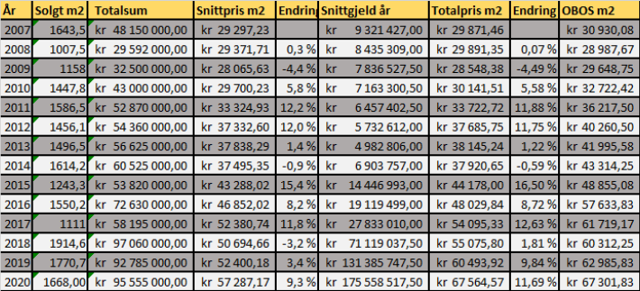

Grafen og tabellen nedenfor viser den gjennomsnittlige prisen ink fellesgjeld for salg av leiligheter fra 2007 - 2020 for Setra Borettslag og for OBOS leiligheter generelt.  

De siste årene har Setra investert mye for å løfte standarden med både fasadeprosjekt og våtromsprosjekt.  Dette har ført til en utvikling som har vært en del bedre en den gjennomsnittlige prisutviklingen til OBOS leiligheter. Graf og tabell viser hvordan vi i de siste årene har tatt igjen forspranget. 

 
Gitt denne prisen er totalsummen på de 17082 m2 leilighetene i Setra består i verdt  kr 1 154 137 959,95 Dette en oppgang fra  kr 484 903 386,23 i 2007

{}
