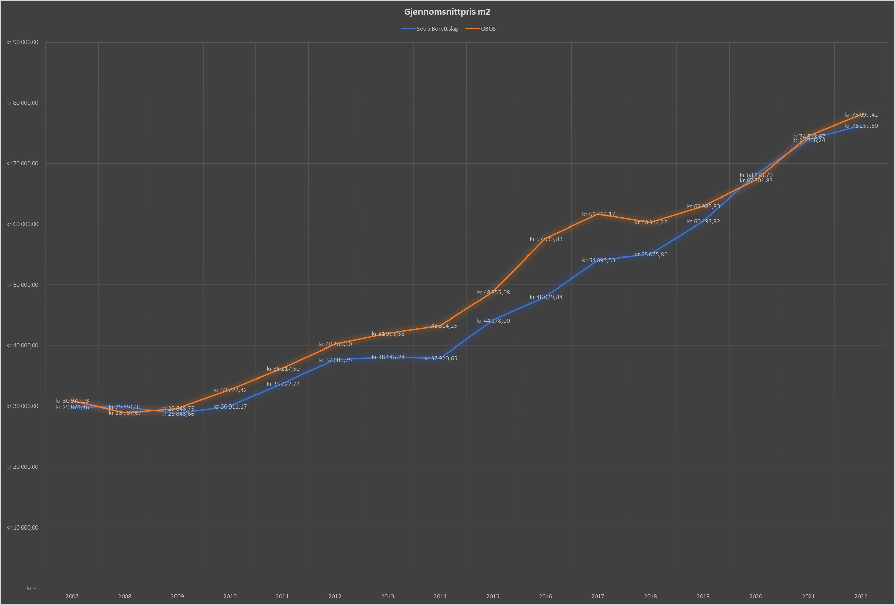
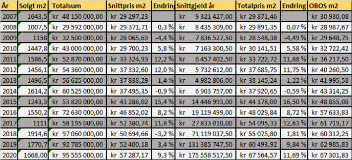

Grafen og tabellen nedenfor viser gjennomsnittlig salgspris inkludert fellesgjeld for leiligheter i Setra borettslag fra 2007 til 2022. Tallene sammenlignes med gjennomsnittsprisen for OBOS-leiligheter generelt.

Setra har investert mye i å heve standarden, blant annet gjennom fasade- og våtromsprosjektene. Prisutviklingen har derfor vært noe bedre enn den gjennomsnittlige utviklingen for OBOS-leiligheter.

Grafen og tabellen viser hvordan Setra de siste årene har tatt igjen forspranget.

 
Med denne kvadratmeterprisen er den samlede beregnede verdien av Setras 17 082 m² med leilighetsareal 1 302 666 422,93 kroner. Det er en økning fra 484 903 386,23 kroner i 2007.

{}
