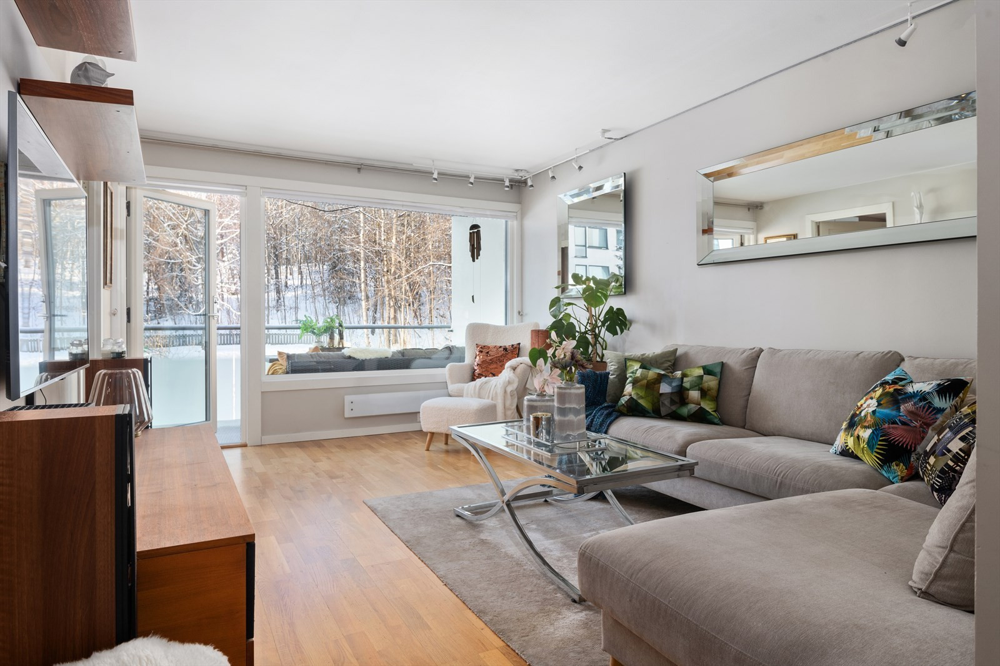
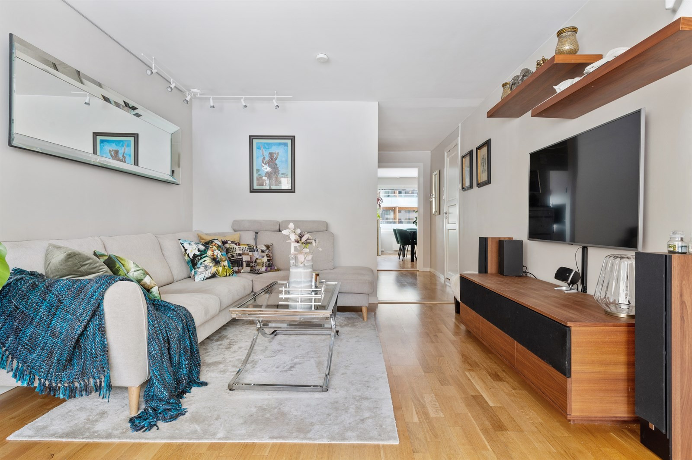
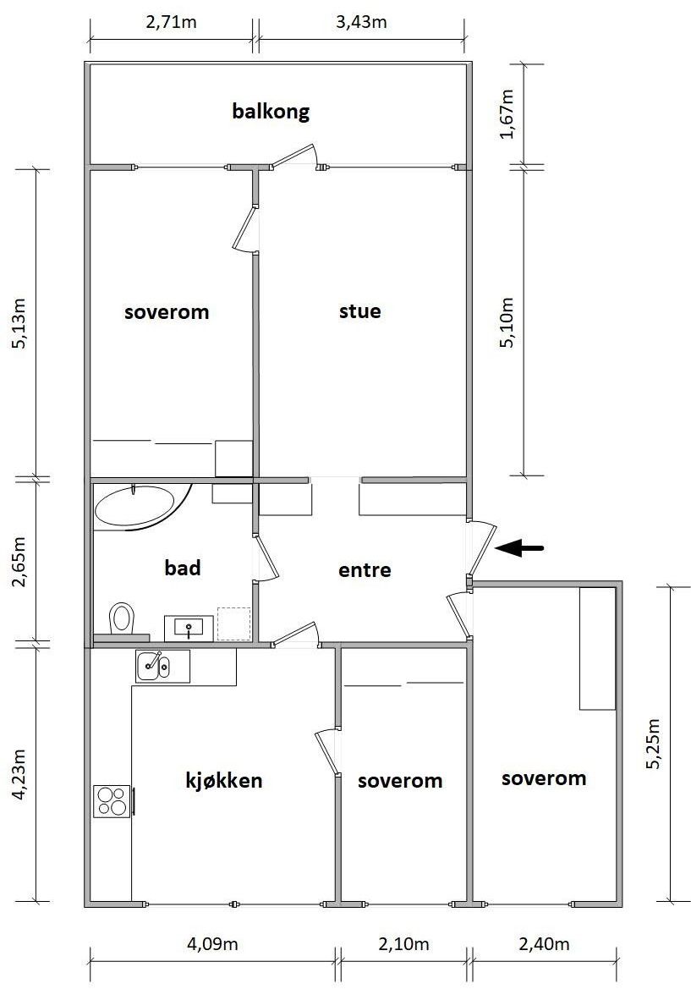
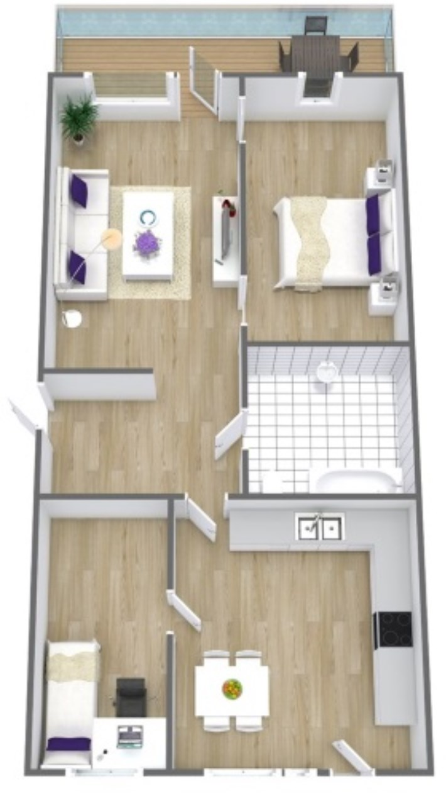
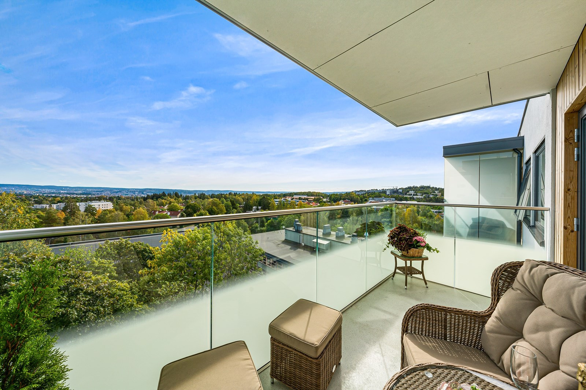
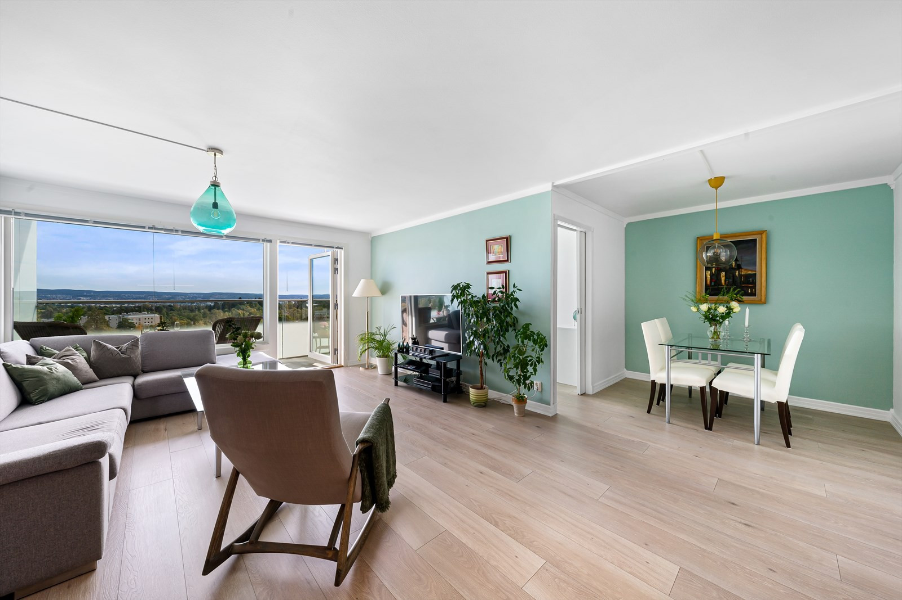
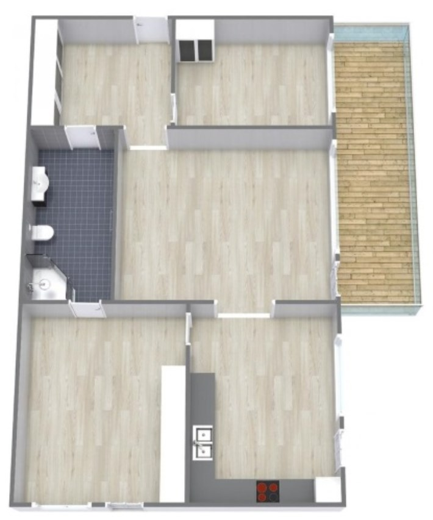

Følgende leilighetstyper finnes i borettslaget.

## Lavblokker - Hovseterveien 64, 66 og 82

### 4 roms - 90m2

Det er totalt 36 slike leiligheter i borettslaget.

Leilighetene har orignalt 3 soverom og et stort kjøkken og stort bad samt stue. 

De fleste slike leiligheter har en slik layout som vist under. Dette var slik de originalt ble bygget. Noen er endret siden 1975.

Se flere eksempler på oversikten over gamle finn annonser.

### 3 roms - 76.2m2

Det er totalt 36 slike leiligheter i borettslaget

## Hovseterveien 84

### 2 roms - 52.5m2

Det er totalt 78 slike leiligheter i borettslaget

### 1 roms - 31m2

Det er totalt 8 slike leiligheter i borettslaget.

## Hovseterveien 68

### 3 roms - 76.8m2 - Hovseterveien 68

Det er totalt 31 slike leiligheter i borettslaget

### 2 roms - 65.5m2 - Hovseterveien 68

Det er totalt 38 slike leiligheter i borettslaget

### 1 roms - 39m2 - Hovseterveien 68

Det er totalt 2 slike leiligheter i borettslaget

{}
