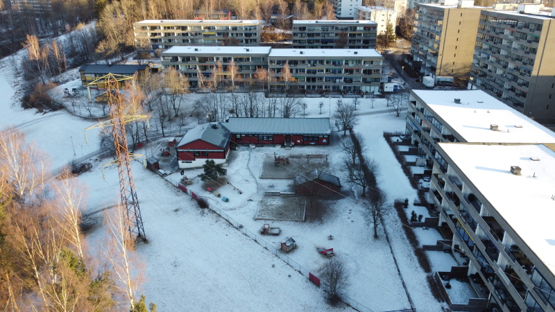
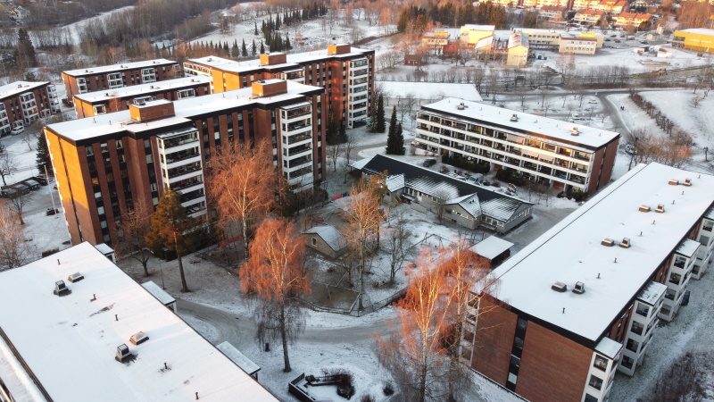
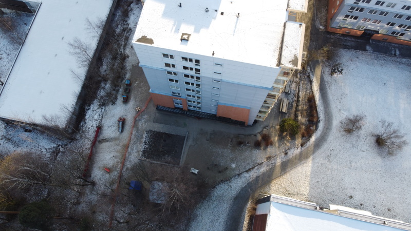

<!-- markdownlint-disable MD033 -->

<figur>
    
    <figcaption><h4>Hov - Meklenborg barnehage</h4></figcaption>
</figur>

Denne barnehagen ligger på baksiden av Hovseterveien 64 som nærmeste nabo til Setra borettslag 10 meter unna. Barnehagen har nye uteområder og består av to bygg. Barnehagen er spesielt populær blant fedre som ofte sloss om å få levere og hente barna. Barn bruker ofter barnehagen som lekeplass på ettermiddagstid og i helger.

[Se hjemmeside](https://www.oslo.kommune.no/barnehage/finn-barnehage-i-oslo/hov-meklenborg-barnehage/#gref)

<figur>
    
    <figcaption><h4>Vestjordet barnehage</h4></figcaption>
</figur>

Vestjordet ligger ned mot Hovseterdalen kun 114 meter fra Setra borettslag.

[Se hjemmeside](https://www.oslo.kommune.no/barnehage/finn-barnehage-i-oslo/vestjordet-barnehage/#gref).

<figur>
    
    <figcaption><h4>Hamborg barnehage</h4></figcaption>
</figur>

Hamborg barnehage ligger rett ved vestejordet 125 meter fra Setra borettslag

[Se hjemmeside](https://www.oslo.kommune.no/barnehage/finn-barnehage-i-oslo/hamborg-barnehage/#gref).

<figur>
    
    <figcaption><h4>Orrebakken barnehage</h4></figcaption>
</figur>

Orrebakken barnehage ligger rett bak Setra borettslag på andre siden av skogen kun 192 meter fra Setra borettslag. Veien er bilfri.

[Se hjemmeside](https://www.oslo.kommune.no/barnehage/finn-barnehage-i-oslo/orebakken-barnehage/#gref)

<figur>
    
    <figcaption><h4>Landingsveien barnehage</h4></figcaption>
</figur>

Landingsveien barnehage ligger mellom blokkene i Orrebakken borettslag en kort vei unna gjennom skogen. Barnehagen ligger  200 meter unna Setra borettslag og veien er bilfri.

[Se hjemmeside](https://www.oslo.kommune.no/barnehage/finn-barnehage-i-oslo/landingsveien-barnehage/#gref)

<figur>
    
    <figcaption><h4>Jarbakken barnehage</h4></figcaption>
</figur>

Jarbakken er den nyeste barnehagen i området. Den ligger 300 meter unna Setra borettslag. Til denne må man krysse bilvei fra Setra borettslag. 

[Se hjemmeside.](https://www.oslo.kommune.no/barnehage/finn-barnehage-i-oslo/jarbakken-barnehage/#gref)

<figur>
    
    <figcaption><h4>Hovseter barnehage</h4></figcaption>
</figur>

Hovseter barnehage ligger i kollektivet borettslag.

[Se hjemmeside](https://www.oslo.kommune.no/barnehage/finn-barnehage-i-oslo/hovseter-barnehage-as/#gref)

<figur>
    
    <figcaption><h4>Røahagen familiebarnehage</h4></figcaption>
</figur>

Røahagen familiebarnehage er en lite barnehage som ligger ned mot Hovseterdalen. (det hvite huset på bildet). Den ligger 215 meter unna Setra.

[Se hjemmeside](https://www.oslo.kommune.no/barnehage/finn-barnehage-i-oslo/roahagan-familiebarnehage/#gref)

Kattugla Steinerbarnehage ligger 370 meter fra Setra.

[Se hjemmeside](https://www.oslo.kommune.no/barnehage/finn-barnehage-i-oslo/kattugla-steinerbarnehage/#gref)

{}
