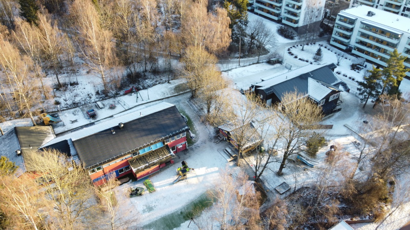
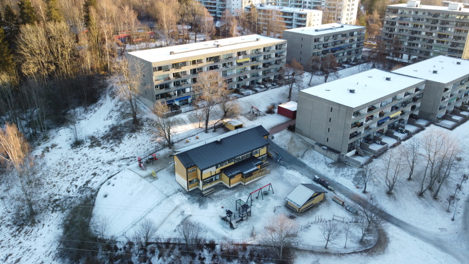
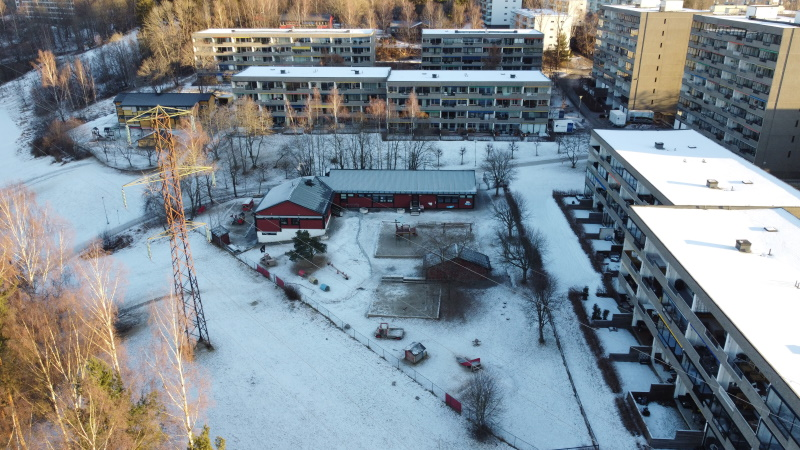
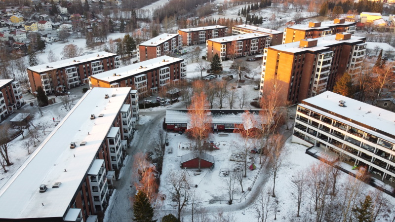
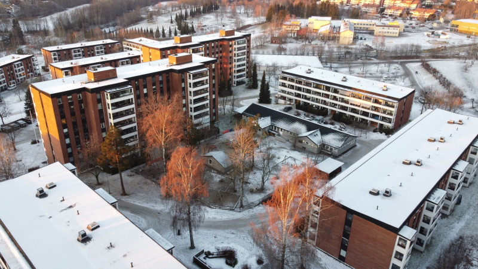
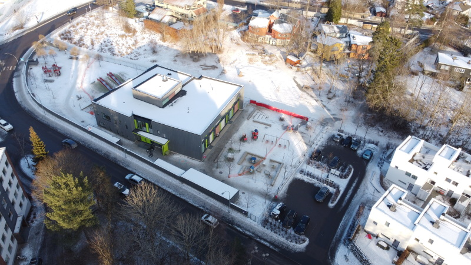
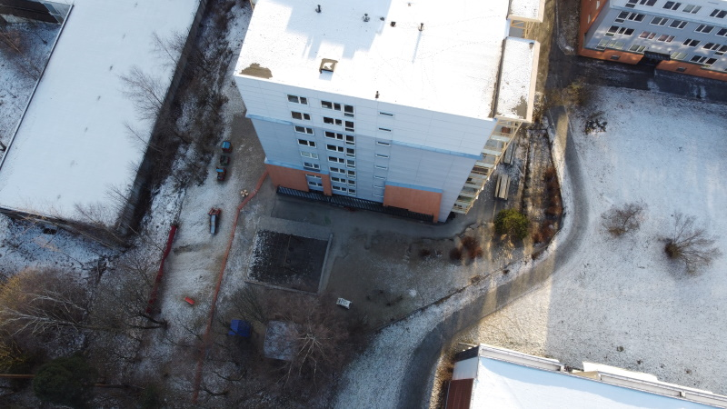
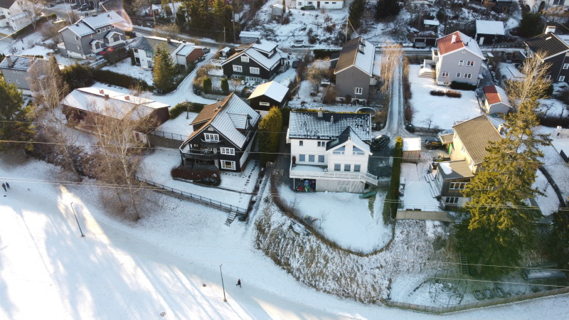
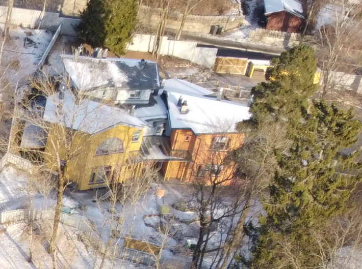

<!-- markdownlint-disable MD033 -->

<figur>
    
    <figcaption><h4>Hov - Meklenborg barnehage</h4></figcaption>
</figur>

Denne barnehagen ligger på baksiden av Hovseterveien 64, bare 10 meter fra Setra borettslag. Barnehagen har nye uteområder og består av to bygg. Barna bruker ofte området som lekeplass på ettermiddager og i helger.

[Se hjemmeside](https://www.oslo.kommune.no/barnehage/finn-barnehage-i-oslo/hov-meklenborg-barnehage/#gref)

<figur>
    
    <figcaption><h4>Vestjordet barnehage</h4></figcaption>
</figur>

Vestjordet ligger ned mot Hovseterdalen kun 114 meter fra Setra borettslag.

[Se hjemmeside](https://www.oslo.kommune.no/barnehage/finn-barnehage-i-oslo/vestjordet-barnehage/#gref).

<figur>
    
    <figcaption><h4>Hamborg barnehage</h4></figcaption>
</figur>

Hamborg barnehage ligger rett ved Vestjordet, 125 meter fra Setra borettslag.

[Se hjemmeside](https://www.oslo.kommune.no/barnehage/finn-barnehage-i-oslo/hamborg-barnehage/#gref).

<figur>
    
    <figcaption><h4>Orrebakken barnehage</h4></figcaption>
</figur>

Orrebakken barnehage ligger på den andre siden av skogen, bare 192 meter fra Setra borettslag. Veien dit er bilfri.

[Se hjemmeside](https://www.oslo.kommune.no/barnehage/finn-barnehage-i-oslo/orebakken-barnehage/#gref)

<figur>
    
    <figcaption><h4>Landingsveien barnehage</h4></figcaption>
</figur>

Landingsveien barnehage ligger mellom blokkene i Orrebakken borettslag, en kort tur gjennom skogen. Barnehagen ligger 200 meter fra Setra borettslag, og veien dit er bilfri.

[Se hjemmeside](https://www.oslo.kommune.no/barnehage/finn-barnehage-i-oslo/landingsveien-barnehage/#gref)

<figur>
    
    <figcaption><h4>Jarbakken barnehage</h4></figcaption>
</figur>

Jarbakken er den nyeste barnehagen i området. Den ligger 300 meter fra Setra borettslag. På vei dit må man krysse en bilvei.

[Se hjemmeside.](https://www.oslo.kommune.no/barnehage/finn-barnehage-i-oslo/jarbakken-barnehage/#gref)

<figur>
    
    <figcaption><h4>Hovseter barnehage</h4></figcaption>
</figur>

Hovseter barnehage ligger i Kollektivet borettslag.

[Se hjemmeside](https://www.oslo.kommune.no/barnehage/finn-barnehage-i-oslo/hovseter-barnehage-as/#gref)

<figur>
    
    <figcaption><h4>Røahagen familiebarnehage</h4></figcaption>
</figur>

Røahagen familiebarnehage er en liten barnehage som ligger ned mot Hovseterdalen, i det hvite huset på bildet. Den ligger 215 meter fra Setra.

[Se hjemmeside](https://www.oslo.kommune.no/barnehage/finn-barnehage-i-oslo/roahagan-familiebarnehage/#gref)

Kattugla Steinerbarnehage ligger 370 meter fra Setra.

[Se hjemmeside](https://www.oslo.kommune.no/barnehage/finn-barnehage-i-oslo/kattugla-steinerbarnehage/#gref)

{}
