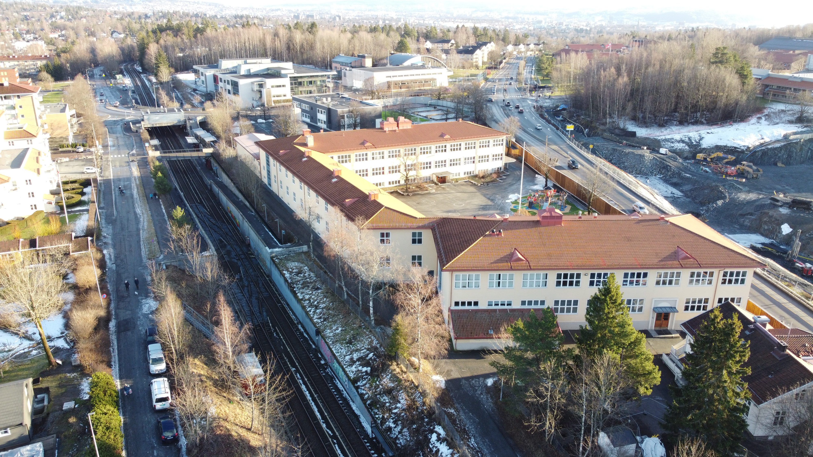
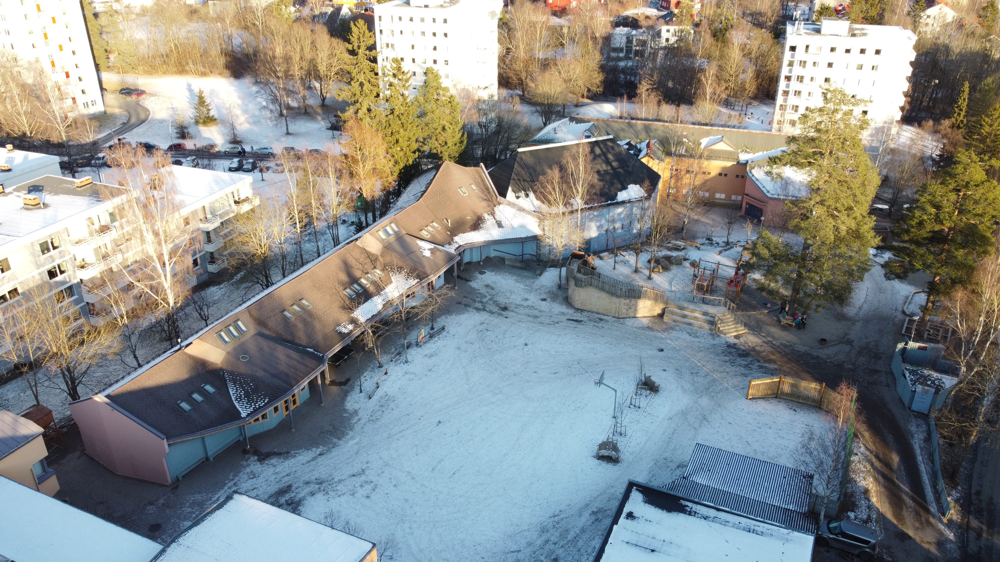
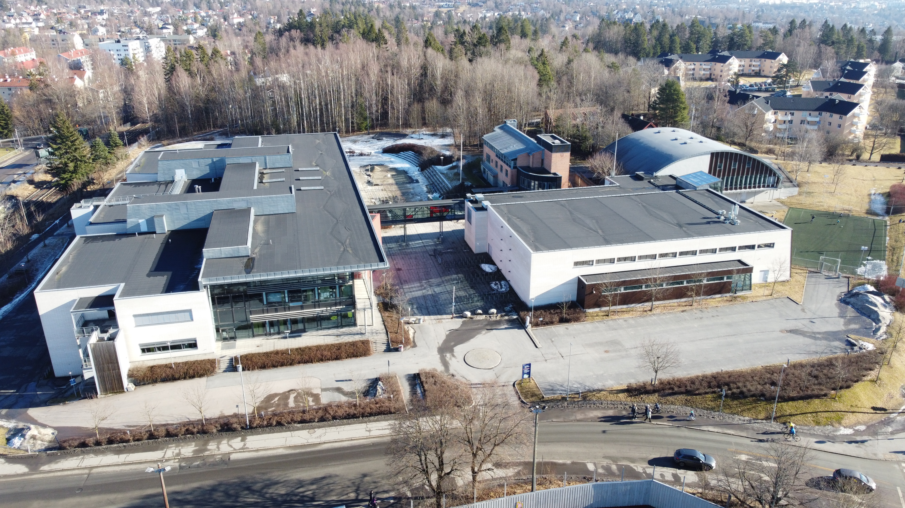

Huseby skole er den barneskolen Setra borettslag sogner til. Den ble startet allerde i 1861 og har ca 700 elever. Huseby skole er blant de [beste skolene](https://www.udir.no/tall-og-forskning/statistikk/statistikk-grunnskole/nasjonale-prover-5.-trinn/) i landet når det gjelder resulater.

Man kan gå bilfritt til Huseby skole fra Setra Borettslag via gangsti gjennom Meklenborg borettslag. I luftlinje ligger skolen 355 meter unna Setra Borettslag. 

Av kjente personer som har gått på skolen har man [Martin Johnsrud Sundsby](https://no.wikipedia.org/wiki/Martin_Johnsrud_Sundby)

[Se hjemmeside](https://huseby.osloskolen.no/om-skolen/om-oss/skolens-historie/).

Voksen skole ligger rett over Setra Borettslag med omtrent samme astand som Huseby skole.  Skolen har 560 elever. Se resulater fra skolen.

Man gå bilfritt til Voksen Skole. Skolen ligger 455 meter unna Setra Borettslag i luftlinje.

[Se hjemmeside](https://voksen.osloskolen.no/om-skolen/om-oss/skolens-historie/) 

Steinerskolen på Hovseter ligger kun to minutters gange fra Setra borettslag. Skolen er et alternativ til offentlig skole og drives etter steinerpedagogiske prinsipper. Det vil si at det enkelte barn alltid skal være i fokus, og de kunstneriske fagene er vektlagt i større grad enn ved offentlig skole. Arkitekturen og bruk av naturmaterialer er også noe som kjennetegner steinerskolene verden rundt.

Skolen arrangerer hvert år et julemarked i ekte middelalderstil. Hvert år strømmer det til med folk fra hele byen for å kjøpe hjemmelagde leker og mat, og for å delta på alle aktivitetene som arrangeres. Dette kan du lese mer om på [www.steinerjulemarkedet.no](https://www.steinerjulemarkedet.no/)

Skolen har 430 elever og er Norges eldste Steinerskole. Man kommer seg bilfritt fra Setra til Steinerskolen. 

[Se hjemmeside](https://www.rsio.no/)

Kortere skolevei er ikke mulig da skolen er nærmeste nabo til Setra. Hovseter skole er ungdomsskole for området og har ca 650 elever. Skolen skal gjennomgå store oppgraderinger de neste årene og er for øyeblikket stengt.

[Se hjemmeside](https://hovseter.osloskolen.no/)

Persbråten videregående skole finner du rett ved Hovseter T-Bane stasjon. Skolen har 500 plasser.

[Se hjemmeside](https://persbraten.vgs.no/om-skolen/om-oss/var-profil/) 

{}
