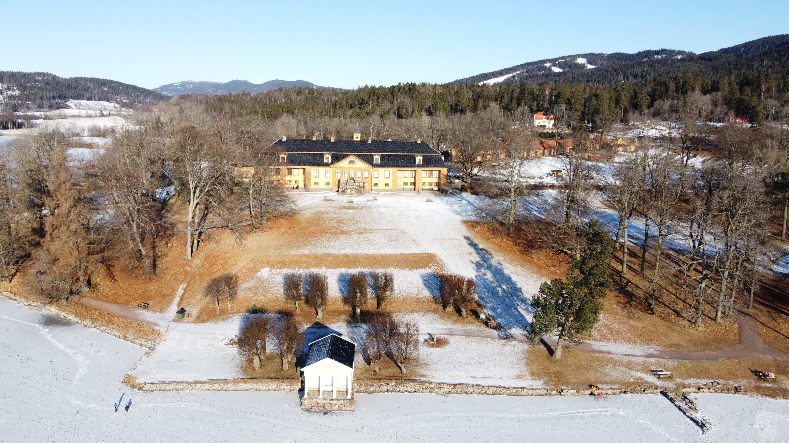

Man kan gå stort sett bilfritt fra Setra til Bogstadvannet. Man må krysse to gangfelt hvis man går gjennom Hovseterdalen. Avstanden er 2100 meter og tar 15-20 minutter.

Ved Bogstadvannet finner man også Bogstad gård med cafe og mulighet for å besøke dyrene.

[Se hjemmesiden](https://bogstad.no/)





{}
