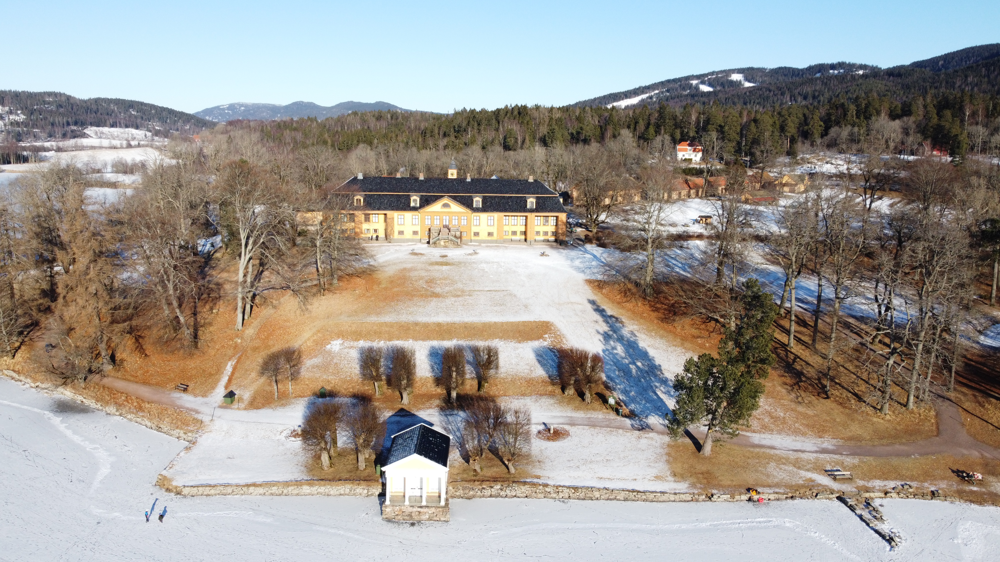
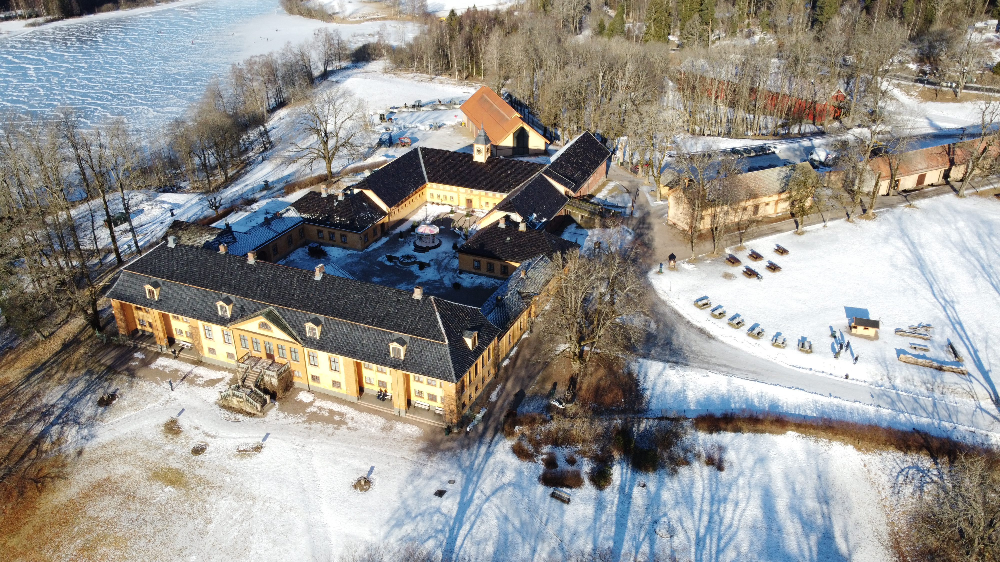

Du kan gå nesten bilfritt fra Setra til Bogstadsvannet gjennom Hovseterdalen. Turen er 2,1 kilometer lang, tar ca. 15–20 minutter og innebærer kryssing av to gangfelt.

Ved Bogstadsvannet ligger også Bogstad gård, med kafé og mulighet for å besøke dyrene.

[Se Bogstad gårds nettsted](https://bogstad.no/).





{}
