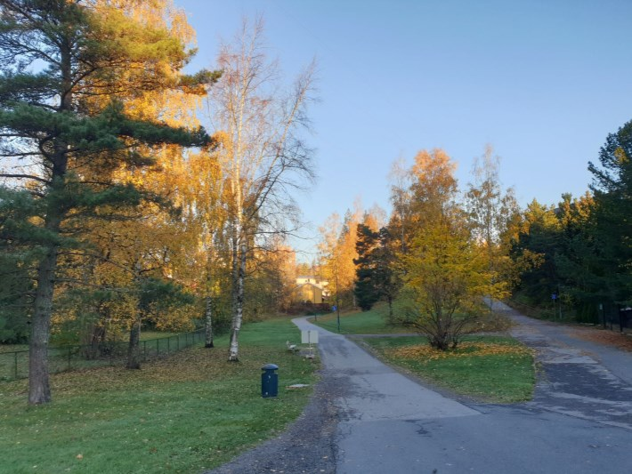
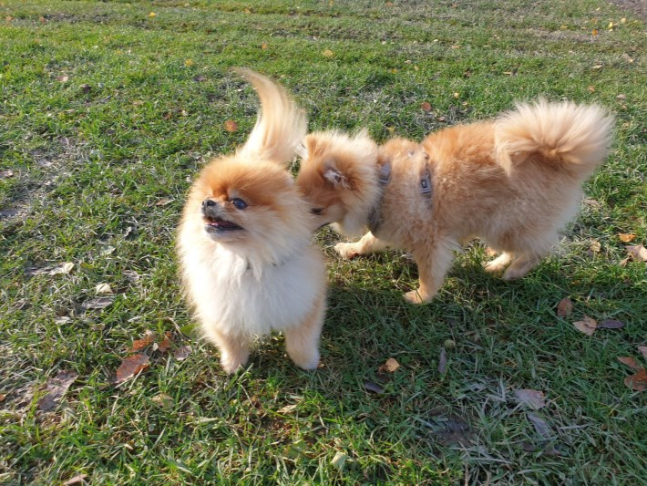
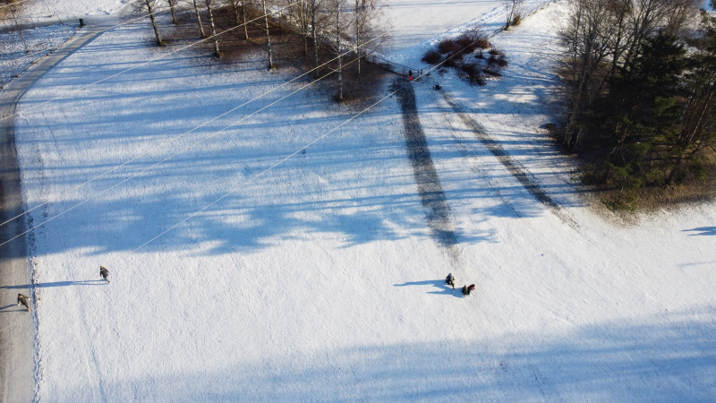
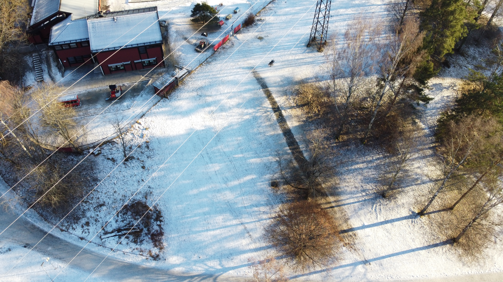

<!-- markdownlint-disable MD033 -->

Dalen som ofte feilaktig kalles for Mærradalen starter der Mærradalen slutter ved Huseby Skole. [Se kart](https://bym.maps.arcgis.com/apps/webappviewer/index.html?id=ca80e1e44054470084dff1534bbe4aec&marker=10.651128420632718%2C59.950926733015095%2C%2C%2C%2C&markertemplate=%7B%22title%22%3A%22Hovseterdalen%20(turvei%20A3%20%2FA4)%22%2C%22longitude%22%3A10.651128420632718%2C%22latitude%22%3A59.950926733015095%2C%22isIncludeShareUrl%22%3Atrue%7D&level=16)

## Akebakker i Hovseteredalen

Det er 7(!) akebakker i Hovseterdalen på vinterstid. Nedenfor finner du beskrivelse av dem. Se dronevideo med akemuligheter i Hovseterdalen.



 

<figur>
    
    <figcaption><h4>Tufterenna</h4></figcaption>
</figur>

Tufterenna er en liten og slak bakke som går fra fotballbanen og ned mot tufteparken. Dette er en fin nybegynnerbakke for de aller minste barna og hellikopter foreldre.

Orrekjempen er den største akebakken i Hovseterdalen og har medium vanskelighetsgrad. Man får stor fart når man starter på toppen. Dette er den mest populære bakken.

 

Kjevebrekkeren går fra skogen på toppen av Hovseterdalen ned den bratteste bakken. Høy vanskelighetsgrad og ender opp i et gjerde hvis man har alt for stor fart.

<figur>
    
    <figcaption><h4>Vesthumpen</h4></figcaption>
</figur>

Vesthumpen er en populær bakke rett ved Vestjordet barnehage. Brukes ofte av de minste barna og de som syns Orrekjempen blir for stor. 

Hamborgspinneren er en liten bakke ved Hamborg barnehage. Den går mellom trærne for ekstra spenning. Passer fint for små barn. 

Mekle tvillingene er i praksis 2 bakker med relativ lik bakkeprofil som bare er skilt med et lite buskass. Bakken er relativ bratt og krysser gangveien som er et ekstra spenningmoment.

{}
