<!-- markdownlint-disable MD033 -->

Dalen, som ofte feilaktig kalles Mærradalen, starter der Mærradalen slutter ved Huseby skole. [Se kart](https://bym.maps.arcgis.com/apps/webappviewer/index.html?id=ca80e1e44054470084dff1534bbe4aec&marker=10.651128420632718%2C59.950926733015095%2C%2C%2C%2C&markertemplate=%7B%22title%22%3A%22Hovseterdalen%20(turvei%20A3%20%2FA4)%22%2C%22longitude%22%3A10.651128420632718%2C%22latitude%22%3A59.950926733015095%2C%22isIncludeShareUrl%22%3Atrue%7D&level=16).

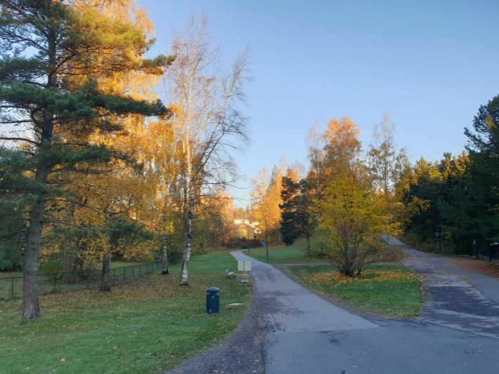

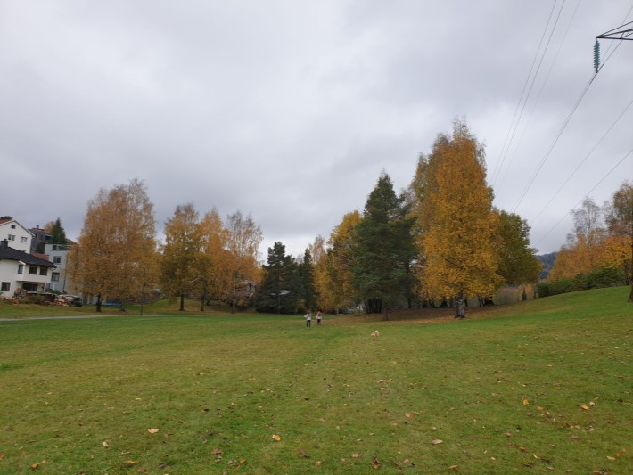

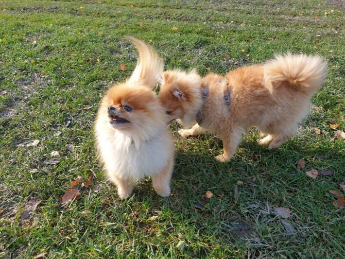

## Hovseterdalen friplass

Hovseterdalen friplass åpnet i juni 2024. Det rundt 2700 kvadratmeter store nærmiljøanlegget har blant annet sprint- og løpebaner, ball- og klatrevegg, apparater for balanse, turn og klatring, trampoliner, volleyball- og badmintonbaner og hoppegrop. Anlegget er åpent for alle og brukes både av skolen, idretten og til egenorganisert aktivitet.

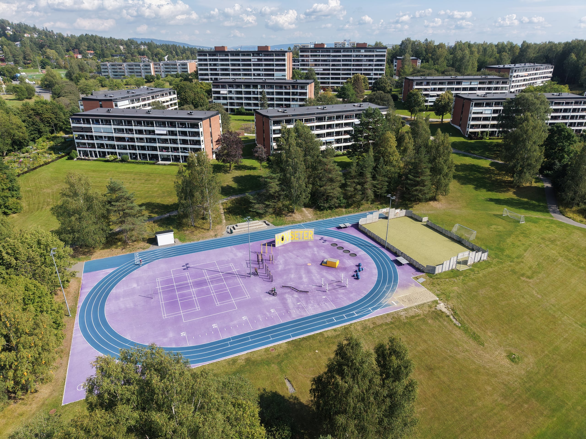

[Les mer om Hovseterdalen friplass hos Oslo kommune](https://www.oslo.kommune.no/natur-kultur-og-fritid/idrett/idrettsanlegg/hovseterdalen-friplass/).

Nedenfor kan du se en oppdatert dronefilm fra Hovseterdalen, tatt 15. august 2026.



## Oppkjørte skiløyper

Når forholdene ligger til rette for det, kjøres det opp skiløyper i Hovseterdalen. Løypene går opp til Bogstad camping, som er knyttet til løypenettet i Marka.

<figur>
    <a href="ski1.jpg">
        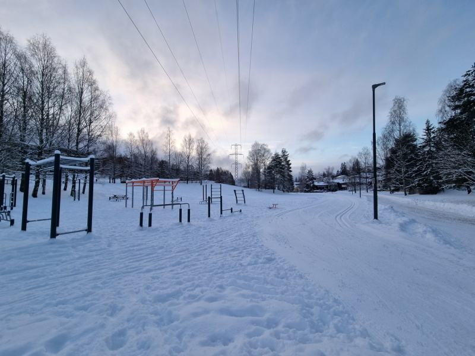
    </a>
    <figcaption><h4>Skispor i Hovseterdalen</h4></figcaption>
</figur>

<figur>
    <a href="ski2.jpg">
        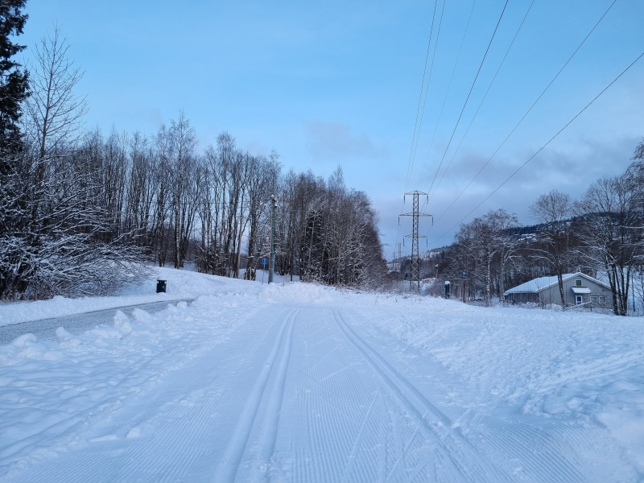
    </a>
    <figcaption><h4>Skispor i Hovseterdalen</h4></figcaption>
</figur>

<figur>
    <a href="ski3.jpg">
        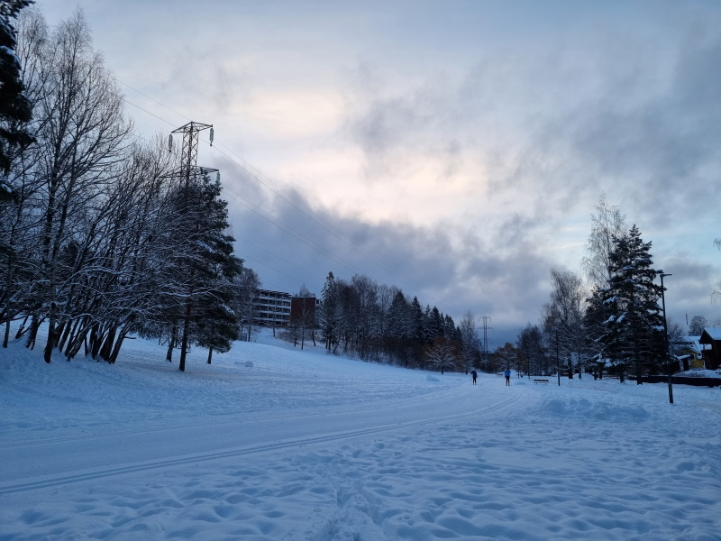
    </a>
    <figcaption><h4>Skispor i Hovseterdalen</h4></figcaption>
</figur>

<figur>
    <a href="ski4.jpg">
        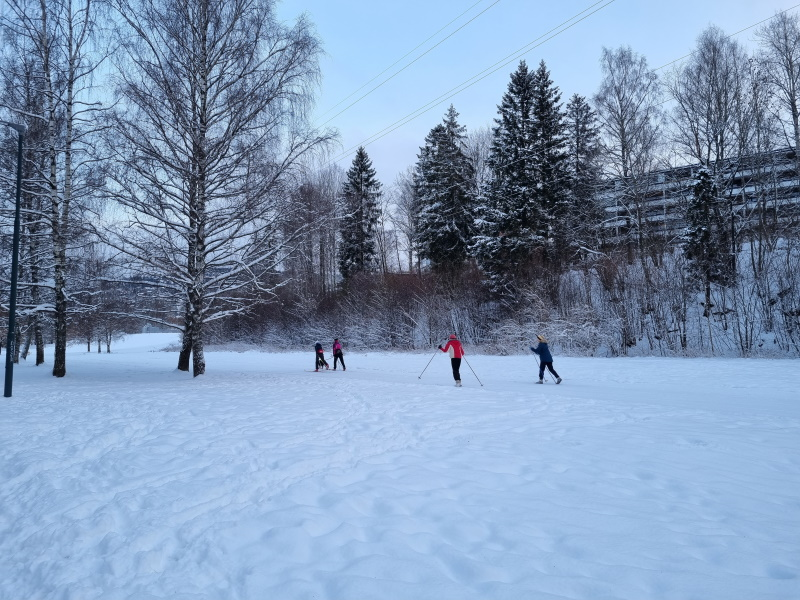
    </a>
    <figcaption><h4>Skispor i Hovseterdalen</h4></figcaption>
</figur>

## Akebakker i Hovseterdalen

Det er hele sju akebakker i Hovseterdalen om vinteren. Nedenfor finner du en beskrivelse av dem og en dronefilm som viser akemulighetene.



 

<figur>
    <a href="tufterenna.jpg">
        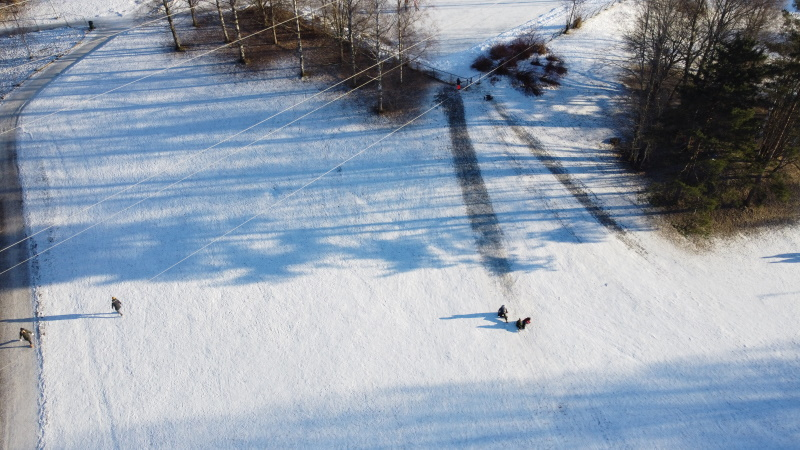
    </a>
    <figcaption><h4>Tufterenna</h4></figcaption>
</figur>

Tufterenna er en liten og slak bakke som går fra fotballbanen og ned mot friplassen. Dette er en fin nybegynnerbakke for de aller minste barna og helikopterforeldre.

 <figur>
    <a href="orrekjempen.jpg">
        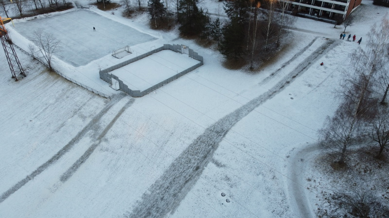
    </a>
    <figcaption><h4>Orrekjempen</h4></figcaption>
</figur>

Orrekjempen er den største akebakken i Hovseterdalen og har middels vanskelighetsgrad. Man får stor fart når man starter på toppen. Dette er den mest populære bakken.
 
 <figur>
    <a href="orrekjempen2.jpg">
        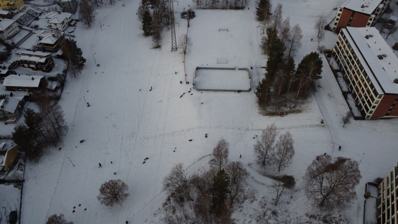
    </a>
    <figcaption><h4>Orrekjempen</h4></figcaption>
</figur>

 
 <figur>
    <a href="kjevebrekkeren.jpg">
        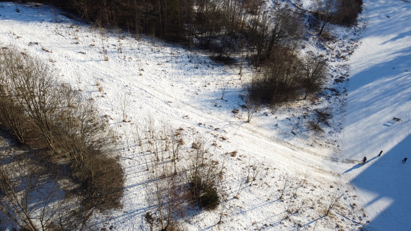
    </a>
    <figcaption><h4>Kjevebrekkeren</h4></figcaption>
</figur>

Kjevebrekkeren går fra skogen på toppen av Hovseterdalen og ned den bratteste bakken. Den har høy vanskelighetsgrad og ender ved et gjerde, så farten må avpasses.

<figur>
    <a href="vesthumpen.jpg">
        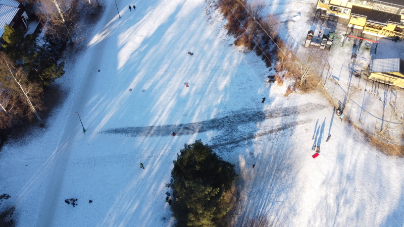
    </a>
    <figcaption><h4>Vesthumpen</h4></figcaption>
</figur>

Vesthumpen er en populær bakke rett ved Vestjordet barnehage. Brukes ofte av de minste barna og de som syns Orrekjempen blir for stor. 

<figur>
    <a href="hamborgspinneren.jpg">
        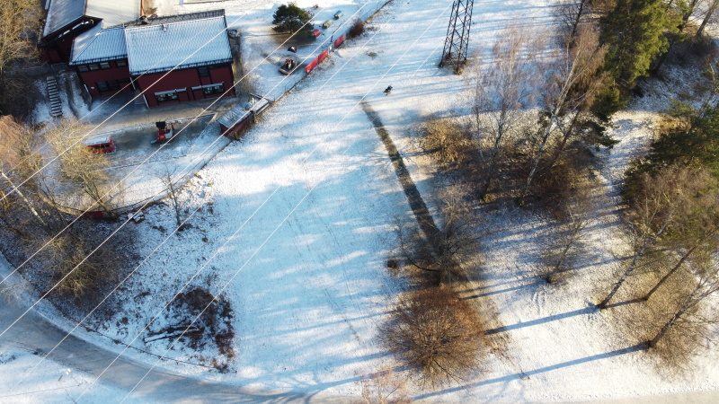
    </a>
    <figcaption><h4>Hamborgspinneren</h4></figcaption>
</figur>

Hamborgspinneren er en liten bakke ved Hamborg barnehage. Den går mellom trærne og passer fint for små barn.

<figur>
    <a href="mekletvillingene.jpg">
        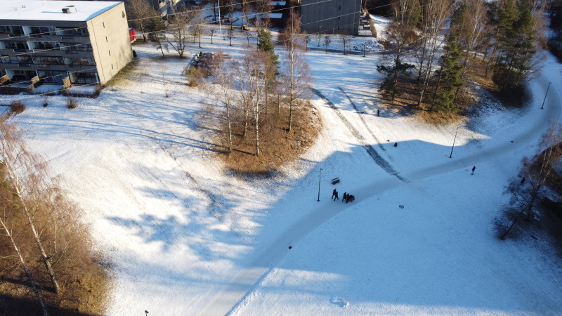
    </a>
    <figcaption><h4>Mekle tvillingene</h4></figcaption>
</figur>

Mekletvillingene er i praksis to bakker med ganske lik profil, bare skilt av et lite buskas. Bakkene er relativt bratte og krysser gangveien, så det er viktig å være oppmerksom.

## Skøytebane

Om vinteren lager kommunen skøytebane ved akebakken Orrekjempen, bare 300 meter fra Setra.



{}
