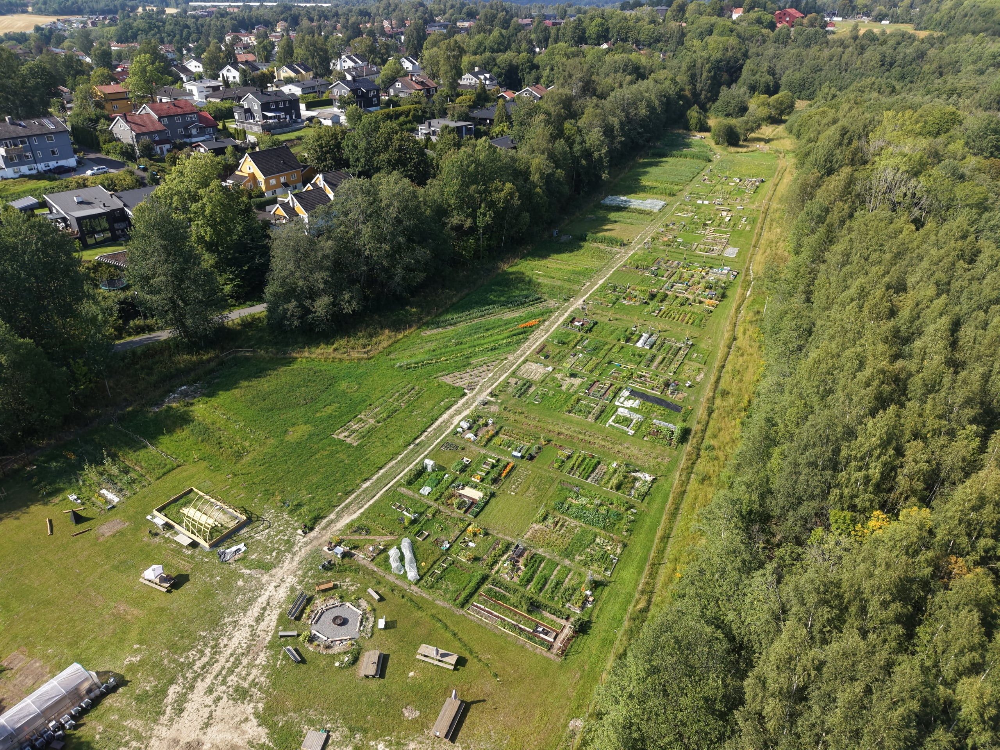
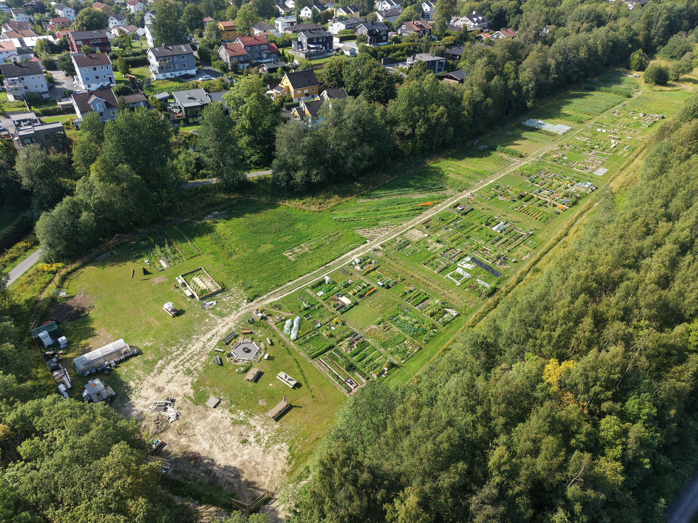

Røa frisbeegolfbane ble permanent stengt i 2025. Banen hadde 18 hull og lå delvis på dyrkbar jord med lovpålagt driveplikt. Oslo kommune søkte om fritak, men Landbruksdirektoratet ga endelig avslag.

Området er nå tatt tilbake til matproduksjon. Voksenenga nærmiljøhage flyttet i 2026 til et nytt område på omtrent 14 000 kvadratmeter og ble utvidet fra rundt 65 til rundt 100 parseller. Her dyrkes grønnsaker, blomster og andre vekster etter økologiske prinsipper.

[Les mer om Voksenenga nærmiljøhage](https://www.voksenenga.no/).

[Les om bakgrunnen for nedleggelsen av frisbeegolfbanen](https://journalen.oslomet.no/nb/innenriks/2025/03/jordbruksloven-satte-en-stopper-frisbeegolfbanen-pa-voksenjordet).

[Se Regionkontor Landbruks årsmelding for 2024](https://regionkontorlandbruk.no/_f/p120/i58d8e172-651f-4a0b-8f9d-e044e270be3c/arsmelding-landbruk-2024.pdf).
