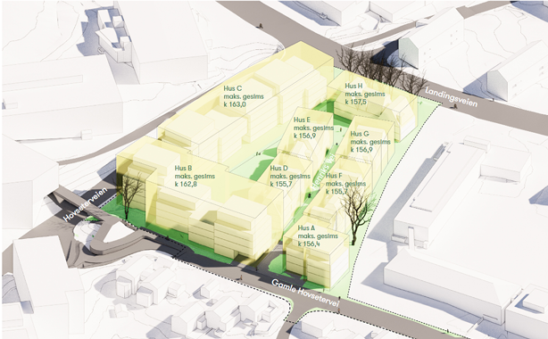

## Nytt planforslag i 2026

Henriks vei Utvikling AS foreslår å omregulere området fra småhusbebyggelse til blokker og rekkehus. Forslaget omfatter omtrent 120–140 boliger i bygg på 3–6 etasjer. Det åpnes også for noe næring og tjenesteyting på bakkeplan.

Planforslaget legger blant annet opp til:

- åtte bygningsgrupper med blokker og rekkehus
- nye felles uteområder og en offentlig tilgjengelig forbindelse gjennom området
- fortau på én side av Gamle Hovsetervei
- parkering under bakken, med biladkomst fra Hovseterveien

Forslaget ligger i [ny plansak 202506860 hos Oslo kommune](https://innsyn.pbe.oslo.kommune.no/saksinnsyn/casedet.asp?caseno=202506860). Det er på offentlig ettersyn fra 15. juni til 21. august 2026. Dette er et planforslag og ikke en vedtatt utbygging.

Plan- og bygningsetaten anbefaler ikke forslaget slik det foreligger. Etaten mener blant annet at bebyggelsen bør bli lavere, og at flere eksisterende trær bør bevares. Se [kommunens side om høringen](https://innsyn.pbe.oslo.kommune.no/sidinmening/main.asp?idnr=2026025851) og [forslagsstillers planbeskrivelse](https://innsyn.pbe.oslo.kommune.no/saksinnsyn/showfile.asp?jno=2026048474&fileid=901090224) for flere detaljer.

## Tidligere planer

Området har tidligere vært behandlet i [plansak 201809548](https://innsyn.pbe.oslo.kommune.no/saksinnsyn/casedet.asp?caseno=201809548). Den nye saken fra 2025 erstatter ikke nødvendigvis alle eldre dokumenter, men det er den nye saken som inneholder det gjeldende planforslaget.

Se også eldre omtaler i Akersposten: [Politikerne støtter utbygging av Henriks vei på Hovseter](https://akersposten.no/politikerne-stotter-utbygging-av-henriks-vei-pa-hovseter/19.2542) og [135 nye leiligheter i byvillaer på Hovseter](https://akersposten.no/nyheter/135-nye-leiligheter-i-byvillaer-pa-hovseter/19.2486).

{}
