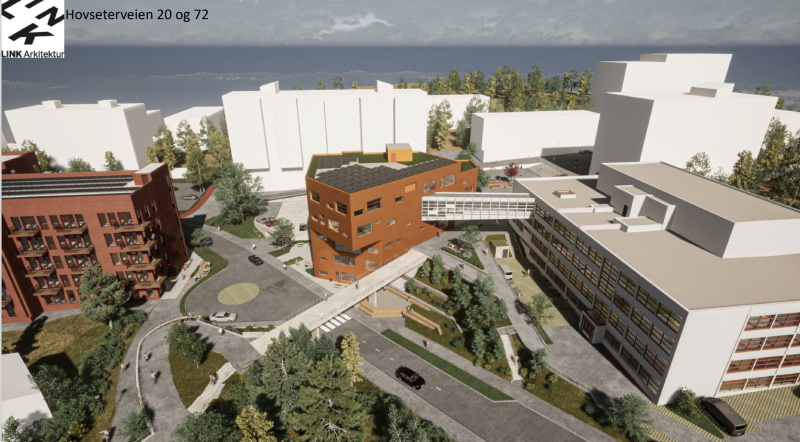
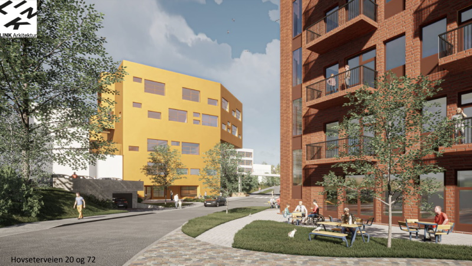
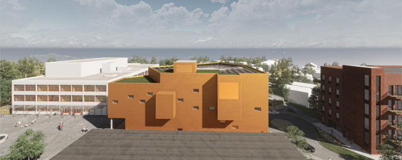
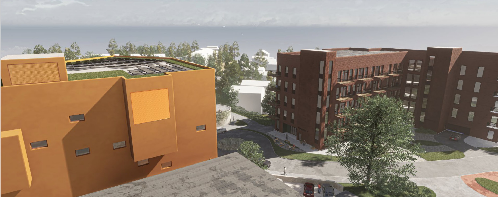
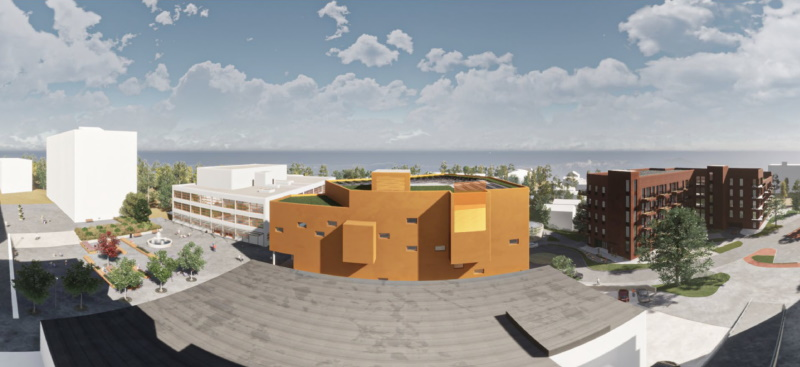
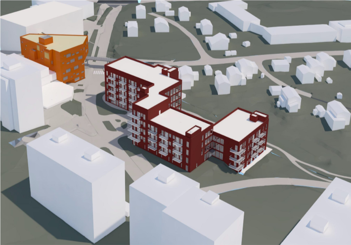
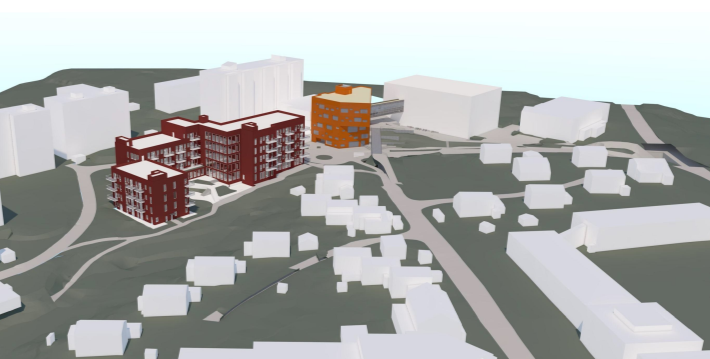

<!-- markdownlint-disable MD033 -->

I Hovseterveien 20 planlegges det omsorgsboliger og i Hovseterveien 72 planlegges det nytt bygg for Hovseter skole. Arbeidet vil være ferdig høsten 2024 for skolen.

<figur>
    
    <figcaption><h4>Hovseterveien 20 og 72</h4></figcaption>
</figur>

Skolebygget vil få en gangbru mellom nytt bygg i Hovseterveien 72 (inntil Rema 1000). Vei til T-Bane vil være under gangbru mellom skolebygg. Broen vil bestå som i dag. 

Slik bygget er prosjektert vil det påvirke utsikten noe til de som bor på østsiden HV68 og delvis HV82/HV84

Nedenfor ser du siste tilgjengelige skisse av skolebygget. Klikk på bildet for større versjon.

<figur>
    
    <figcaption><h4>Hovseterveien 20 og 72</h4></figcaption>
</figur>

<figur>
    
    <figcaption><h4>Gangveien opp mot broen gjøres mindre bratt ved å lage en U sving.</h4></figcaption>
</figur>

<figur>
    
    <figcaption><h4>Gangveien opp mot broen gjøres mindre bratt ved å lage en U sving.</h4></figcaption>
</figur>

<figur>
    
    <figcaption><h4>Perspektiv fra litt ovenfor innkjørsel til U3</h4></figcaption>
</figur>

<figur>
    
    <figcaption><h4>Perspektiv fra innkjørsel gjesteparkering hos Meklenborg</h4></figcaption>
</figur>

<figur>
    
    <figcaption><h4>Perspektiv fra under broen mot Hovseterveien 20</h4></figcaption>
</figur>

<figur>
    
    <figcaption><h4>Som del av prosjektet vil Hovseter torg pusses opp</h4></figcaption>
</figur>

<figur>
    
    <figcaption><h4>Perspektiv fra Hovseterveien 68 ca 5 etasje mot Hovseterveien 72</h4></figcaption>
</figur>

<figur>
    
    <figcaption><h4>Perspektiv fra Hovseterveien 68 ca 5 etasje mot skolegård</h4></figcaption>
</figur>

<figur>
    
    <figcaption><h4>Perspektiv fra Hovseterveien 68 ca 5 etasje mot Hovseterveien 20</h4></figcaption>
</figur>

<figur>
    
    <figcaption><h4>Perspektiv fra Hovseterveien 68 ca 5 etasje vidvinkel</h4></figcaption>
</figur>

Se mer [detaljer hos Oslo Kommune](https://innsyn.pbe.oslo.kommune.no/saksinnsyn/casedet.asp?direct=Y&mode=all&caseno=201617238&Dateparam=07/18/2019&sti=). Se spesielt [Planbeskrivelse](https://innsyn.pbe.oslo.kommune.no/saksinnsyn/showfile.asp?jno=2021158288&fileid=9937835) til forslag til detaljreguleringsplan Hovseterveien for detaljer.

{}
