<!-- markdownlint-disable MD033 -->

I Hovseterveien 20 er det planlagt omsorgsboliger, og i Hovseterveien 72 et nytt bygg for Hovseter skole. Skolebygget var planlagt ferdigstilt høsten 2024.

<figur>
    <a href="hv2072_1.jpg">
        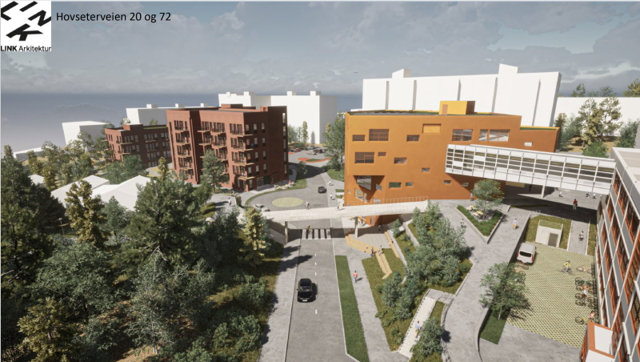
    </a>
    <figcaption><h4>Hovseterveien 20 og 72</h4></figcaption>
</figur>

Det nye skolebygget i Hovseterveien 72, ved Rema 1000, vil få en gangbru. Veien til T-banen vil gå under gangbrua mellom skolebyggene. Den eksisterende brua vil bestå.

Slik bygget er prosjektert, vil det påvirke utsikten noe for dem som bor på østsiden av nr. 68 og delvis i nr. 82 og 84.

Se informasjonsvideoen fra prosjektet:



Besøk også [prosjektets nettsted](https://www.oslo.kommune.no/slik-bygger-vi-oslo/hovseter-skole-utvidelse/).

Nedenfor ser du siste tilgjengelige skisse av skolebygget. Klikk på bildet for større versjon.

<figur>
    <a href="hv2072_2.jpg">
        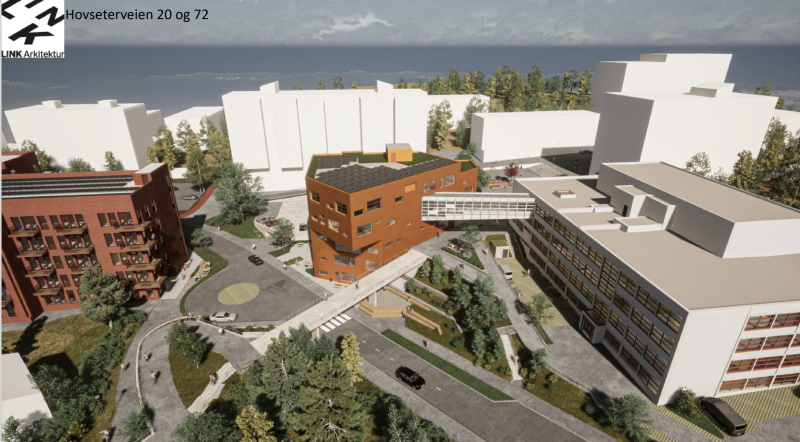
    </a>
    <figcaption><h4>Hovseterveien 20 og 72</h4></figcaption>
</figur>

<figur>
    <a href="hv2072_3.jpg">
        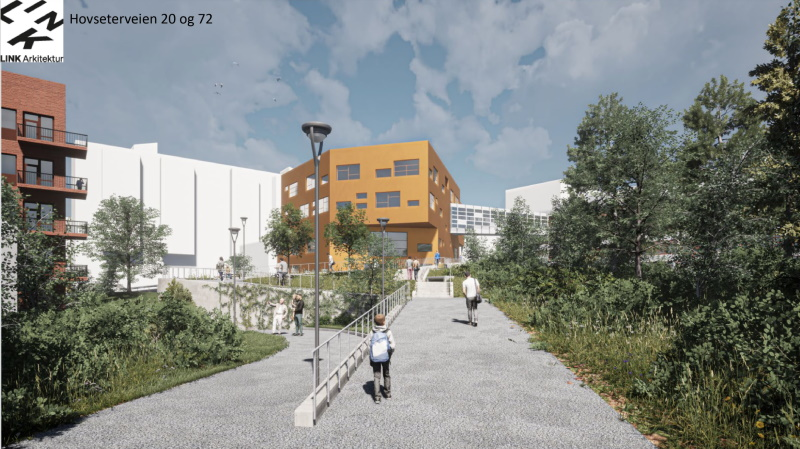
    </a>
    <figcaption><h4>Gangveien opp mot brua gjøres mindre bratt ved å lage en U-sving.</h4></figcaption>
</figur>

<figur>
    <a href="hv2072_4.jpg">
        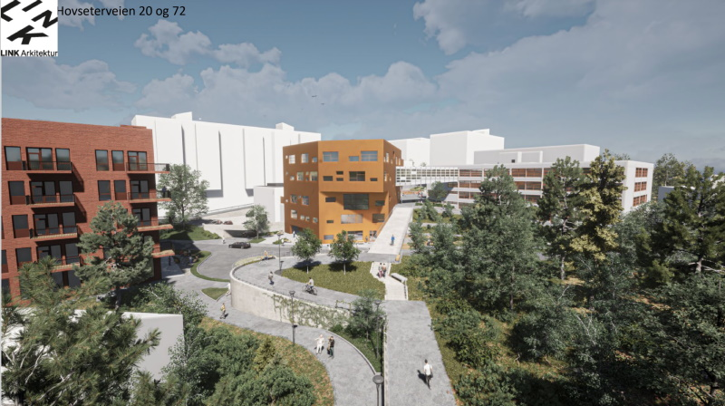
    </a>
    <figcaption><h4>Gangveien opp mot brua gjøres mindre bratt ved å lage en U-sving.</h4></figcaption>
</figur>

<figur>
    <a href="hv2072_5.jpg">
        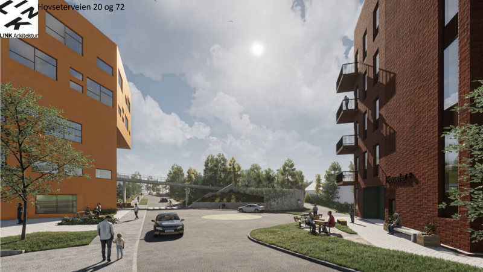
    </a>
    <figcaption><h4>Perspektiv fra litt ovenfor innkjørselen til U3.</h4></figcaption>
</figur>

<figur>
    <a href="hv2072_6.jpg">
        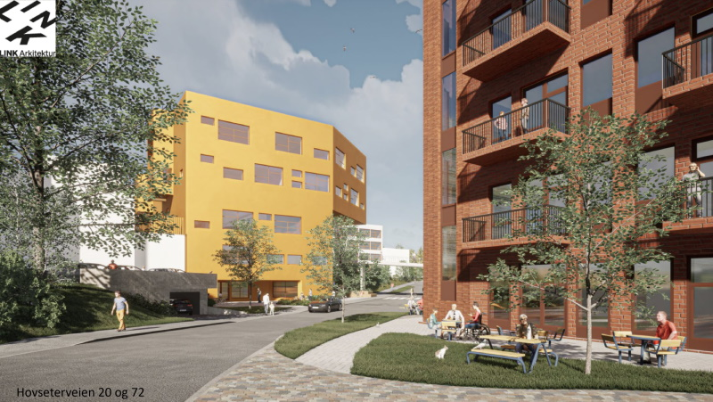
    </a>
    <figcaption><h4>Perspektiv fra innkjørselen til gjesteparkeringen hos Meklenborg.</h4></figcaption>
</figur>

<figur>
    <a href="hv2072_7.jpg">
        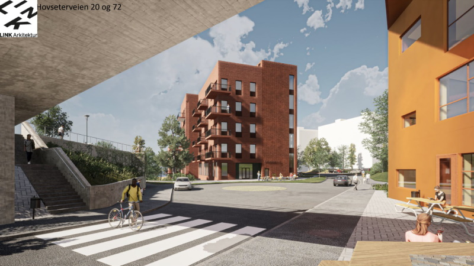
    </a>
    <figcaption><h4>Perspektiv fra under broen mot Hovseterveien 20</h4></figcaption>
</figur>

<figur>
    <a href="hv2072_8.jpg">
        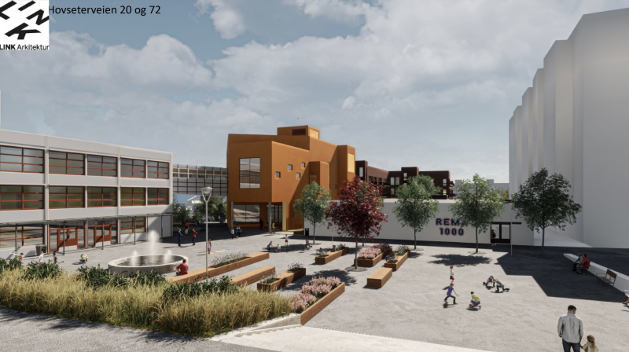
    </a>
    <figcaption><h4>Som del av prosjektet skal Hovseter torg pusses opp.</h4></figcaption>
</figur>

<figur>
    <a href="hv2072_9.jpg">
        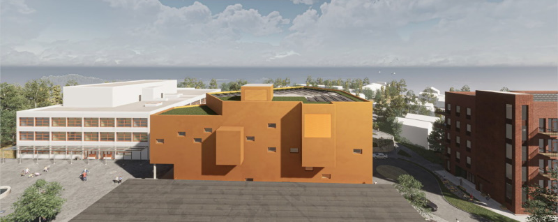
    </a>
    <figcaption><h4>Perspektiv fra ca. femte etasje i Hovseterveien 68 mot Hovseterveien 72.</h4></figcaption>
</figur>

<figur>
    
    <figcaption><h4>Perspektiv fra ca. femte etasje i Hovseterveien 68 mot skolegården.</h4></figcaption>
</figur>

<figur>
    <a href="hv2072_11.jpg">
        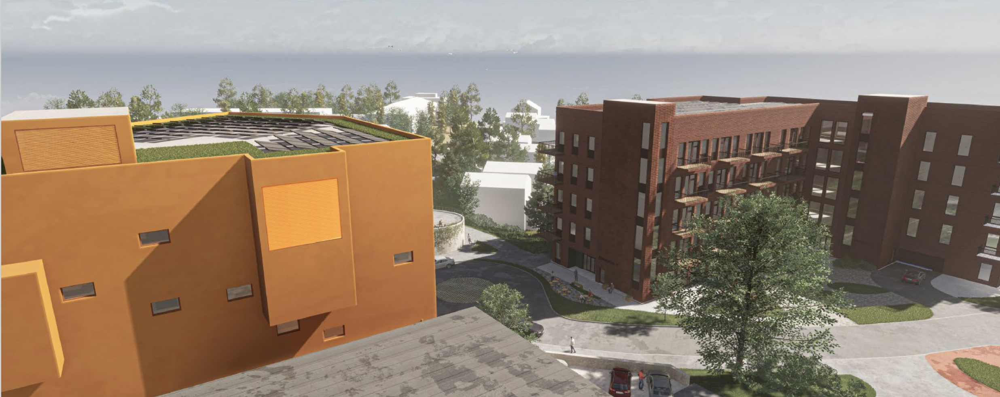
    </a>
    <figcaption><h4>Perspektiv fra ca. femte etasje i Hovseterveien 68 mot Hovseterveien 20.</h4></figcaption>
</figur>

<figur>
    <a href="hv2072_12.jpg">
        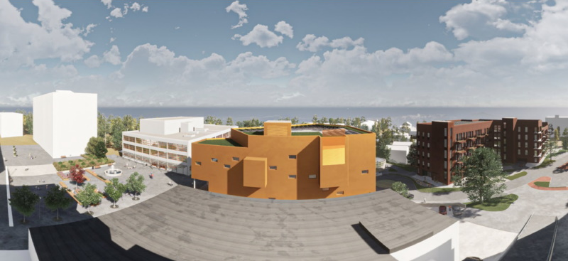
    </a>
    <figcaption><h4>Vidvinkelperspektiv fra ca. femte etasje i Hovseterveien 68.</h4></figcaption>
</figur>

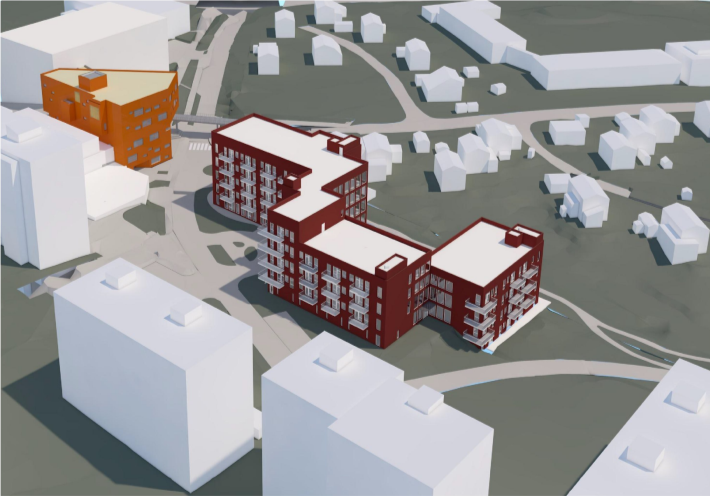

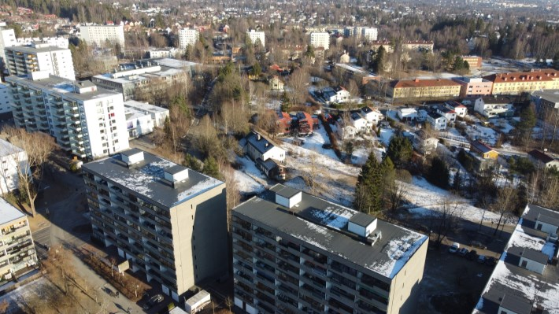

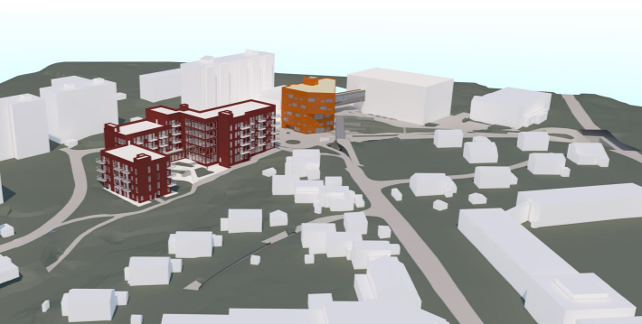

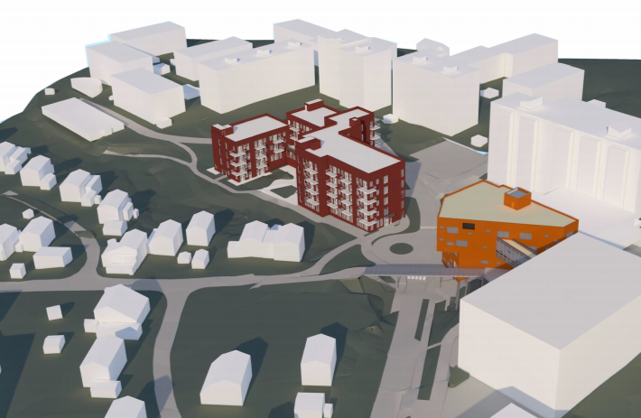

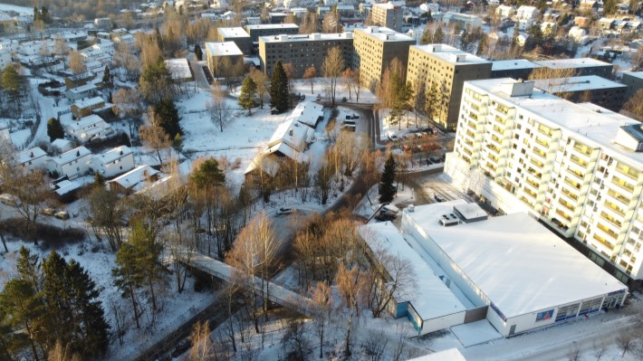

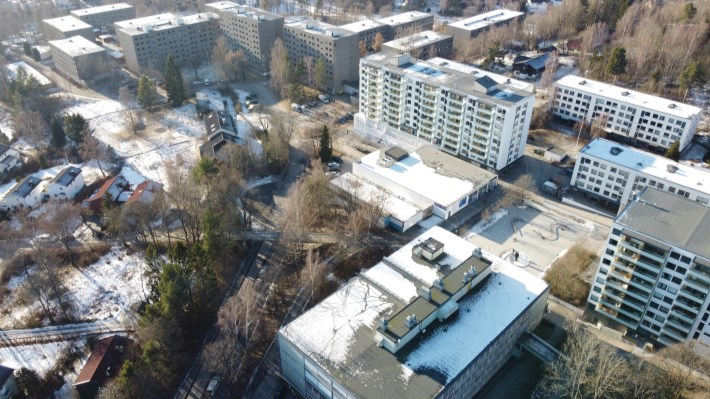

Se flere [detaljer hos Oslo kommune](https://innsyn.pbe.oslo.kommune.no/saksinnsyn/casedet.asp?direct=Y&mode=all&caseno=201617238&Dateparam=07/18/2019&sti=). Se spesielt [planbeskrivelsen](https://innsyn.pbe.oslo.kommune.no/saksinnsyn/showfile.asp?jno=2021158288&fileid=9937835) til forslaget om detaljregulering av Hovseterveien.

{}
