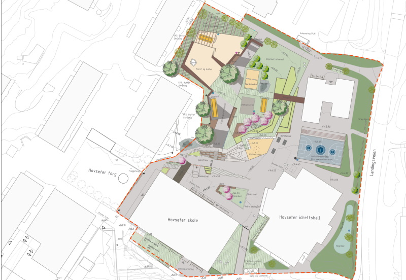

<!-- markdownlint-disable MD033 -->
Arbeidet vil være ferdig høsten 2024 for skolen.

Arbeidet må også sees i sammenheng med arbeidet [Hovseterveien 70](../hovseterveien2072)

<figur>
    
    <figcaption><h4>Som del av prosjektet vil Hovseter torg pusses opp</h4></figcaption>
</figur>

<figur>
    
    <figcaption><h4>Perspektiv fra Hovseterveien 68 ca 5 etasje mot skolegård</h4></figcaption>
</figur>

<figur>
    
    <figcaption><h4>Det bygges ny og flott skolepark som blir nærmeste nabo til 84</h4></figcaption>
</figur>

Se mer [detaljer hos Oslo Kommune](https://innsyn.pbe.oslo.kommune.no/saksinnsyn/casedet.asp?direct=Y&mode=all&caseno=202013563).

{}
