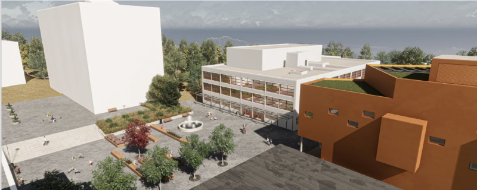
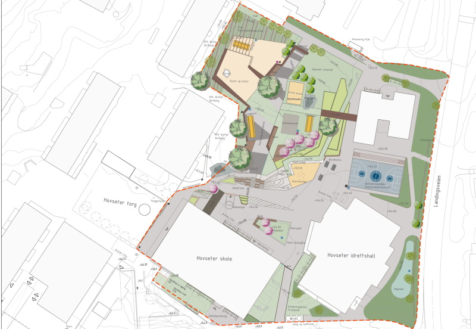

<!-- markdownlint-disable MD033 -->
Prosjektet er ferdigstilt. Hovseter skole er rehabilitert og utvidet med nytt skolebygg, idrettshall, skolepark og oppgraderte uteområder. Skolen og ungdomshuset B7 er tatt i bruk.

Prosjektet må ses i sammenheng med planene for [Hovseterveien 20 og 72](../hovseterveien2072). Fremdriften for de planlagte omsorgsboligene i Hovseterveien 20 er fortsatt uavklart.

[Se oppdatert bilde og informasjon om Hovseter skole](../../kindergardenschools/schools/)

Illustrasjonene nedenfor er fra planleggingsfasen.

<figur>
    
    <figcaption><h4>Planillustrasjon av oppgraderingen av Hovseter torg.</h4></figcaption>
</figur>

<figur>
    
    <figcaption><h4>Perspektiv fra ca. femte etasje i Hovseterveien 68 mot skolegården.</h4></figcaption>
</figur>

<figur>
    
    <figcaption><h4>Planillustrasjon av skoleparken ved nr. 84.</h4></figcaption>
</figur>

Se flere [detaljer hos Oslo kommune](https://innsyn.pbe.oslo.kommune.no/saksinnsyn/casedet.asp?direct=Y&mode=all&caseno=202013563).

{}
