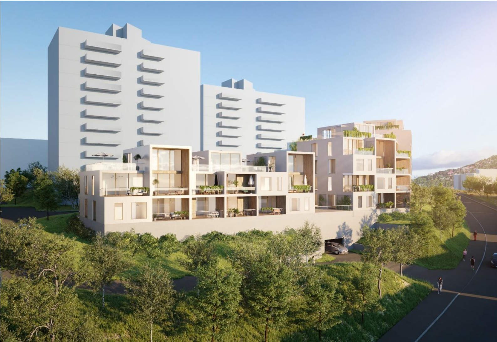

Garasjeanlegget i Landingsveien 14 er revet. Setra borettslag leide 56 parkeringsplasser i anlegget og hadde en 50-årig bruksrett til plassene fra 1. januar 1975. Konkursboet etter den tidligere eieren sa opp plassene.

Prosjektet omfatter et nytt underjordisk parkeringsanlegg og tre boligbygg. Utbygger selger parkeringsplasser til interesserte i området.

## Bakgrunn og tidligere planer

[Byggeplanen ble lagt ut til offentlig ettersyn 14.04.2021](https://innsyn.pbe.oslo.kommune.no/saksinnsyn/showfile.asp?jno=2021028784&fileid=9491411)

[Se detaljer hos Plan- og bygningsetaten.](https://innsyn.pbe.oslo.kommune.no/saksinnsyn/casedet.asp?caseno=201613348)

{}
