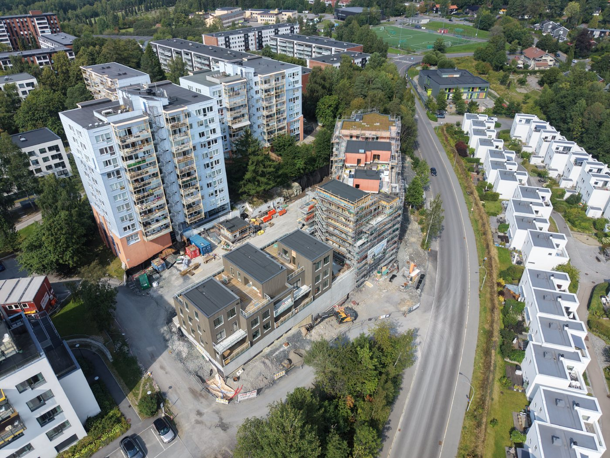

## Status per 15. august 2026

Byggearbeidene i Landingsveien 14 er i full gang. Flere av boligbyggene er reist, og arbeidene med boligene, uteområdene og det underjordiske parkeringsanlegget fortsetter.

Prosjektet omfatter et nytt underjordisk parkeringsanlegg og tre boligbygg. Utbygger selger parkeringsplasser til interesserte i området.

## Bakgrunn og tidligere planer

Det tidligere garasjeanlegget er revet. Setra borettslag leide 56 parkeringsplasser i anlegget og hadde en 50-årig bruksrett til plassene fra 1. januar 1975. Konkursboet etter den tidligere eieren sa opp plassene.

[Byggeplanen ble lagt ut til offentlig ettersyn 14.04.2021](https://innsyn.pbe.oslo.kommune.no/saksinnsyn/showfile.asp?jno=2021028784&fileid=9491411)

[Se detaljer hos Plan- og bygningsetaten.](https://innsyn.pbe.oslo.kommune.no/saksinnsyn/casedet.asp?caseno=201613348)

{}
