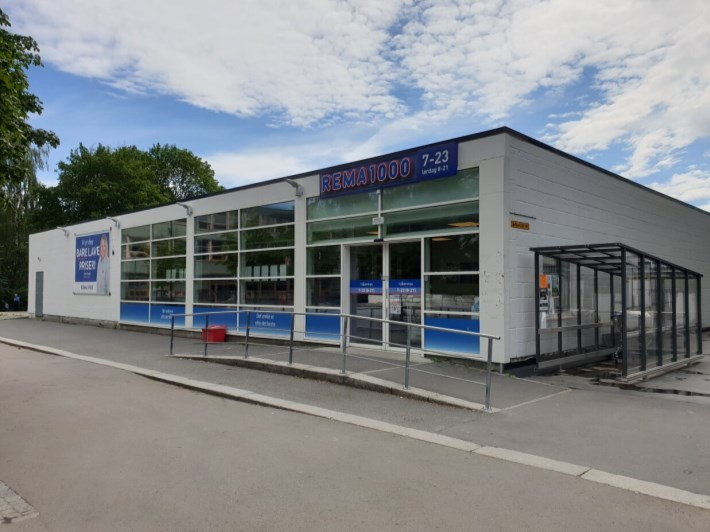
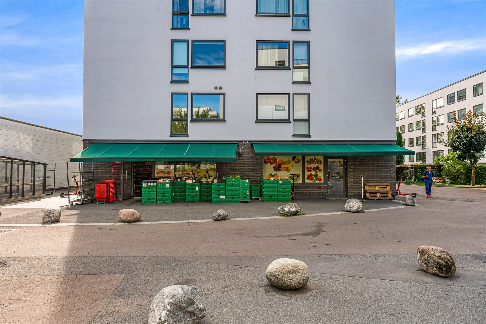
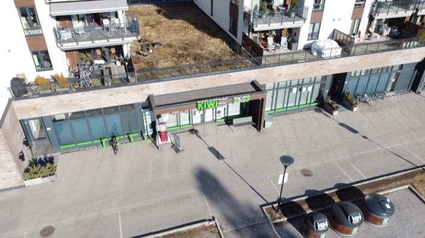
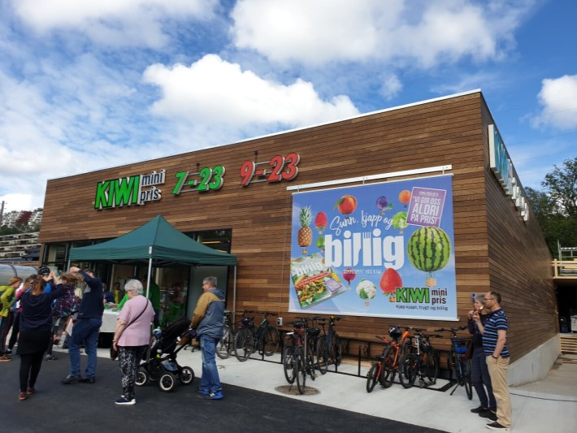

På denne siden finner du en oversikt over dagligvarebutikker i gangavstand fra Setra borettslag. Avstandene er målt fra Hovseter Torg.

## Rema 1000 Hovseter - 0 meter

Rema 1000 på Hovseter er en ny og flott butikk som åpnet i 2017. Her finner du det du trenger til hverdagen.

Åpningstidene er kl. 7–23 på hverdager og kl. 8–21 på lørdager.

[Se hjemmeside for info](https://www.rema.no/butikker/oslo/oslo/rema-1000-hovseter/)

[Facebook-side til butikken](https://www.facebook.com/REMA1000Hovseter)

[Se bilder fra innsiden på Google Maps](https://www.google.com/maps/place/REMA+1000+Hovseter/@59.949548,10.6535963,15z/data=!4m2!3m1!1s0x0:0xe41c5eaff05cff5c?sa=X&ved=2ahUKEwjR277t98XjAhUGwMQBHVPAA8MQ_BIwCnoECA8QCA)

## Hovseter frukt og grønt - 0 meter - Søndagsåpent

Hovseter frukt og grønt har et godt utvalg av frukt og grønnsaker i tillegg til et godt og variert tilbud.

Åpningstidene er kl. 8.30–19.00 på hverdager og kl. 10.00–18.00 på søndager.

[Se hjemmesiden med bilder](https://hovseter-frukt-og-grnt.business.site/)

[Se Facebook-side](https://www.facebook.com/hovseterfruktgront/)

## Coop Extra Huseby - 450 meter

Coop Extra Huseby ligger ved Hovseter T-banestasjon. Her finner du også nærmeste Post i butikk.

[Se Facebook-side](https://www.facebook.com/extrahuseby)

[Se hjemmeside](https://coop.no/butikker/extra/huseby-4369/)

## Meny Røa - 800 meter

En av Norges flotteste butikker. Helt ny. [Kåret til Norges 2. beste butikk i 2021](https://dagligvarehandelen.no/nyheter/2021/arets-matgledebutikker-er-karet)

[Se Facebook-side](https://www.facebook.com/MenyRoa)

## Rema 1000 Røa - 800 meter

## Rema 1000 Arnebråteveien - 800 meter

## Coop Mega Røa - 850 meter

En av Norges flotteste butikker. Helt ny. [Kåret til Norges 3. beste butikk i 2021](https://dagligvarehandelen.no/nyheter/2021/arets-matgledebutikker-er-karet)

[Se Facebook-side](https://www.facebook.com/coopmegaroa)

## Rema 1000 Stasjonsveien - 900 meter

## Kiwi Røa - 1100 meter

[Se mer informasjon på Google Maps](https://www.google.no/maps/place/Kiwi+R%C3%B8a/@59.9462744,10.6431143,17z/data=!3m1!4b1!4m12!1m6!3m5!1s0x46416d63d0856ce7:0x9cb2ba3ff2249e4!2sKIWI+Bogstad!8m2!3d59.9625449!4d10.6441513!3m4!1s0x46416d728d3f780f:0x1904336ade84e597!8m2!3d59.9462717!4d10.645303)

## Joker Vækerøveien - 1500 meter - Søndagsåpent

## Joker Ullerntoppen - 1700 meter - Søndagsåpent

## Kiwi Bogstad - 1800 meter - Søndagsåpent

Kiwi åpnet en ny butikk på Bogstad i juli 2019. Den er søndagsåpen og holder åpent kl. 7–23 hver dag.

[Se mer informasjon på Google Maps](https://www.google.no/maps/place/KIWI+Bogstad/@59.9625449,10.6431764,18z/data=!4m5!3m4!1s0x46416d63d0856ce7:0x9cb2ba3ff2249e4!8m2!3d59.9625449!4d10.6441513)

{}
