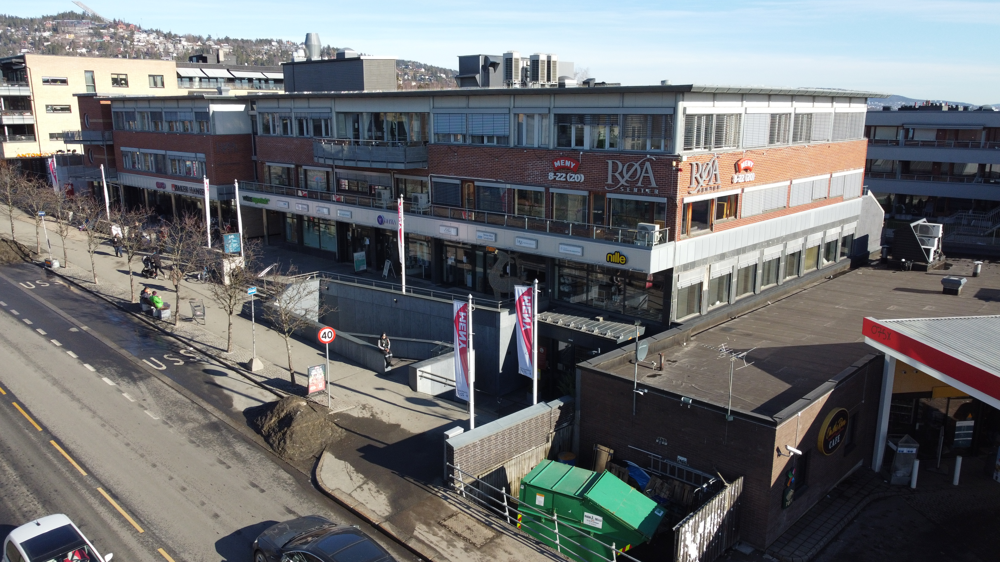
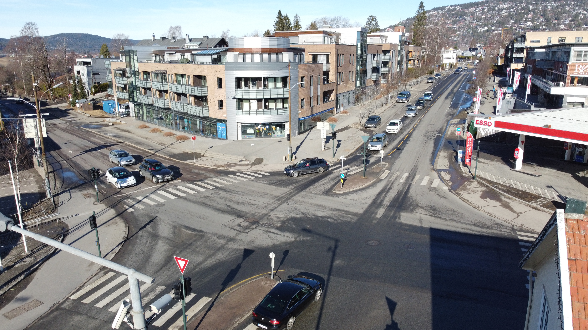

På Røa senter finner du en rekke butikker. Avstanden er bare 425 meter i luftlinje fra Setra. Man går direkte til Røa via Hovseterdalen for kortest mulig vei.

Butikker du finner her er blant annet

- Anton Sport
- Ark Bokhandel
- Baker Hansen
- Fredrik & Louse Parfymeri
- Kid Interiør
- Meny
- Mester Grønn
- Mister Minit
- Musti Dyrebutikk
- Nille
- Vita
- Vitus Apotek

[Se komplett oversikt på hjemmesiden](https://roasenter.no/butikkoversikt/)

Røa torg  er et splitter nytt kjøpesenter på Røa som ble åpnet vinteren 2021. I luftlinje ligger senteret 570 meter unna Setra borettslag.

Her finner du en rekke butikker.

- Aire
- Apotek 1 Røa
- Blade Beauty
- Blade Studio
- Brillemagi
- Cashmere House
- Christiania Glasmagasin
- Coop Mega
- Floriss
- Krogh Optikk
- Lively Home
- Lively Me
- Min Beste venn
- Norli
- Olivelle
- Princess Interiør
- Sunkost
- Strikkemagi
- Thune
- VIC
- Vinmonopolet

[Se komplett oversikt på hjemmesiden](https://roatorg.no/butikker/)

## Røa bok og leker

På Røa bok og leker finner du et godt utvalg av leker og bøker. 675 meter i luftlinje. 

[Se facebooksiden til butikken](https://www.facebook.com/roaleker/) 

Jernia ligger midt i Røa krysset.

[Se hjemmeside](https://www.jernia.no/store/Jernia%20R%C3%B8a)

{}
