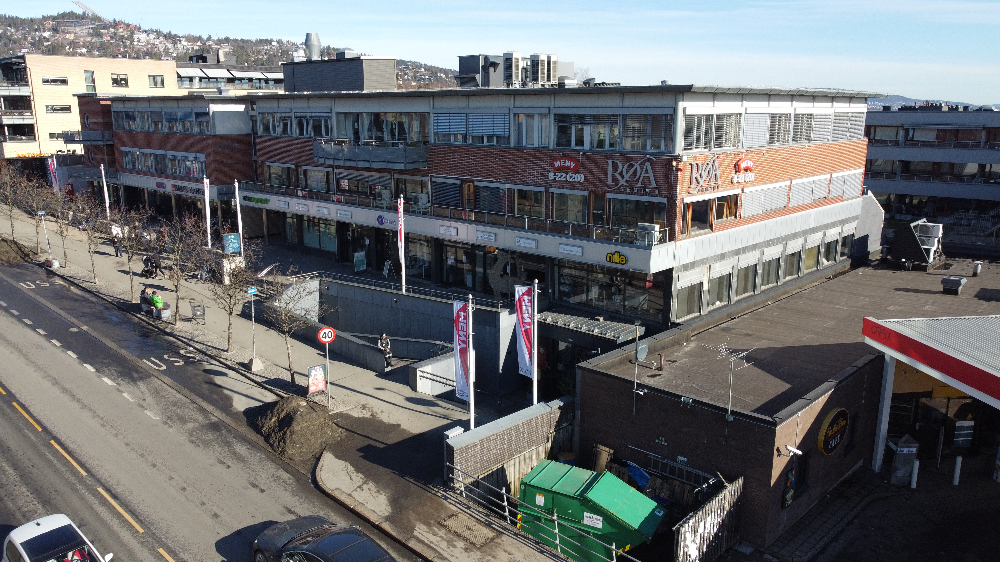
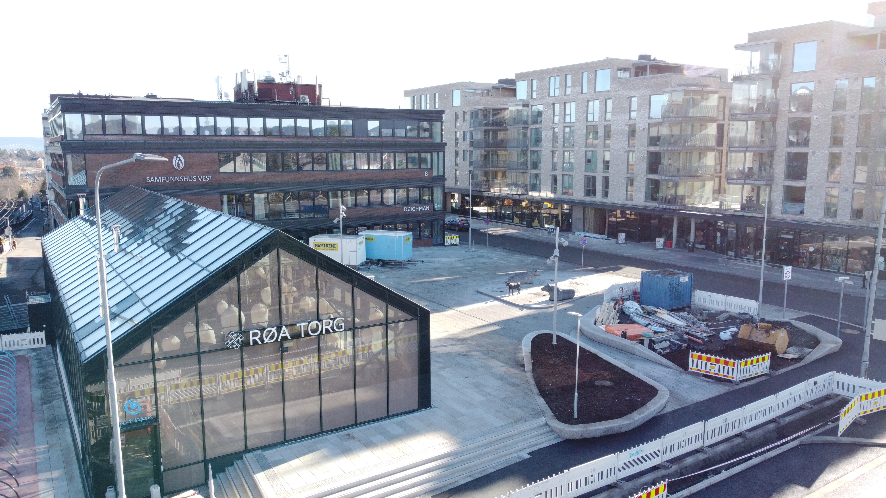
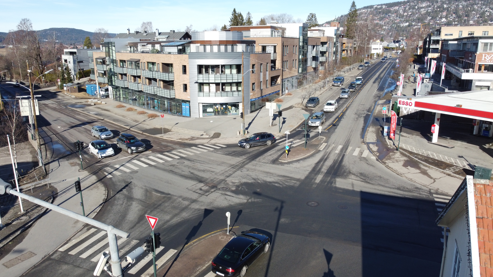

På Røa senter finner du en rekke butikker. Avstanden i luftlinje fra Setra er bare 425 meter. Den korteste gangveien går gjennom Hovseterdalen.

Her finner du blant annet:

- Anton Sport
- Ark Bokhandel
- Baker Hansen
- Fredrik & Louisa Parfymeri
- Kid Interiør
- Meny
- Mester Grønn
- Mister Minit
- Musti Dyrebutikk
- Nille
- Vita
- Vitus Apotek

[Se hele butikkoversikten på nettstedet](https://roasenter.no/butikkoversikt/).

Røa torg er et kjøpesenter på Røa som åpnet vinteren 2021. Senteret ligger 570 meter fra Setra borettslag i luftlinje.

Her finner du en rekke butikker.

- Aire
- Apotek 1 Røa
- Blade Beauty
- Blade Studio
- Brillemagi
- Cashmere House
- Christiania Glasmagasin
- Coop Mega
- Floriss
- Krogh Optikk
- Lively Home
- Lively Me
- Min Beste venn
- Norli
- Olivelle
- Princess Interiør
- Sunkost
- Strikkemagi
- Thune
- VIC
- Vinmonopolet

[Se hele butikkoversikten på nettstedet](https://roatorg.no/butikker/).

## Røa bok og leker

Røa bok og leker har et godt utvalg av leker og bøker. Butikken ligger 675 meter fra Setra i luftlinje.

[Se Facebook-siden til butikken](https://www.facebook.com/roaleker/).

Jernia ligger midt i Røakrysset.

[Se butikkens nettsted](https://www.jernia.no/store/Jernia%20R%C3%B8a).

{}
