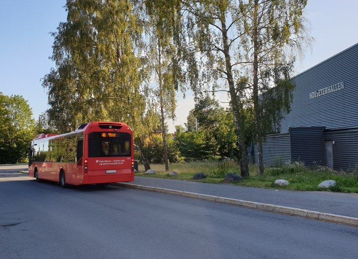
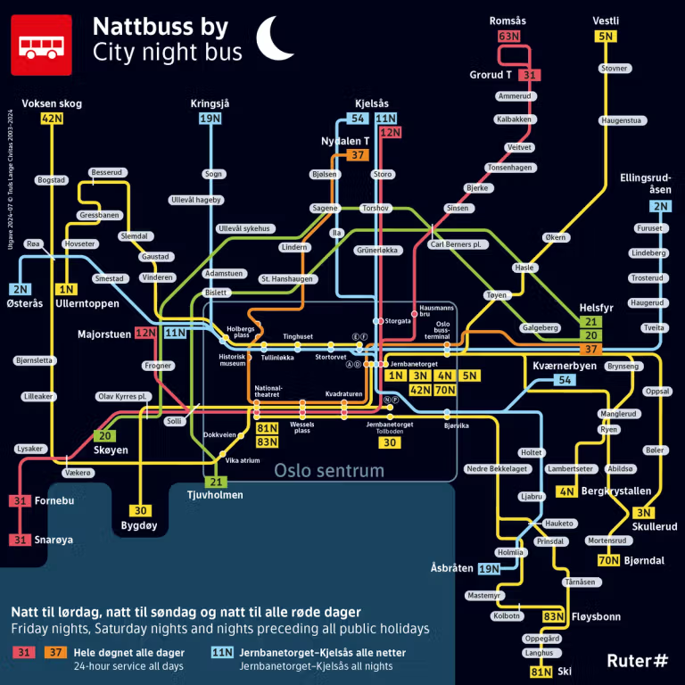

Flere busslinjer stopper i nærheten av Setra borettslag.

## Hovseter skole

Her stopper buss 46 mellom Ullerntoppen og Majorstuen samt nattbuss N1.

[Se avgangstider](https://ruter.no/reiseplanlegger/?departures=true&departureMode=bus&departureStop=%7B%22id%22%3A%22NSR%3AStopPlace%3A6365%22%2C%22name%22%3A%22Hovseter+skole%22%2C%22county%22%3A%22Oslo%22%2C%22locality%22%3A%22Oslo%22%2C%22coordinates%22%3A%7B%22x%22%3A10.656557%2C%22y%22%3A59.949485%7D%2C%22category%22%3A%5B%22onstreetBus%22%5D%7D)

## Huseby skole

Enkelte avganger på Flybussen Connect linje FB3 går til og fra Huseby skole. Den ordinære ruten har Radiumhospitalet som endepunkt, så sjekk alltid den aktuelle avgangen før du reiser.

[Sjekk avgang og pris hos Flybussen](https://www.flybussen.no/).

## Røa kirke

Her stopper buss 32 mellom Kværnerbyen og Voksen skog samt buss 41 til Sørkedalen.

[Se avgangstider](https://ruter.no/reiseplanlegger/?departures=true&departureMode=bus&departureStop=%7B%22id%22%3A%22NSR%3AStopPlace%3A6390%22%2C%22name%22%3A%22R%C3%B8a+kirke%22%2C%22county%22%3A%22Oslo%22%2C%22locality%22%3A%22Oslo%22%2C%22coordinates%22%3A%7B%22x%22%3A10.644247%2C%22y%22%3A59.950017%7D%2C%22category%22%3A%5B%22onstreetBus%22%5D%7D).

## Nattbuss

Hovseter har et godt nattbusstilbud. Tre nattbusslinjer kjører forbi natt til lørdag og søndag, så det er enkelt å komme seg hjem fra byen uten taxi. N1 stopper ved Hovseter skole, N2 ved Huseby skole og N32 ved Røa kirke.

{}
