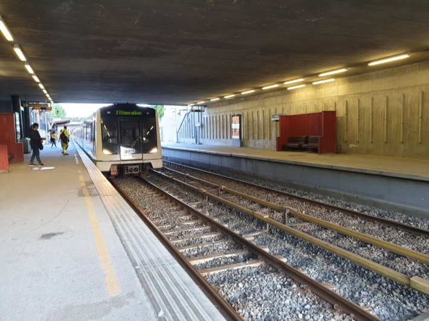

Linje 2 betjener Hovseter stasjon, med åtte avganger i timen.

[Se avganger hos Ruter](https://ruter.no/reiseplanlegger/?departures=true&departureStop=%7B%22id%22%3A%22NSR%3AStopPlace%3A58275%22%2C%22name%22%3A%22Hovseter%22%2C%22county%22%3A%22Oslo%22%2C%22locality%22%3A%22Oslo%22%2C%22coordinates%22%3A%7B%22x%22%3A10.655462%2C%22y%22%3A59.946404%7D%2C%22category%22%3A%5B%22metroStation%22%2C%22onstreetBus%22%5D%7D)

{}
