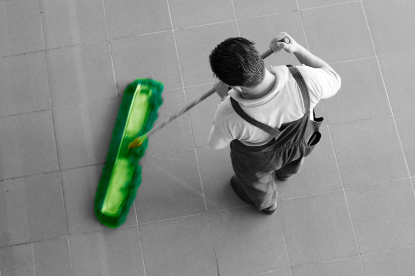

Vask gjennomføres på torsdager i lavblokkene og fredager i høyblokkene. De vasker høyblokkene med stor gulvvaskemaskin for å sikre et rent og pent miljø i høyblokkene.
For å sikre et effektivt renhold må alle ta inn dørmatten før renholdsfirma begynner med vasking på torsdag og fredag morgen. Den kan legges ut igjen når det er vasket.

{}
