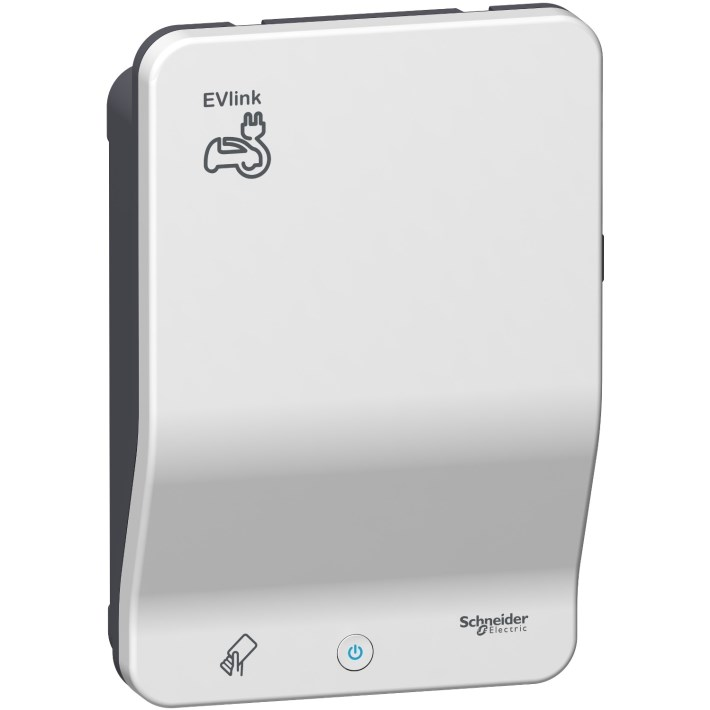

Det ble vedtatt 5. februar 2019 å inngå avtale med Mer (tidligere Grønn Kontakt) om installasjon av et slikt anlegg. Arbeidet omfattet infrastruktur til alle de 157 plassene og ladebokser til dem som ønsket det. Elbilanlegget var klart til bruk 18. september 2019. Arbeidet kostet totalt kr 768 733,75.

Det ble også søkt Oslo kommune om støtte til ladeinfrastrukturen gjennom [kommunens støtteordning](https://www.oslo.kommune.no/politikk-og-administrasjon/tilskudd-legater-og-stipend/tilskudd-til-ladeinfrastruktur-i-borettslag-og-sameier/#gref). Borettslaget fikk utbetalt kr 153 747 i støtte.

## Hva koster det å lade?

Strømmen til elbilladingen går over et abonnement betalt av borettslaget. Denne utgiften må dekkes av de som bruker strøm til elbilladingen. 

Det er borettslagets styre som setter prisen på lading. Prisen settes basert på prinsippet om at borettslaget ikke skal tjene eller tape penger på elbilladingen. 
Prisen vil derfor settes basert på gjennomsnittlig strømpris med avgifter.

I tillegg må hver boenhet inngå avtale med Wattif og betale abonnementskostnaden i tillegg til strømprisen i anlegget.

På Min side hos Wattif får den enkelte brukeren oversikt over eget forbruk og samlet ladestatistikk.

Wattif er ansvarlig for brukerstøtte og fakturering.

## Om ladeboksen

Ladeboksen som Mer har montert i Hovseterveien 70, er en Schneider EVLink EVB1A22P2RI som kan levere opptil 22 kW. I borettslaget er den konfigurert for lading med opptil 7,2 kW.

Kapasiteten begrenses av strømnettet på Hovseter. Dette er et såkalt 230-volts TN-nett.

Boksen har uttak for en type 2-kabel, som vanligvis følger med elbilen. Videoen viser hvordan du starter lading. I borettslaget bruker vi brikke i stedet for kort, og anlegget har ikke elsykkelladingen som vises i videoen.

## Hvordan bestiller jeg?

Ladeboks og montering bestilles direkte fra leverandøren. Se [oppdatert informasjon på Vibbo](https://vibbo.no/setra/tema/elbil-lader) før du bestiller.
 
**Spørsmål:** Hva er et lastbalansert anlegg?

**Svar:** Du kan lese en [god forklaring](https://no.mer.eco/nyheter/hjemmelading/hva-er-lastbalansering/) hos Mer.

**Spørsmål:** Hvor stor kapasitet får anlegget totalt?

**Svar:** Anlegget dimensjoneres for totalt 750 A, og hver etasje får en strømskinne dimensjonert for 250 A. Det er montert en hovedsikring på 400 A, med maksimal bruk på 125 A. Et 230-volts trefaseanlegg i et IT-nett gir en maksimal kapasitet på 49,7 kW. Dette kan teoretisk utvides til 298 kW senere.
