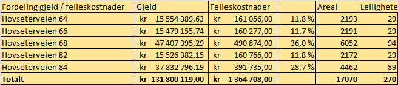
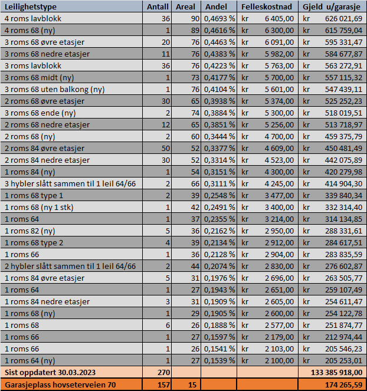

Hver leilighet i borettslaget har felleskostnader og fellesgjeld. Disse varierer basert på en rekke egenskaper med leilighetene.

### Hva dekker felleskostnadene

Felleskostnadene dekker utgifter som strøm til varmtvann, TV, Internett, renovasjon og renter/avdrag på fellesgjeld. 

Foran hver generalforsamling så legges det frem detaljert regnskap for året før og budsjett for det inneværende. Disse finner du her. 

### Hvordan fordeles felleskostandene?

Felleskostnadene fordeles basert på fordelingsnøkkelen til hver leilighet. Nedenfor vises en tabell for regnskapet for 2020 som viser de største kostnadene som ikke dekkes av nye lån.  (Altså ikke fasade og vvs prosjektene).

Totalsummen samt fordelingen av disse kostnadene pr leilighetstype basert på fordelingsnøkkelen. 

### Felleskostnadene har steget en god del i 2017-2018. Når vil de bli satt ned igjen til tidligere nivå?

Lånene som betjenes med fellesgjelden har en nedbetalingsplan på 30 og 40 år. Dette betyr at man kan ikke forvente at husleien vil gå ned igjen. Innen 30 år er det sikkert behov for andre prosjekt som krever nye lån. I løpet av 2021 vil det bli gjort en vurdering for behov for justeringer. Siste justering ble effektiv januar 2019. Siden den gang har ingen beboere fått endret hva som må innbetales.

## Hva dekker fellesgjelden

Borettslaget har forskjellige lån tatt opp til forskjellige behov over tid. Eksempler på lån som er tatt opp nylig er rør og våtromsprosjektet, kjøp av garasje og fasadeprosjekt.

Lånene er.

### OBBK02

- Saldo: 29 201 526,00
- Antall terminer:
- Månedlig terminer til september 2047

Gjelder kjøp av garasjer i Hovseterveien 70. Fordeles på leiligheter med garasje i Hovseterveien 70 (157 plasser)

### OBOS08

- Saldo: 75 375 629,00
- Antall terminer:
- Månedlig terminer til april 2059

Lån til fasadeprosjekt. Dette er nå fullt ut belastet og vil ikke øke mer.

### OBOS09

- Saldo: 6 560 401
- Antall terminer:
- Månedlig terminer til april 2039

Lån til tidligere vedlikehold.

### OBOS04

- Saldo: 56 363 894,00
- Antall terminer:
- Månedlig terminer til november 2047

Lån til bad og våtroms rehabilitering.

## Hvordan fordeles fellesgjelden

Fordelingen av fellesgjelden avhenger av hva gjelden er tatt opp for. Noe av fellesgjelden fordeles jevnt på leilighetene, mens annen gjeld fordeles i henhold til fordelingsnøkkelen.

F.eks fordeles gjelden på garasjen likt på alle leiligheter med garasjeplass i Hovseterveien 70, mens gjelden på Fasadeoppussingen vil fordeles ved hjelp av fordelingsnøkkelen. 

### Hva er fordelingsnøkkelen?

Fordelingsnøkkelen er en nøkkel som hver leilighet har og som ble definert i det borettslaget ble opprettet. Den sier noe om hvor stor andel av fellesgjeld man står til ansvar for. 

### Hvordan ble fordelingsnøkkelen min definert?

Nøkkelen er et resultatet av flere faktorer. Størrelsen på leiligheten er en av faktorene, hvilken etasje man bor i er en annen faktor. Frem til 2018 var også om man hadde garasjeplass en slik faktor, men dette ble trukket ut slik at f.eks kostnadene til fasadaprosjekt ikke skal avhenge om man har parkeringsplass eller ikke.  Fordelingsnøkkelen ble definert i 1978 basert på hvor stort innskudd hver leilighet måtte stå for når de ble solgt første gang. (innskuddskapitalen varierte mellom 7.400 for de minste hyblene til 40.900,- for 4 roms med garasje. 

### Hva er min fordelingsnøkkel?

Dette er en nøkkel som Obos sitter på å benytter når de fordeler. Samlet sett står alle andelene for 100% av utgiftene og gjelden til borettslaget. Se nederst for fordelingsnøkker for de forskjellige leilighetene.

### Hvordan regner jeg ut min andel av et lån

Hvis lånet du ønsker å regne ut skal fordeles via fordelingsnøkkelen så tar man lånesummen og ganger med sin fordelingsnøkkel. Dette gjør Obos

Eksempel. Totallån utenom garasje på 139.203.368 * 0,004693* = 653.324,-  

Se nederst for utregning pr leilighetstype

Oversikt over gjeld/fellesutgifter pr bygg

 

### Når blir lånet fordelt?

Lånet blir fordelt i det lånet benyttes til å betale kostnader. Det betyr at det kan gå lang tid fra lånet blir tatt opp til at fordelingen skjer. For øyeblikket er alt av de store lånene utbetalt og fordelt. Det er ikke planer om noen nye lån på nåværende tidspunkt.

### Når får man økt felleskostnader grunnet lån?

Bankene krever typisk at man øker felleskostnaden til nødvendig nivå for å betjene lånet før det innvilges. F.eks så betaler man lemge på nivået som er nødvendig for fasadeprosjektet selv om det ikke var utbetalt noe eller man hadde begynt å betale ned på det. 

### Hvordan bestemmes min andel av lånekostnadene som går inn på felleskostnaden? 

Når et lån tas opp vil nebetalingsplanen og rentenivået avgjøre hvor stor lånekostnad borettslaget har hver måned. Hver måned vil borettslaget betale inn renter og avdrag. Denne kostnaden fordeles utover leilighetene. For lån som fasadelånet benyttes fordelingsnøkkelen for å fordele kostnadene på leilighetene. For lån som garasjelånet fordeles dette flatt utover leilighetene.

Renteendringer ville kunne medføre endringer i det månedelige beløpet som gjør at også leilighetene vil få en endring. Borettslaget gjør en jevnlig vurdering basert på rentenivå om at innbetalingene fra leilighetene er riktig. 

Nedenfor ser du de forskjellige leilighetstypene med fellesgjeld nå. Hvis du i tilegg har garasjeplass i Hovseterveien 70 må den legges til. Utregningen er basert på hvordan OBOS rapporterer dette til skattemyndighetene. 

{}
