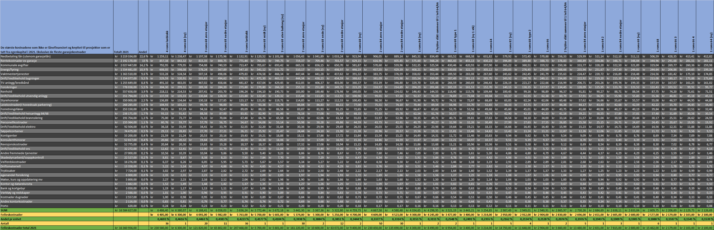
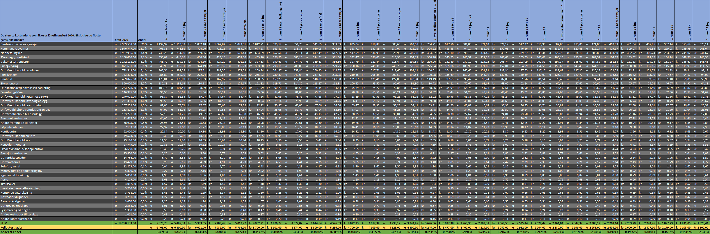
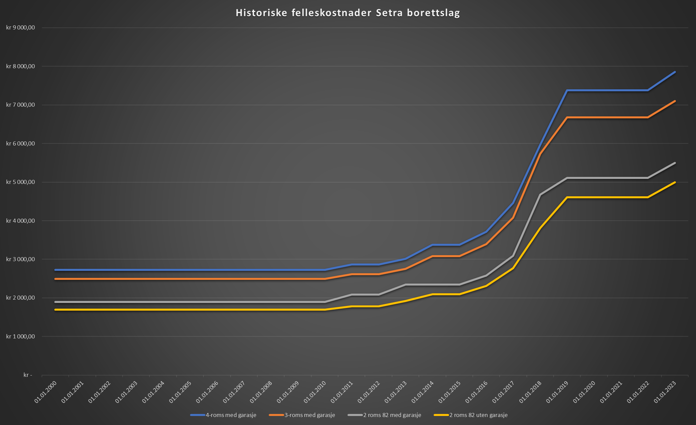
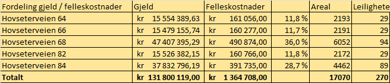
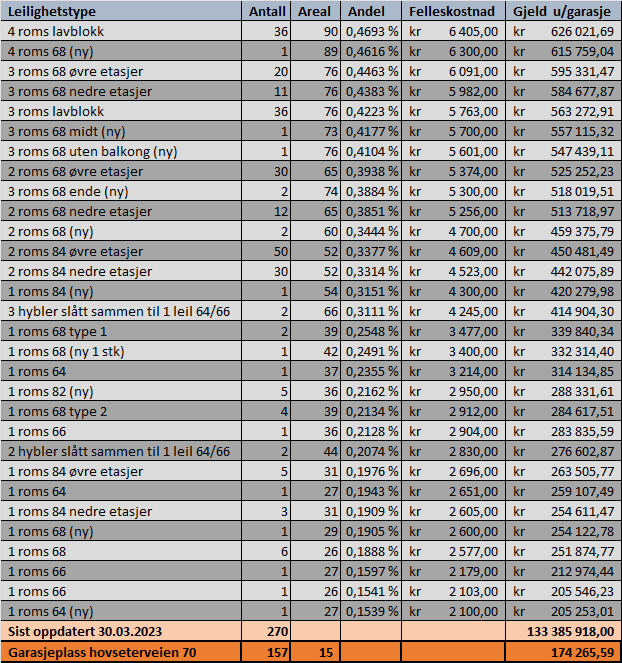

Hver leilighet i borettslaget har felleskostnader og fellesgjeld. Beløpene varierer ut fra egenskapene ved leiligheten.

### Hva dekker felleskostnadene?

Felleskostnadene dekker blant annet strøm til varmtvann, TV, internett, renovasjon samt renter og avdrag på fellesgjeld.

Før hver generalforsamling legges det frem et detaljert regnskap for året før og et budsjett for inneværende år.

### Hvordan fordeles felleskostnadene?

Felleskostnadene fordeles etter fordelingsnøkkelen til hver leilighet. Tabellene nedenfor viser de største kostnadene i regnskapene for 2021 og 2020 som ikke ble dekket av nye lån. Fasade- og VVS-prosjektene er derfor ikke tatt med.

De viser både totalsummen og fordelingen per leilighetstype basert på fordelingsnøkkelen.

### Felleskostnadene steg mye i 2017–2018. Når blir de satt ned til tidligere nivå?

Lånene som betjenes gjennom fellesgjelden, har nedbetalingsplaner på 30 og 40 år. Man kan derfor ikke forvente at felleskostnadene går ned til tidligere nivå. I løpet av denne perioden vil det trolig også bli behov for andre prosjekter som krever nye lån.

Fra 1. januar 2023 økte felleskostnadene med 10 %. Dette skyldtes hovedsakelig høyere kommunale avgifter og rentekostnader. Det skulle gjøres en ny vurdering våren 2023 av behovet for ytterligere justeringer.

Grafen nedenfor viser utviklingen av felleskostnader over tid for utvalgte leilighetstyper. Endringene er relativt like store på alle typer.

## Hva dekker fellesgjelden

Borettslaget har over tid tatt opp lån til forskjellige formål. Nyere eksempler er rør- og våtromsprosjektet, kjøpet av garasjen og fasadeprosjektet.

Lånene var på totalt kr 158 417 856 per 14. november 2023.

### OBBK02

- Saldo: kr 26 617 737 
- Månedlige terminer til september 2047

Gjelder kjøp av garasjer i Hovseterveien 70. Fordeles på leiligheter med garasje i Hovseterveien 70 (157 plasser)

### OBBK04

- Saldo:  kr 53 089 235 
- Månedlige terminer til november 2047

Lån til rehabilitering av bad og våtrom.

### OBOS08

- Saldo:  kr 72 794 480
- Månedlige terminer til april 2059

Lån til fasadeprosjekt.

### OBOS09

- Saldo:  kr 5 916 404
- Månedlige terminer til april 2039

Lån til tidligere vedlikehold.

## Hvordan fordeles fellesgjelden

Fordelingen av fellesgjelden avhenger av hva gjelden er tatt opp for. Noe av fellesgjelden fordeles jevnt på leilighetene, mens annen gjeld fordeles i henhold til fordelingsnøkkelen.

For eksempel fordeles gjelden på garasjen likt mellom alle leiligheter med garasjeplass i Hovseterveien 70, mens gjelden fra fasadeoppussingen fordeles ved hjelp av fordelingsnøkkelen.

### Hva er fordelingsnøkkelen?

Fordelingsnøkkelen ble definert da borettslaget ble opprettet. Den angir hvor stor andel av fellesgjelden hver leilighet er ansvarlig for.

### Hvordan ble fordelingsnøkkelen min definert?

Nøkkelen er et resultat av flere faktorer, blant annet størrelsen på leiligheten og hvilken etasje den ligger i. Frem til 2018 var garasjeplass også en faktor. Dette ble skilt ut, slik at kostnadene til for eksempel fasadeprosjektet ikke avhenger av om leiligheten har parkeringsplass. Fordelingsnøkkelen ble definert i 1978 ut fra innskuddet for hver leilighet ved første salg. Innskuddskapitalen varierte fra kr 7 400 for de minste hyblene til kr 40 900 for 4-romsleiligheter med garasje.

### Hva er min fordelingsnøkkel?

OBOS har oversikten over fordelingsnøklene og benytter dem ved fordeling. Til sammen utgjør alle andelene 100 % av borettslagets utgifter og gjeld. Se oversikten nedenfor for fordelingsnøkkelen til de forskjellige leilighetstypene.

### Hvordan regner jeg ut min andel av et lån

Hvis lånet skal fordeles etter fordelingsnøkkelen, multipliserer du lånesummen med leilighetens fordelingsnøkkel. Det er denne beregningen OBOS bruker.

Eksempel: Et samlet lån utenom garasjen på kr 139 203 368 × 0,004693 gir en andel på kr 653 324.

Se beregningen per leilighetstype nedenfor.

Oversikt over gjeld og fellesutgifter per bygg:

### Når blir lånet fordelt?

Lånet blir fordelt når det benyttes til å betale kostnader. Det kan derfor gå lang tid fra lånet tas opp til fordelingen skjer. For øyeblikket er alle de store lånene utbetalt og fordelt. Det er ikke planlagt nye lån på nåværende tidspunkt.

### Når får man økt felleskostnader grunnet lån?

Bankene krever vanligvis at felleskostnadene økes til et nivå som kan betjene lånet før det innvilges. For fasadeprosjektet betalte beboerne derfor høyere felleskostnader allerede før lånet var utbetalt og nedbetalingen hadde begynt.

### Hvordan bestemmes min andel av lånekostnadene som går inn på felleskostnaden?

Når et lån tas opp, avgjør nedbetalingsplanen og rentenivået hvor store lånekostnader borettslaget har hver måned. Borettslaget betaler renter og avdrag, og kostnadene fordeles mellom leilighetene. For fasadelånet benyttes fordelingsnøkkelen, mens garasjelånet fordeles likt mellom de aktuelle leilighetene.

Renteendringer kan endre det månedlige beløpet for leilighetene. Borettslaget vurderer jevnlig om innbetalingene er riktige ut fra rentenivået.

Nedenfor ser du de forskjellige leilighetstypene med fellesgjeld nå. Hvis du i tillegg har garasjeplass i Hovseterveien 70 må den legges til. Utregningen er basert på hvordan OBOS rapporterer dette til skattemyndighetene.

{}
