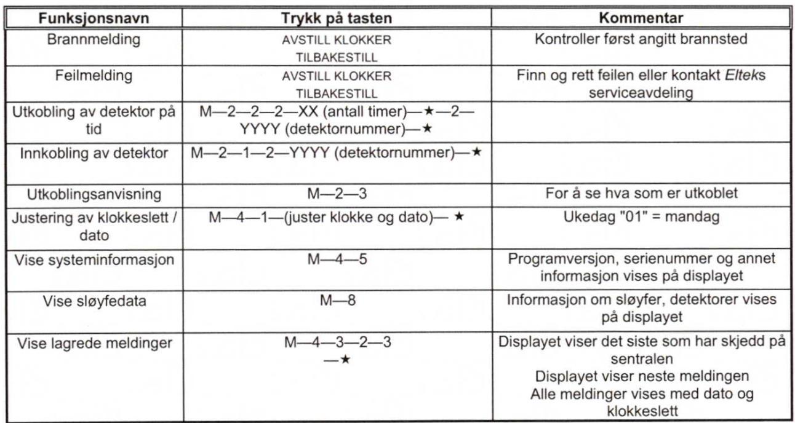
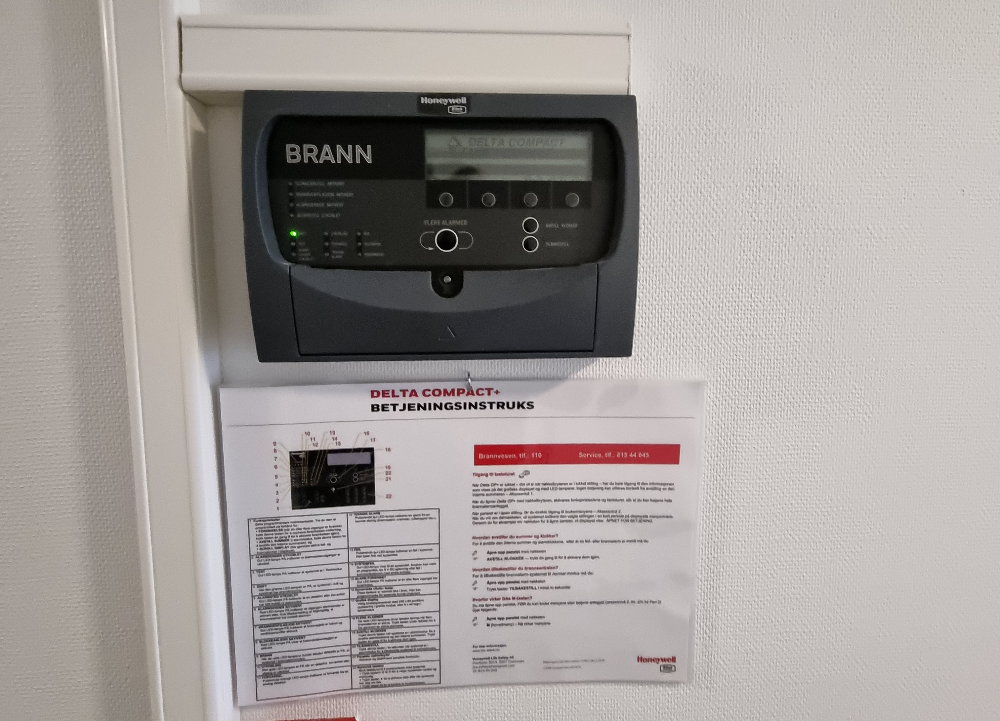

Hovseterveien 68 og 84 har automatisk brannlegg  som har sensor i leilighetene og gangene. 

## Hovseterveien 68

Det er plassert en alarmsentral i B og J hvor man se hvilken sensor som er utløst. 

Ved brannalarm må det sjekkes for å finne ut hvorfor sensor er utløst. 

Hvis man utløser alarmen i egen leilighet ved f.eks steking av mat må man sikre at ikke hele blokken får alarm. Dette gjøres på kontrollenheten i leiligheten. Les bruksanvisningen [her](alarmforsinkelsesenhet.pdf).

Denne må alle beboere i 68 gjøre seg kjent med. 

## Hovseterveien 84

Hovseterveien 84 har et annet anlegg som ble [montert vinteren 2023](../../projects/firesystem84/) og igangsatt 24.03.2023

Anlegget har en sentral i inngangspartiet samt sentral i hver etasje.

Det er montert sensor i alle leiligheter samt næringslokaler.

Hvis alarm feilaktig blir utløst i leilighet (matlaging f.eks) så har beboer 3 minutter på å gå til panelet i sin etasje for å bekrefte falsk alarm før alarmen vil ule i hele blokken. 

Beskrivelse står ved hver sentral. 

Hvis alarmen går må man sikre at det ikke er brann før den eventuelt slås av. Falske alarmer skal i liten grad skje med dette systemet. 

{}
