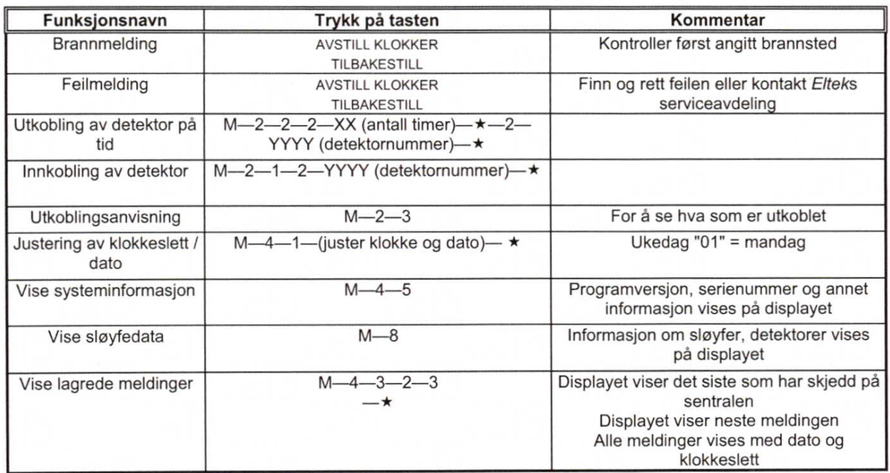
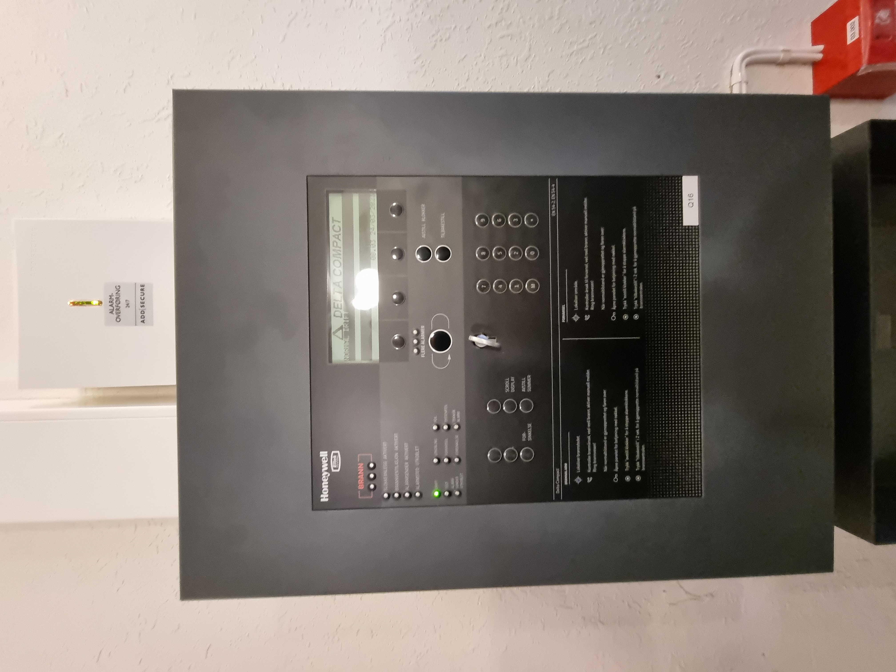
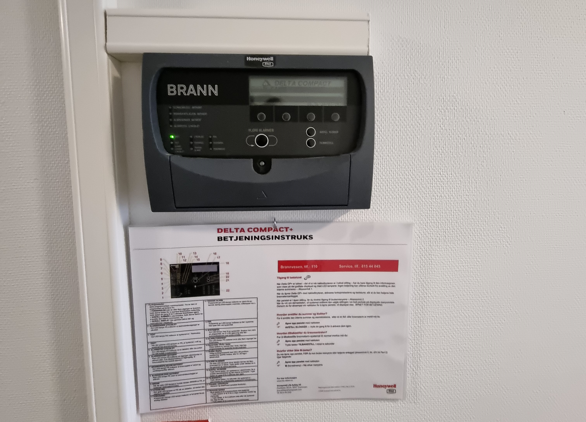

Hovseterveien 68 og 84 har automatiske brannalarmanlegg med sensorer i leilighetene og gangene.

## Hovseterveien 68

Det er plassert alarmsentraler i oppgang B og J, der man kan se hvilken sensor som er utløst.

Ved brannalarm må man undersøke hvorfor sensoren er utløst.

Hvis man utløser alarmen i egen leilighet, for eksempel ved matlaging, må man hindre at alarmen går i hele blokken. Dette gjøres på kontrollenheten i leiligheten. Les [bruksanvisningen](alarmforsinkelsesenhet.pdf).

Alle beboere i blokk 68 må gjøre seg kjent med bruksanvisningen.

## Hovseterveien 84

Hovseterveien 84 har et annet anlegg, som ble [montert vinteren 2023](../../projects/firesystem84/) og satt i drift 24. mars 2023.

Anlegget har en sentral i inngangspartiet og en sentral i hver etasje.

Det er montert sensorer i alle leiligheter og næringslokaler.

Hvis alarmen utløses ved en feil i en leilighet, for eksempel under matlaging, har beboeren tre minutter på å gå til panelet i etasjen og bekrefte falsk alarm. Deretter går alarmen i hele blokken.

En veiledning står ved hver sentral.

Hvis alarmen går må man sikre at det ikke er brann før den eventuelt slås av. Falske alarmer skal i liten grad skje med dette systemet. 

{}
