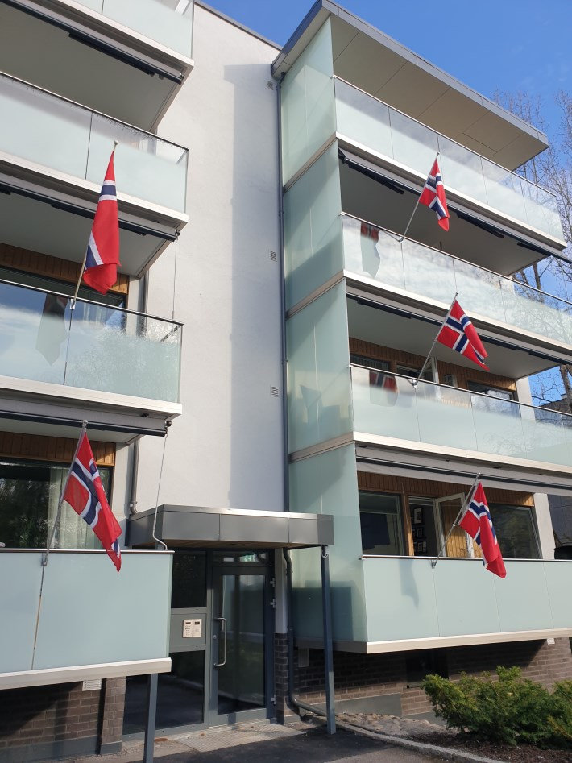
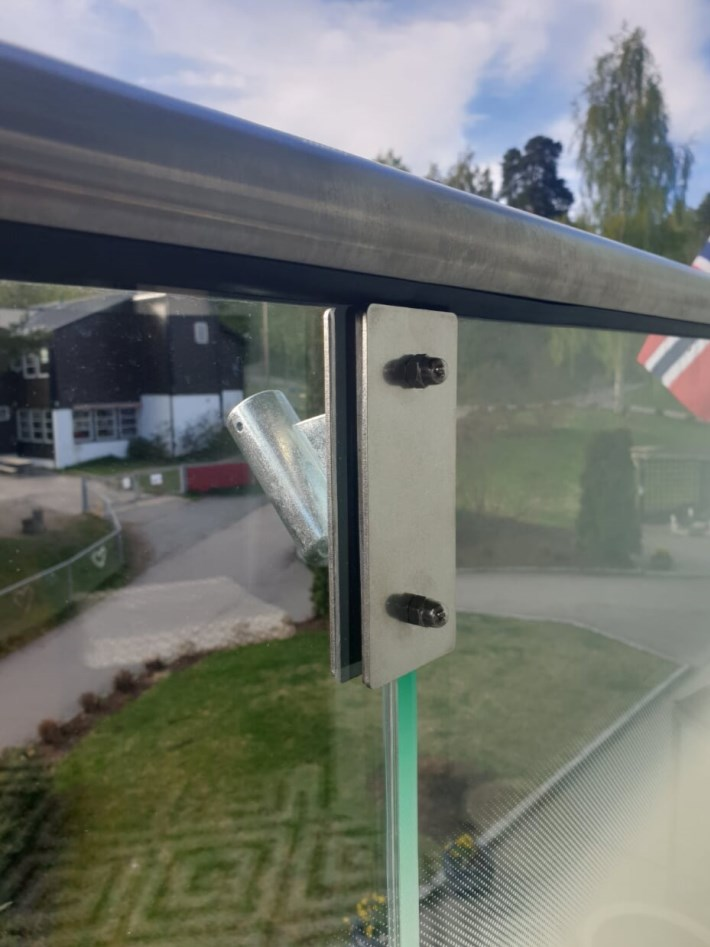

Flaggfestene koster 485 kr. pr. stk.

For lavblokkene skal den monteres i den sprekken som er omtrent midt utenfor det store stuevinduet slik at du kan nyte flagget fra stuen. For 84 skal den monteres i sprekk rett utenfor døren.

Flaggfestet skal monteres opp mot håndtaket. Alt du trenger er en umbraco nøkkel og en skiftnøkkel. (se bilder nedenfor)

I flaggfestet kan du sette standard balkongflagg. Dette får du kjøpt en rekke steder.

Send mail til setra@styrerommet.net med informasjon om mobilnummer for bestilling. Du vil da få en sms med betalingsinfo. Når festet er betalt kan dette hentes etter avtale med en representant fra styret.

{}
