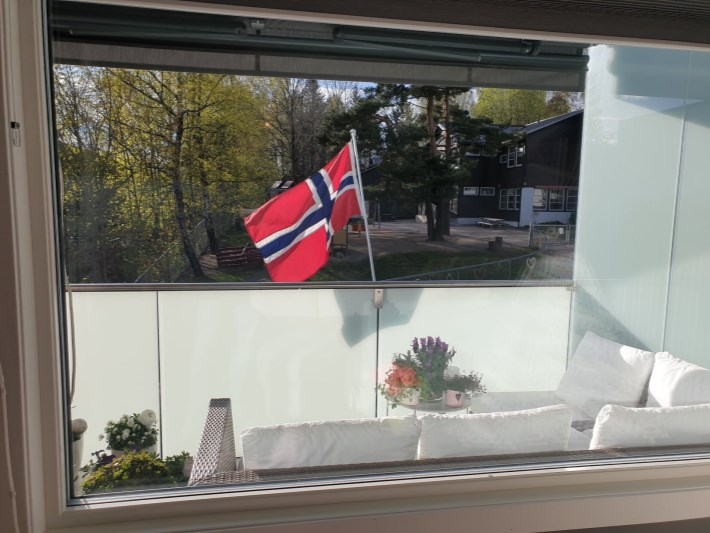
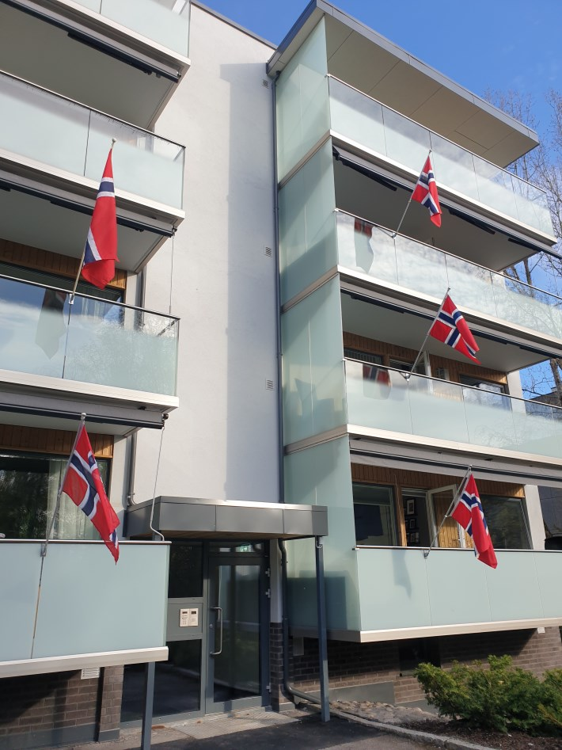
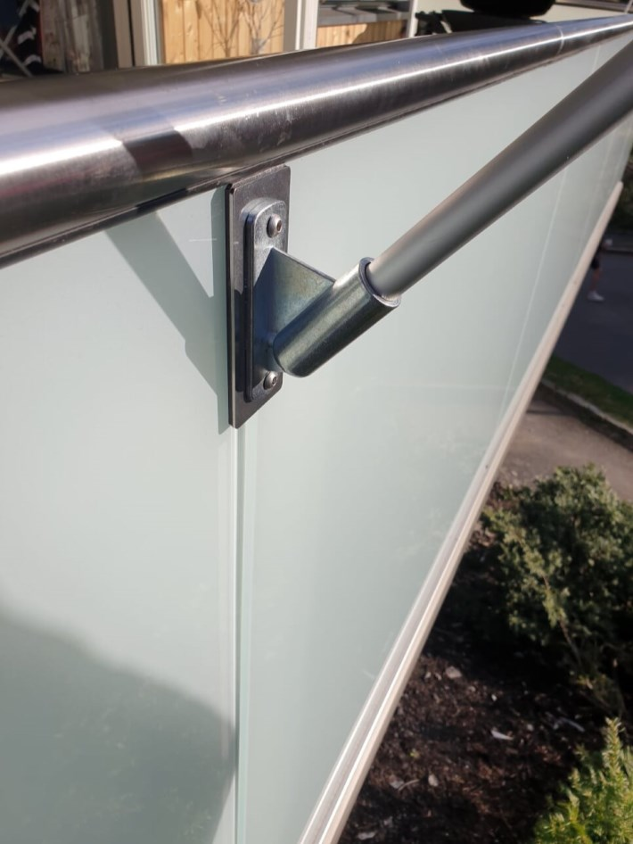
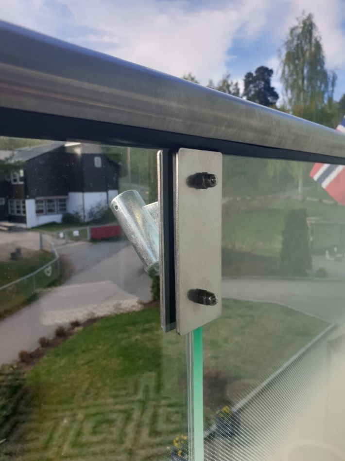
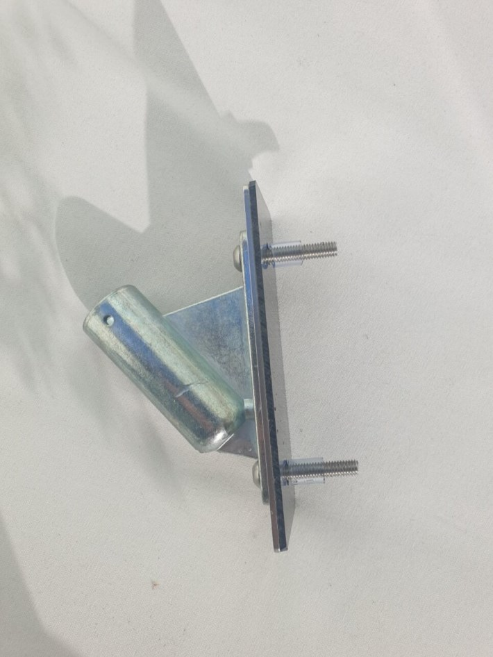
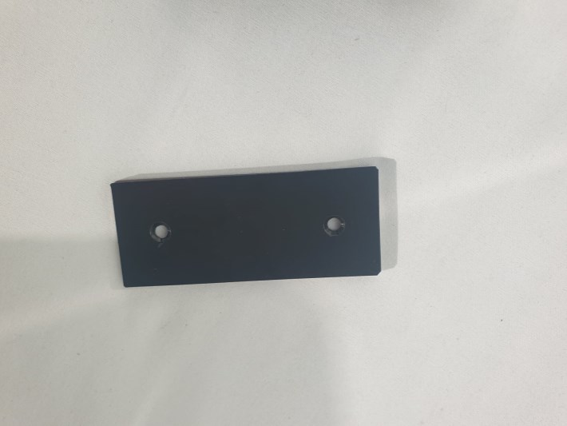
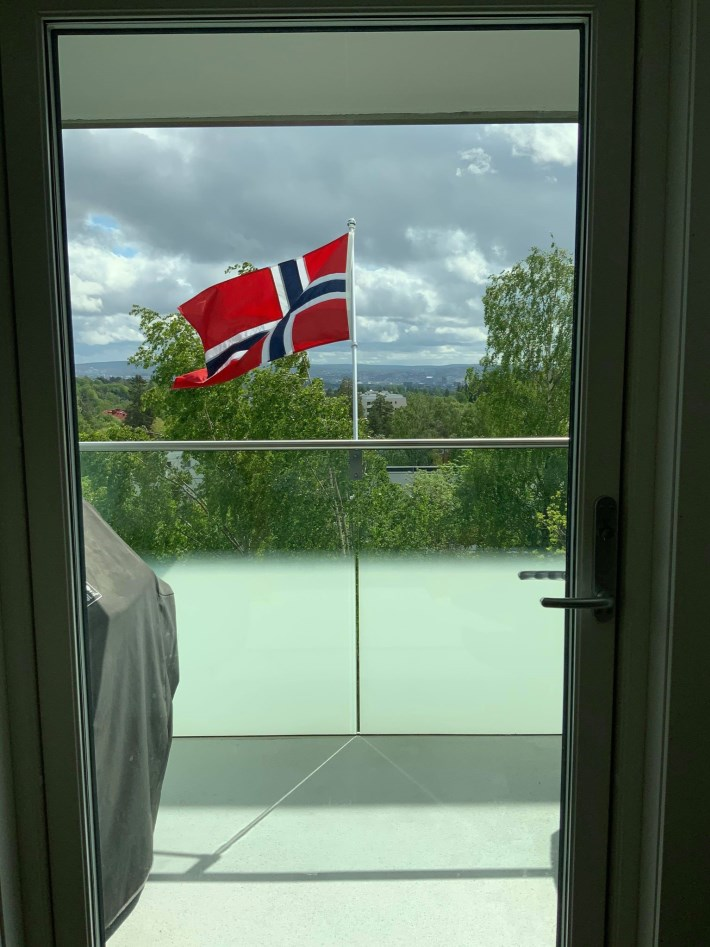

Flaggfestene koster 485 kroner per stykk.

I lavblokkene skal festet monteres i sprekken omtrent midt utenfor det store stuevinduet. I nr. 84 skal det monteres i sprekken rett utenfor døren.

Flaggfestet skal monteres opp mot håndtaket. Du trenger en unbrakonøkkel og en skiftenøkkel. Se bildene nedenfor.

Flaggfestet passer til vanlige balkongflagg, som kan kjøpes flere steder.

Send en bestilling på e-post til setra@styrerommet.net og oppgi mobilnummeret ditt. Du mottar deretter en SMS med betalingsinformasjon. Når festet er betalt, kan det hentes etter avtale med en representant fra styret.

{}
