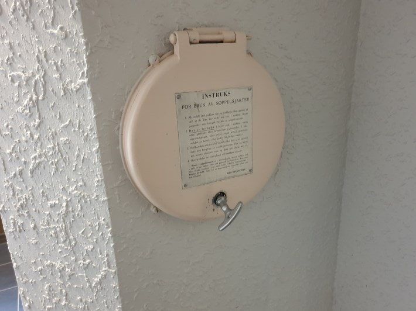

Normalt tørt søppel kastes i søppelsjaktene. Søppelet skal være i knytte poser og de må ikke være for store slik at det er fare for at de setter seg fast i sjakten. Søppelrommet er avlåst og kun tilgjengelig for renovasjonspersonell. Hvis du har mistet nøkkelen til sjakten kan du blant annet kjøpe hos [Ellefsen sikkerhet](https://www.ellefsensikkerhet.no/ProductDetail/Sjaktn%C3%B8kkel) as i grini næringspark.

Papp og papir kastes i papircontainer.

2-3 ganger i året vil borettslaget bestille container slik at man kan kaste større ting som ikke kan kastes i søppelsjakt. Hvis det ikke er mulig å vente på å kaste anbefales Smestad Gjenbrukstasjon.

Det vil varsles på forhånd med oppslag på ytterdørene noen dager før containerne plasseres ut.

Vanligvis har man container i januar, rundt dugnad april/mai og ca midten av oktober.  Disse plasseres typisk ved strømtrafo mellom 68 og 66.

{}
