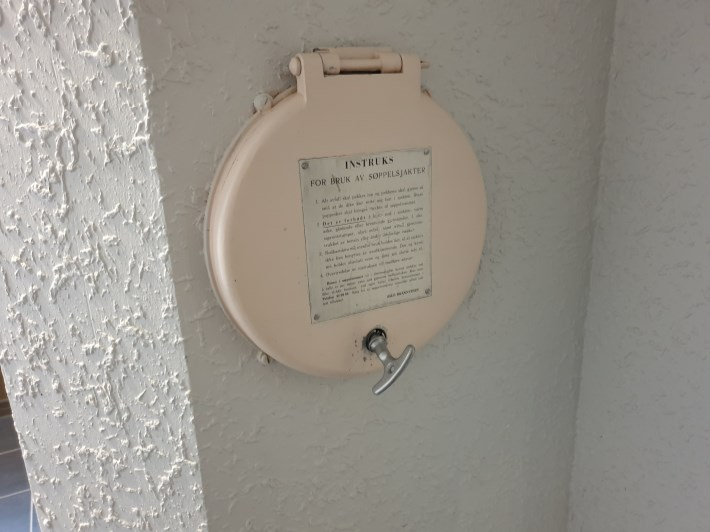

Vanlig, tørt restavfall kastes i søppelsjaktene. Avfallet skal ligge i poser med knute. Posene må ikke være så store at de kan sette seg fast i sjakten. Søppelrommet er avlåst og bare tilgjengelig for renovasjonspersonell. Hvis du har mistet nøkkelen til sjakten, kan du blant annet kjøpe en hos [Ellefsen Sikkerhet](https://www.ellefsensikkerhet.no/ProductDetail/Sjaktn%C3%B8kkel) AS i Grini Næringspark.

Papp og papir kastes i papirbeholderen.

{}
