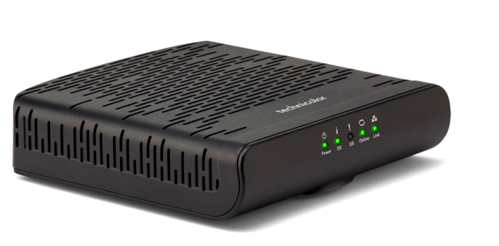

Inkludert i husleien har hver leilighet kabel-TV og TV fra Telenor. 

Det følger med en T-WE boks som tilhører leiligheten. 

Prisen er inkludert i leiligheten og snittprisen er ca 281 kr for TV og 120 for Internett pr måned.

For øyeblikket er Internet/Kabel-TV fordelt via fordelingsnøkkel som gir følgende ca priser for de forskjellige leilighetstypene

|    | Kabel-TV | Internett | Totalt |
|----|------|------|------|------|
|4-roms lavblokk | kr 329,- | kr 154,- | kr 483,- |
|3-roms lavblokk | kr 296,- | kr 139,- | kr 435,- |
|3-roms 68 | kr 313,- | kr 154,- | kr 483,- |
|2-roms 68 | kr 276,- | kr 129,- | kr 405,- |
|2-roms 84 | kr 237,- | kr 111,- | kr 348,- |
|1-roms 82 | kr 151,- | kr 71,- | kr 223,- |

Hastigheten er 100Mbit ned og 10Mbit opp. Dette kan økes til opptil 1000Mbit ned.

Hvis man øker utover standard vil dette komme som en seperat faktura fra telenor til deg.

| Hastighet | Pris pr mnd |
|--------|------------|
| 200/20 | 199,- |
| 350/30 | 289,- |
| 600/50 | 599,- |
| 1000/50 | 759,- |

Dette endres på [telenor.no](https://www.telenor.no/privat/minesider/web/)

## Utstyr

Utstyr som er tilknyttet systemet eies av borettslaget. Ved salg skal utstyret viderføres til ny kjøper. 

Utstyr som følger med er

")

{}
