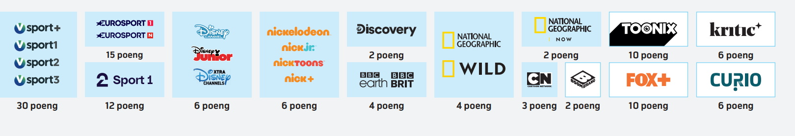
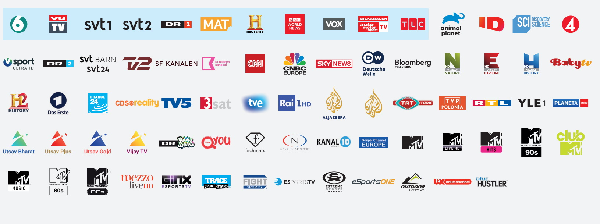
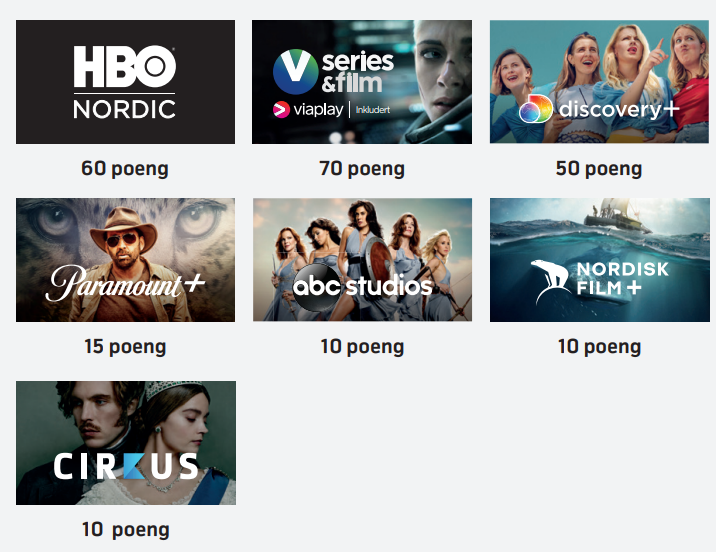
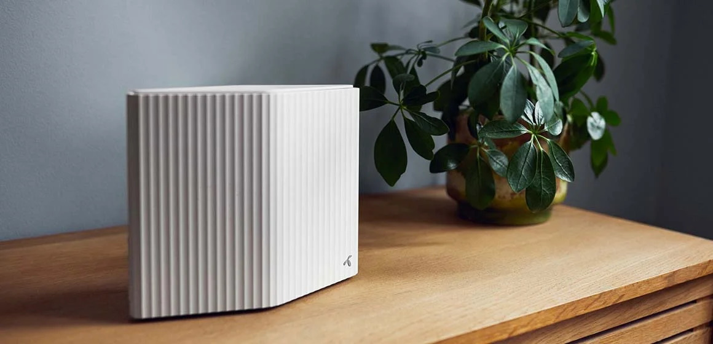
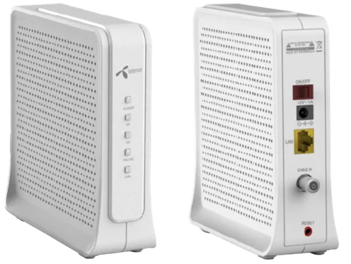

Inkludert i husleien har hver leilighet kabel-TV og Internett fra Telenor.

Fra 10.06.2022 vil borettslaget ha [Telenor Frihet M](https://www.telenor.no/privat/tv/poengsystem/frihet-m/?cid=11391_fix_sny_awa_all_aup_nul_frihet_m) avtale som er en revolusjon i forhold til tidligere avtale.

Dette betyr at hver leilighet har 240 poeng de kan bruke fritt hos Telenor slik at man selv kan bestemme om man bare skal ha TV, bare skal ha Internett eller en kombinasjon.

F.eks vil man med 240 poeng kunne sette opp følgende pakker:

- Bredbånd 20 og størst tv-pakke
- Bredbånd 100 og samme tv-pakke som i dag
- Bredbånd 200 og liten tv-pakke
- Bredbånd 350 og ingen tv-pakke

Ekstra poeng kan kjøpes i tilegg. Disse koster 29,- for 20 poeng.

Et viktig poeng er at du kan endre på oppsettet hele tiden så mange ganger du vil. Dette gjøres du på [Telenors hjemmesider](https://www.telenor.no/privat/minesider/web/fixed/)

## Internett hastigheter

Man kan selv velge hvilken hastighet på  Internett man ønsker seg. Nedenfor er hastigheten med poengkostnad og poengverdi.

| Hastighet ned/opp | Poeng | Poengverdi |
|--------|------------|------|
| 20/1 | 0 poeng | 0,- |
| 100/10 | 40 poeng | 58,- |  
| 200/20 | 140 poeng | 203,- |
| 350/30 | 240 poeng | 348,- |
| 600/50 | 340 poeng | 493,- |
| 1000/50 | 440 poeng | 638,- |

Bruker du bare poeng på Internett får du altså en 350/30 linje inkludert.

## TV- Kanaler

Telenor tilbyr en rekke kanalpakker og enkeltkanaler man kan velge å bruke poeng på

## Strømmetjenester

Du kan også benytte poeng på strømmetjenester slik du slipper å ha eget abonnement på det.

## Kostnader

Fra 01.08.2022 vil Internett/TV kostnadene skilles ut som en egen linje på faktura.
Fra denne dato vil enhetene ble belastet den kostnaden som borettslaget blir belastet for enheten.

Tidligere har kostnaden vært fordelt med fordelingsnøkkelen. Dette betyr kostnaden på Internett/TV ble fordelt ujevnt basert på fordelingsnøkkelen. De minste leilighetene ble i praksis sponset av de største.

Kostnaden er 399,- pr mnd.  

De største leilighetene vil fra denne perioden få litt redusert husleie (50-100kr) og de minst vil få noe økt samlet kostnaded. (ca 50-150)(flestparten rundt 50,-)

Hvis man kjøper ekstra poeng vil dette komme som en seperat faktura fra Telenor til deg.

Det at kostnaden kommer på egen linje vil gjøre det enklere å få dette kompensert fra arbeidsgiver for de som får dekket Internett. 

For de som trenger mer spesifikasjon for Internettkostnader. 

**Internettpakken 350 koster 240 poeng. 240 poeng tilsvarer 12 poengpakker med 20 poeng med kostnad 29,- kr. Dette tilsvarer at 348,- kr er utgiften på Internett som er inkludert i TV/Internettpakken hver bebeoer må betale**

## Utstyr

Utstyr som er tilknyttet systemet eies av borettslaget. Ved salg skal utstyret viderføres til ny kjøper.

Våren 2022 fikk borettslaget nye modem og Wifi-routere til alle leiligheter (som ikke har ny type allerde).

Dette skal ifølge Telenor gi raskere og mer stabilit Internett.

Utstyr som følger med leilighetene er.

[Se mer info om router](https://www.telenor.no/kundeservice/internett/modem-og-ruter/wifi-ruter/)

[Koblingsinfo](https://www.telenor.no/kundeservice/internett/modem-og-ruter/wifi-ruter/koble-til/kabel/)

{}

[Se mer informasjon hos Telenor](https://www.telenor.no/kundeservice/internett/modem-og-ruter/kaon-kabelmodem/)
