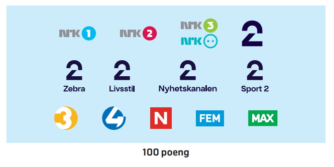
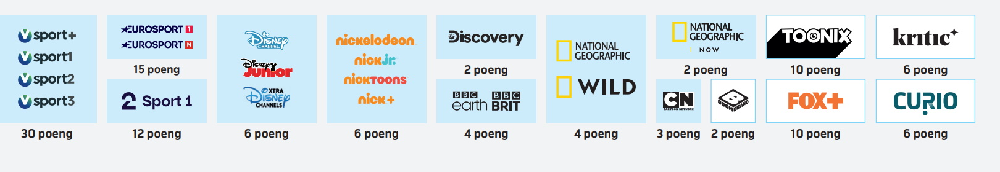
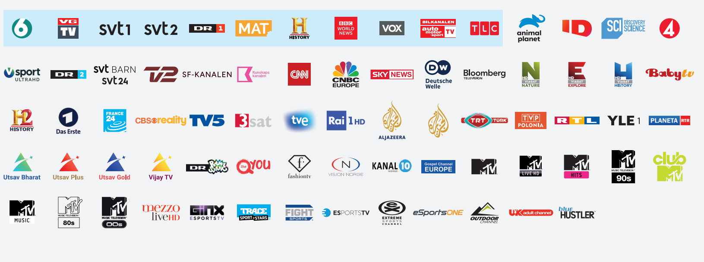
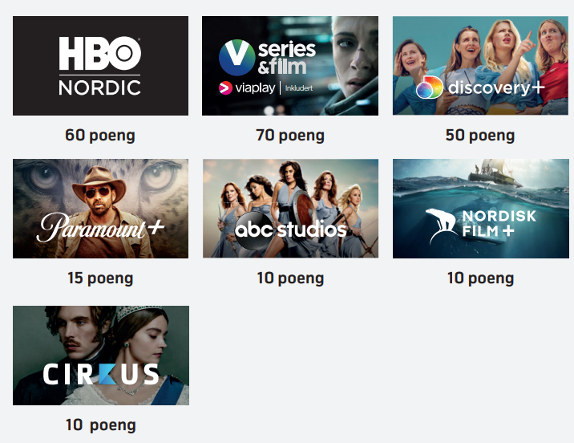
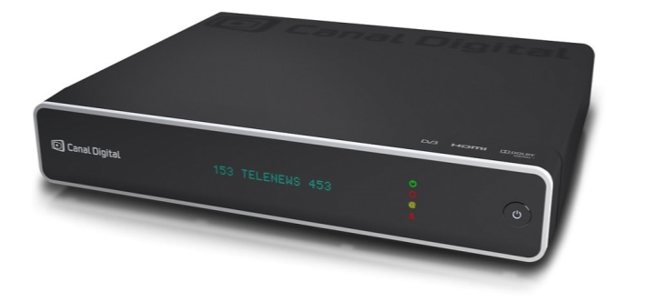
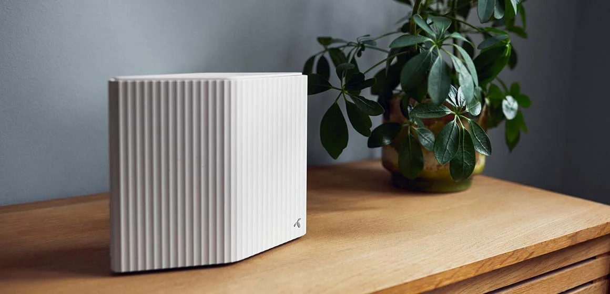
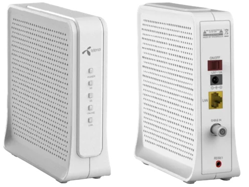

Kabel-TV og internett fra Telenor er inkludert i felleskostnadene for hver leilighet.

Fra 10. juni 2022 har borettslaget en [Telenor Frihet M-avtale](https://www.telenor.no/privat/tv/poengsystem/frihet-m/?cid=11391_fix_sny_awa_all_aup_nul_frihet_m).

Hver leilighet har 260 poeng som kan brukes fritt hos Telenor. Du kan dermed velge TV, internett eller en kombinasjon.

Med 240 poeng kan du for eksempel velge følgende pakker:

- Bredbånd 50 og størst tv-pakke
- Bredbånd 100 og samme tv-pakke som i dag
- Bredbånd 250 og liten tv-pakke
- Bredbånd 500 og ingen tv-pakke

Ekstra poeng kan kjøpes i tillegg.

Du kan endre oppsettet så ofte du vil. Dette gjør du på [Telenors nettsider](https://www.telenor.no/privat/minesider/web/fixed/).

## TV-kanaler

Telenor tilbyr en rekke kanalpakker og enkeltkanaler som du kan bruke poengene på.

## Strømmetjenester

Du kan også bruke poeng på strømmetjenester, slik at du slipper å ha egne abonnementer.

## Kostnader

Fra 1. august 2022 ble internett- og TV-kostnadene skilt ut som en egen linje på fakturaen. Fra denne datoen blir hver enhet belastet det samme beløpet som borettslaget betaler for enheten.

Tidligere ble kostnaden fordelt etter fordelingsnøkkelen. Det innebar at kostnaden for internett og TV ble fordelt ulikt mellom leilighetene.

Kostnaden er kr 399 per måned.

Fra denne perioden får de største leilighetene litt lavere felleskostnader, mens de minste får en noe høyere samlet kostnad. Endringen er ca. kr 50–150, og for de fleste rundt kr 50.

Hvis du kjøper ekstra poeng, kommer disse på en separat faktura fra Telenor.

Når kostnaden står på en egen linje, er det enklere å dokumentere den overfor en arbeidsgiver som dekker internett.

For dem som trenger en nærmere spesifikasjon av internettkostnaden: Internettpakken 500 koster 240 poeng. Det tilsvarer 12 poengpakker à 20 poeng, med en pris på kr 29 per pakke. Internettandelen av TV- og internettpakken er dermed kr 348.

## Utstyr

Utstyr som er tilknyttet systemet eies av borettslaget. Ved salg skal utstyret videreføres til ny kjøper.

Hvis du mangler enten dekoder, modem eller ruter, må du kontakte Telenor for hjelp.

Våren 2022 fikk alle leiligheter som ikke allerede hadde den nye typen, nye modemer og Wi-Fi-rutere.

Dette skal ifølge Telenor gi raskere og mer stabilt Internett.

Følgende utstyr hører til leiligheten:

[Les mer om ruteren](https://www.telenor.no/kundeservice/internett/modem-og-ruter/wifi-ruter/)

[Koblingsinfo](https://www.telenor.no/kundeservice/internett/modem-og-ruter/wifi-ruter/koble-til/kabel/)

{}

[Se mer informasjon hos Telenor](https://www.telenor.no/kundeservice/internett/modem-og-ruter/kaon-kabelmodem/)
