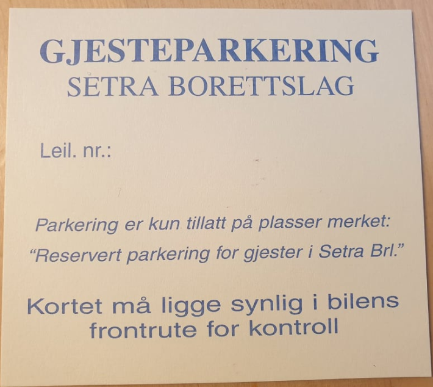

## Hovseterveien 70

Borettslaget eier 157 garasjeplasser i Hovseterveien 70.

Disse plassene er tilordnet leiligheter. Eierne av disse leilighetene får spesifisert leie pr måned på regning fra OBOS. I tilegg er leilighetene med garasje tilordnet sin andel av fellesgjelden på garasjekjøpet.

Alle leiligheter som har parkeringsplass i Hovseterveien 70 har egen garasjeportåpner.
I 2018 fikk garasjeanlegget montert nye motoriserte porter fra Industriporter AS.

### Oversikt over plasser i Hovseterveien 70

Nedenfor er det en oversikt over nummereringen av parkeringsplassene i Hovseterveien 70.

[Oversikt U1](oversiktu1.png)

[Oversikt U2](oversiktu2.png)

[Oversikt U3](oversiktu3.png)

### Elbillading

I Hovseterveien 70 har borettslaget etablert infrastruktur for ladebokser. Les mer om ladeanlegget på egen side.

## Landingsveien 14

I tillegg leies det 54 garasjeplasser i Landingsveien 14

Leiligheter som har parkeringsplass i Landingsveien 14 har nøkkel til parkeringshuset.

Det er usikkert hvor lenge borettslaget får leie parkeringsplasser i Landingsveien 14, da det er nye eiere av parkeringsanlegget og hele parkeringshuset planlegges å rives for å bygges på nytt. Følg byggeprosessen her.

## Parkering utenfor leiligheter

Ved oppgangene kan en kun stå ved av/på- lessing, og da maks 20 minutter. Fra 1. November 2020 må det ligget et gyldig beboerkort synlig i vinduet. Dette for å skille mellom beboere og andre som parkerer utenfor. Beboerkortet er kort  avbildet ovenfor. Beboerkort fås hos styret.

Skal man stå lenger, må man ha et tidsbegrenset kort utstedt av styre. Dette kan være i sammenheng med f.eks flytting eller håndtverkere hvor det ikke er praktisk mulig for dem å parkere på gjesteparkering.

## Gjesteparkering

Hver leilighet har anledning til å ha to gjesteparkeringskort.  Fra 01.10.2020 er det de gule kortene som gjelder. Hver leilighet har fått utdelt to stk 22.09.2020.  Borettslaget har ikke eget område for gjesteparkering men leier plass for gjester hos Meklenborg borettslag. Med vårt gule gjesteparkeringskort kan en parkere på ledig plass. Det er kun kortet som ser ut som dette under som er gyldig etter 01.10.2020 og det er kun lov å bruke på parkeringsplassen avbildet over!.  

Vi ber alle ta vare på sine dispensasjonskort for utlån til gjester, og være påpasselig med at parkeringsbestemmelsene blir fulgt.

Etersom borettslaget har svært få gjesteparkeringsplasser (23), må alle beboere bruke sine garasjer. Det er heller ikke lov å parkere biler benyttet i eget arbeid på gjesteparkering.

## Parkeringsvakter

Vi gjør oppmerksom på at styret leier et firma til å påse at parkeringsbestemmelsene overholdes. Meklenborg leier også parkeringsselskap for å sjekke gjesteparkeringsplassen.  

{}
