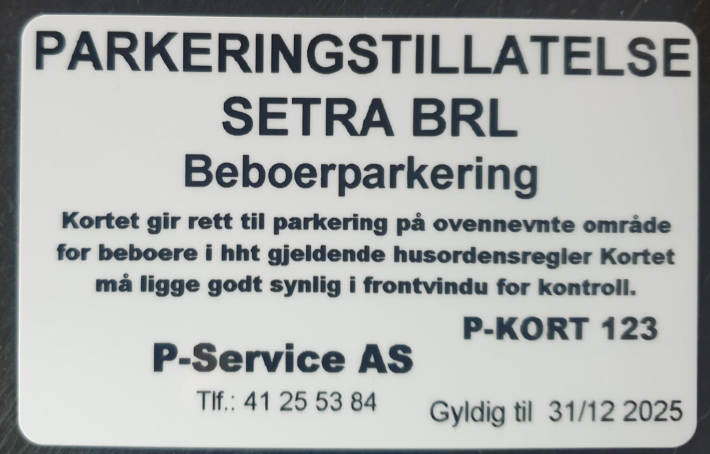
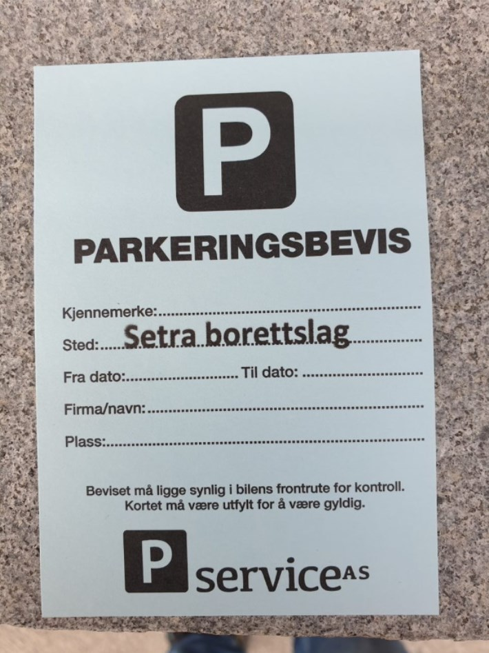
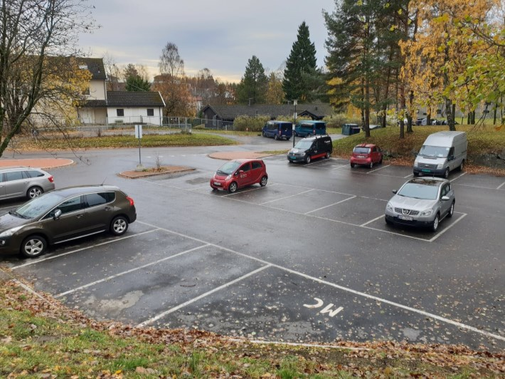
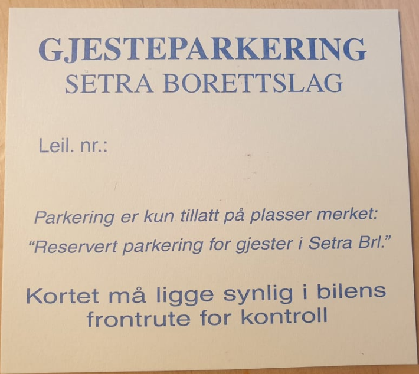

## Hovseterveien 70

Borettslaget eier 157 garasjeplasser i Hovseterveien 70.

Disse plassene er tilordnet leiligheter. Eierne av disse leilighetene får spesifisert leie per måned på regning fra OBOS. I tillegg er leilighetene med garasje tilordnet sin andel av fellesgjelden på garasjekjøpet.

Alle leiligheter som har parkeringsplass i Hovseterveien 70 har egen garasjeportåpner.
I 2018 fikk garasjeanlegget montert nye motoriserte porter fra Industriporter AS.

### Oversikt over plasser i Hovseterveien 70

Nedenfor er det en oversikt over nummereringen av parkeringsplassene i Hovseterveien 70.

[Oversikt U1](oversiktu1.png)

[Oversikt U2](oversiktu2.png)

[Oversikt U3](oversiktu3.png)

### Elbillading

I Hovseterveien 70 har borettslaget etablert infrastruktur for ladebokser. Les mer om ladeanlegget på egen side.

## Landingsveien 14

I tillegg leies det 54 garasjeplasser i Landingsveien 14.

Leiligheter som har parkeringsplass i Landingsveien 14 har nøkkel til parkeringshuset.

Det er usikkert hvor lenge borettslaget får leie parkeringsplasser i Landingsveien 14, da det er nye eiere av parkeringsanlegget og hele parkeringshuset planlegges å rives for å bygges på nytt. Følg byggeprosessen her.

## Parkering utenfor leiligheter

Ved oppgangene er det bare tillatt å stå under av- og pålessing, og da i maksimalt 20 minutter. Fra 1. november 2020 må et gyldig beboerkort ligge synlig i vinduet. Kortet skiller beboere fra andre som parkerer utenfor. Beboerkortet er avbildet ovenfor og fås hos styret.

Skal man stå lenger, må man ha et tidsbegrenset kort utstedt av styret. Det kan være aktuelt ved for eksempel flytting eller håndverkerbesøk når det ikke er praktisk mulig å bruke gjesteparkeringen.

## Gjesteparkering

Hver leilighet kan ha to gjesteparkeringskort. Fra 1. oktober 2020 er det de gule kortene som gjelder. Hver leilighet fikk utdelt to kort 22. september 2020. Borettslaget har ikke et eget område for gjesteparkering, men leier gjesteplasser hos Meklenborg borettslag. Med det gule gjesteparkeringskortet kan man parkere på en ledig plass. Kortet som er vist nedenfor, er det eneste gyldige kortet og kan bare brukes på parkeringsplassen som er avbildet ovenfor.

Vi ber alle ta vare på sine dispensasjonskort for utlån til gjester, og være påpasselig med at parkeringsbestemmelsene blir fulgt.

Ettersom borettslaget har svært få gjesteparkeringsplasser (23), må alle beboere bruke sine egne garasjeplasser. Det er heller ikke tillatt å parkere biler som brukes i eget arbeid, på gjesteparkeringen.

## Parkeringsvakter

Vi gjør oppmerksom på at styret leier et firma til å påse at parkeringsbestemmelsene overholdes. Meklenborg leier også parkeringsselskap for å sjekke gjesteparkeringsplassen.  

{}
