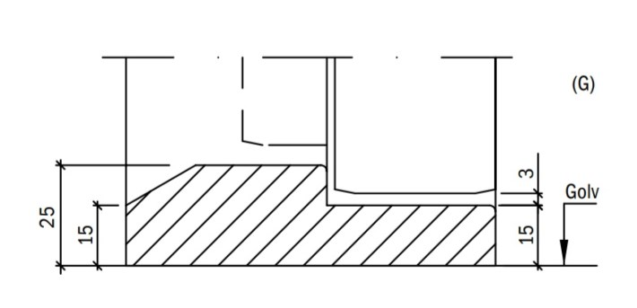
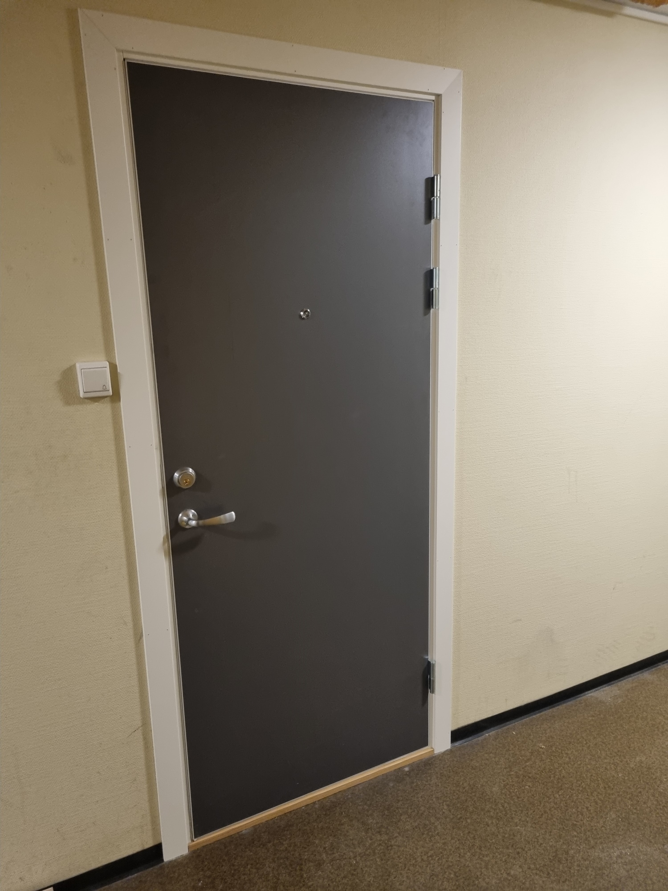

De fleste leilighetene hadde dører fra 1975.

De originale dørene var slitt og dårlig isolert. De gir heller ikke samme brannisolasjon som nye dører gir.

Valget falt til slutt på Palmgren som leverandør og dørtypen ble en Swedor Massivdør med 43db lyddemping.

Målet er å få gjennomført dørbyttet innen januar 2022. [Se informasjonskriv fra Palmgreen](Informasjonsskriv.pdf)

Dørene vil ha Laminat overflate hvor utsiden vil ha denne fargen , mens innsiden vil ha denne fargen.

Alle dører vil få terskel. Målene på terskel er.

## Farger

Utvendig leilighetsdører blir fargen [F7912 Storm](https://www.formica.com/nb-no/products/laminate/F7912)

Fargen på trapperomsdører i høyblokkene blir [F1998 Oslo](https://www.formica.com/nb-no/products/laminate/F1998).

Listene blir hvite

## Spørsmål og svar

1. Spørsmål: Vil Palmgren montere smartlås fra gammel dør i ny.
**svar:** Nei. Dette må gjøres selv i etterkant.

2. Vil det komme mulighet til å bestille dør med smartlås
**Svar:** Det var ikke mulig å få bestilt dette grunnet leveringsituasjon. Dette må håndteres av beboer selv.

3. Vil det være mulig å få Iloq i dørene. **Svar:** Det må isåfall avtales med leverandør i etterkant

## Fremdriftsplan

{}
