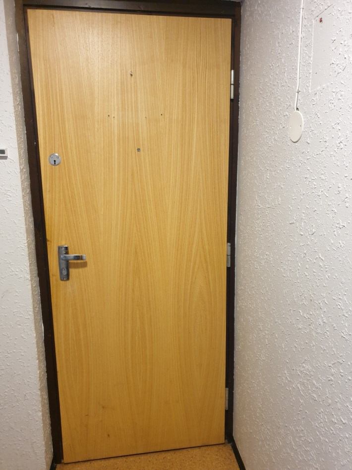
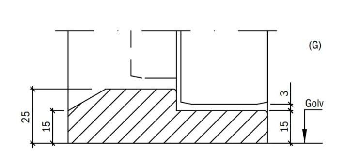
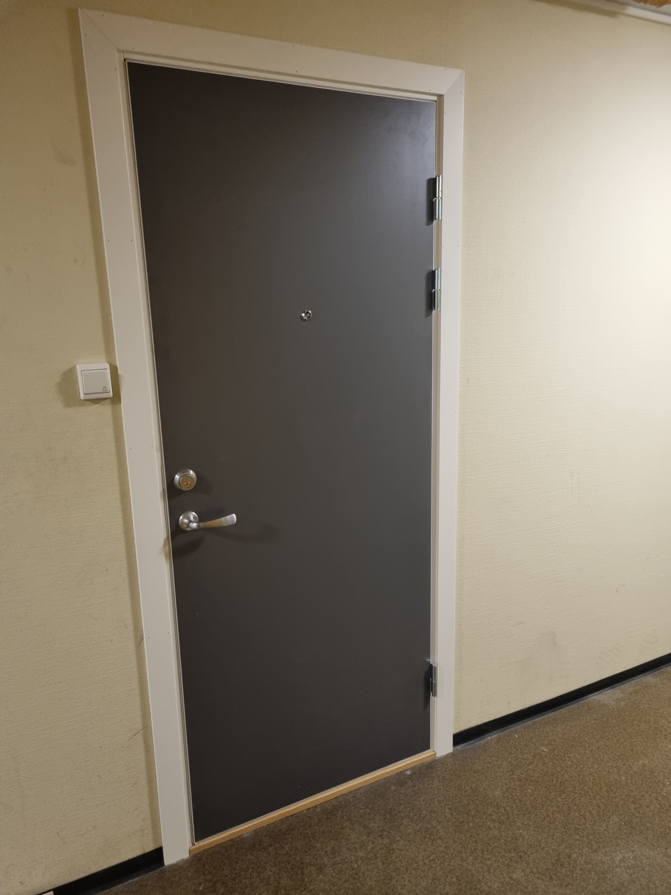

De fleste leilighetene hadde dører fra 1975.

De opprinnelige dørene var slitte og dårlig isolert. De ga heller ikke like god brannbeskyttelse som nye dører.

Palmgren ble valgt som leverandør. Dørtypen er en Swedoor massivdør med 43 dB lyddemping.

Målet var å fullføre dørbyttet innen januar 2022. [Se informasjonsskrivet fra Palmgren](Informasjonsskriv.pdf).

Dørene har laminatoverflate. Utsiden og innsiden har ulike farger.

Alle dørene har terskel. Målene vises nedenfor.

## Farger

Utsiden av leilighetsdørene har fargen [F7912 Storm](https://www.formica.com/nb-no/products/laminate/F7912).

Fargen på trapperomsdører i høyblokkene blir [F1998 Oslo](https://www.formica.com/nb-no/products/laminate/F1998).

Listene er hvite.

## Spørsmål og svar

1. **Spørsmål:** Vil Palmgren flytte smartlåsen fra den gamle døren til den nye?
   **Svar:** Nei. Dette må beboeren gjøre selv i etterkant.

2. **Spørsmål:** Er det mulig å bestille en dør med smartlås?
   **Svar:** Dette kunne ikke bestilles på grunn av leveringssituasjonen. Beboeren må ordne det selv.

3. **Spørsmål:** Er det mulig å få iLOQ i dørene?
   **Svar:** Det må i så fall avtales med leverandøren i etterkant.

## Fremdriftsplan

{}
