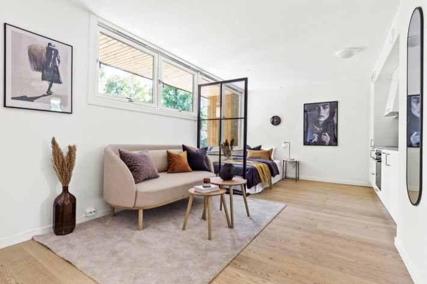

Antallet enheter som skulle bygges har variert i løpet av prosessen. Nedenfor viser en oversikt over de 16 boenhetene som ble etablert. Klikk på lenker på leilighetsnr for Finn annonse og flere bilder.

|Leilighetsnr|Bygg|Størrelse|Antall rom|Prisantydning|Status
|----------|-----|--------|-------|--------|--------|
|[1053](https://www.finn.no/realestate/homes/ad.html?finnkode=191919075)|64A|27m2|1|2.000.000,-|Solgt 28.09.2020|
|[1065](https://www.finn.no/realestate/homes/ad.html?finnkode=214976709)|68|73m2|3|3.900.000,-|Solgt 11.05.2021|
|[1066](https://www.finn.no/realestate/homes/ad.html?finnkode=209380303)|68|74m2|3|4.400.000,-|Solgt 09.03.2021|
|[1067](https://www.finn.no/realestate/homes/ad.html?finnkode=206294149)|68|74m2|3|4.900.000,-|Solgt 15.02.2021|
|[1063](https://www.finn.no/realestate/homes/ad.html?finnkode=210880986)|68|60m2|2|3.700.000,-|Solgt 26.03.2021|
|1064|68|59m2|2|3.450.000,-|Solgt 27.03.2021|
|[1062](https://www.finn.no/realestate/homes/ad.html?finnkode=210880772)|68|89m2|3|4.600.000,-|Solgt 12.04.2021|
|[1061](https://www.finn.no/realestate/homes/ad.html?finnkode=214159932)|68|29m2|1|2.500.000,-|Solgt 20.04.2021|
|[1060](https://www.finn.no/realestate/homes/ad.html?finnkode=210880570)|68|42m2|1|2.900.000,-|Solgt 25.03.2021|
|[1038](https://www.finn.no/realestate/homes/ad.html?finnkode=220098515)|68|77m2|3|3.900.000,-|Solgt 30.08.2021|
|[1054](https://www.finn.no/realestate/homes/ad.html?finnkode=193501469)|82A|36m2|1|2.500.000,-|Solgt 12.10.2020|
|1055|82B|36m2|1|2.500.000,-|Solgt 13.10.2020|
|1056|82B|36m2|1|2.500.000,-|Solgt 13.10.2020|
|1057|82C|36m2|1|2.500.000,-|Solgt 13.10.2020|
|1058|82C|36m2|1|2.500.000,-|Solgt 13.10.2020|
|[1059](https://www.finn.no/realestate/homes/ad.html?finnkode=195108769)|84|54 m2|1|3.100.000,-|Solgt 28.10.2020|

Totalt 837m2

Totalt vil de nye leiligheten gi 777.012,- kr i årlig fellesinntekter til borettslaget (av totalt 16.360.956,-). I tilegg vil 4.75% av fellesgjelden overtas av disse leilighetene. Total salgsum ble 52.755.000,-  Salgsummen ble brukt  til å nedbetale på fellesgjeld og annet nødvendig vedlikehold.

## Tidsplan

Leilighetene ble bygget av Front Entrepenør med underleverandører og ble ferdigstillt i paralell med fasadeprosjektet. Første leilighet ble lagt ut til salgs 18. september 2020 og siste ble lagt ut for salg 27.05.2021.

{}
