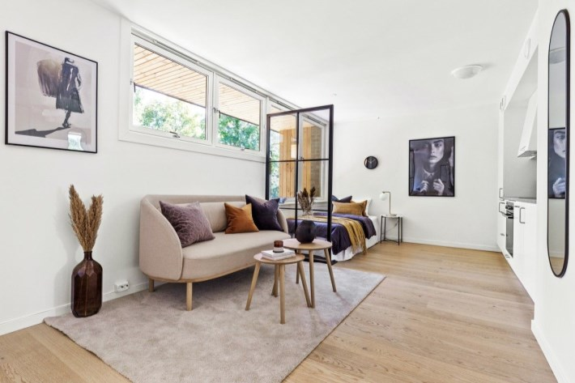
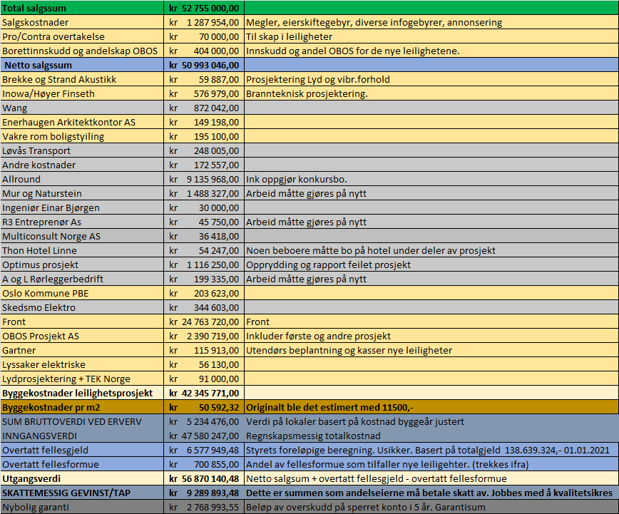

Antallet enheter som skulle bygges, varierte i løpet av prosessen. Nedenfor er en oversikt over de 16 boenhetene som ble etablert. Klikk på et leilighetsnummer for å se FINN-annonsen og flere bilder. Grå linjer i kostnadsoversikten gjelder kun det tidligere, avbrutte prosjektet. Noen linjer omfatter både det nye og det gamle prosjektet, for eksempel prosjektledelse fra OBOS.

|Leilighetsnummer|Bygg|Størrelse|Antall rom|Prisantydning|Status
|----------|-----|--------|-------|--------|--------|
|[1053](https://www.finn.no/realestate/homes/ad.html?finnkode=191919075)|64A|27 m²|1|2 000 000 kr|Solgt 28.09.2020|
|[1065](https://www.finn.no/realestate/homes/ad.html?finnkode=214976709)|68|73 m²|3|3 900 000 kr|Solgt 11.05.2021|
|[1066](https://www.finn.no/realestate/homes/ad.html?finnkode=209380303)|68|74 m²|3|4 400 000 kr|Solgt 09.03.2021|
|[1067](https://www.finn.no/realestate/homes/ad.html?finnkode=206294149)|68|74 m²|3|4 900 000 kr|Solgt 15.02.2021|
|[1063](https://www.finn.no/realestate/homes/ad.html?finnkode=210880986)|68|60 m²|2|3 700 000 kr|Solgt 26.03.2021|
|1064|68|59 m²|2|3 450 000 kr|Solgt 27.03.2021|
|[1062](https://www.finn.no/realestate/homes/ad.html?finnkode=210880772)|68|89 m²|3|4 600 000 kr|Solgt 12.04.2021|
|[1061](https://www.finn.no/realestate/homes/ad.html?finnkode=214159932)|68|29 m²|1|2 500 000 kr|Solgt 20.04.2021|
|[1060](https://www.finn.no/realestate/homes/ad.html?finnkode=210880570)|68|42 m²|1|2 900 000 kr|Solgt 25.03.2021|
|[1038](https://www.finn.no/realestate/homes/ad.html?finnkode=220098515)|68|77 m²|3|3 900 000 kr|Solgt 30.08.2021|
|[1054](https://www.finn.no/realestate/homes/ad.html?finnkode=193501469)|82A|36 m²|1|2 500 000 kr|Solgt 12.10.2020|
|1055|82B|36 m²|1|2 500 000 kr|Solgt 13.10.2020|
|1056|82B|36 m²|1|2 500 000 kr|Solgt 13.10.2020|
|1057|82C|36 m²|1|2 500 000 kr|Solgt 13.10.2020|
|1058|82C|36 m²|1|2 500 000 kr|Solgt 13.10.2020|
|[1059](https://www.finn.no/realestate/homes/ad.html?finnkode=195108769)|84|54 m²|1|3 100 000 kr|Solgt 28.10.2020|

Totalt 837 m².

De nye leilighetene vil til sammen gi borettslaget 777 012 kroner i årlige fellesinntekter, av totalt 16 360 956 kroner. I tillegg vil 4,75 % av fellesgjelden overtas av disse leilighetene. Den totale salgssummen var 52 755 000 kroner. Salgssummen ble brukt til å nedbetale fellesgjeld og finansiere annet nødvendig vedlikehold.

## Tidsplan

Leilighetene ble bygget av Front Entreprenør med underleverandører og ferdigstilt parallelt med fasadeprosjektet. Den første leiligheten ble lagt ut for salg 18. september 2020, og den siste 27. mai 2021.

## Resultat

Nedenfor ser du det foreløpig beregnede resultatet av prosjektet. Overskuddet er skattepliktig for andelseierne. Det arbeides med å kvalitetssikre alle tallene.

## Reklamasjoner

Reklamasjoner på nye leiligheter kan i utgangspunktet rettes til Front Entreprenør, som bygget leilighetene.
E-post: eirik@frontent.no

Sett gjerne setra@styrerommet.no på kopi.

## Ferdigattester 

[Ferdigattest 68](Ferdigattest_1.pdf)

[Ferdigattest 64 og 82](Ferdigattest_2.pdf)

[Ferdigattest 84F](Ferdigattest_3.pdf)

{}
