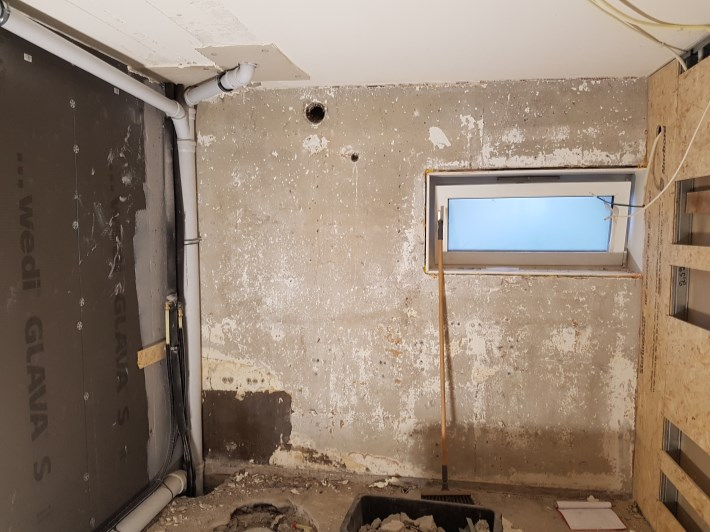
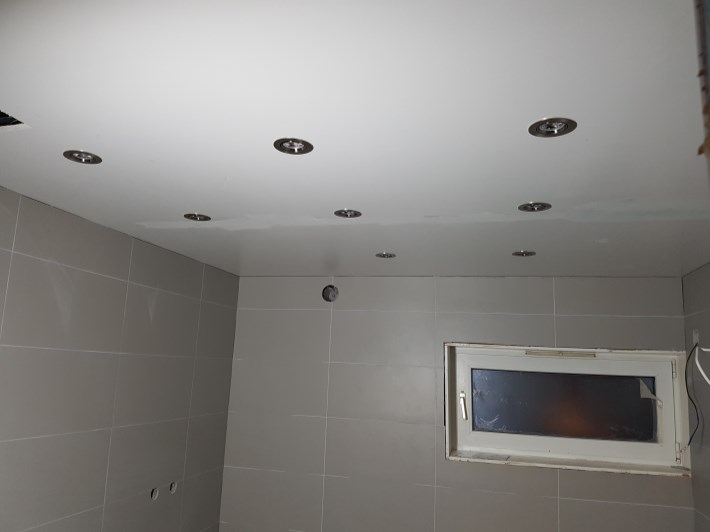
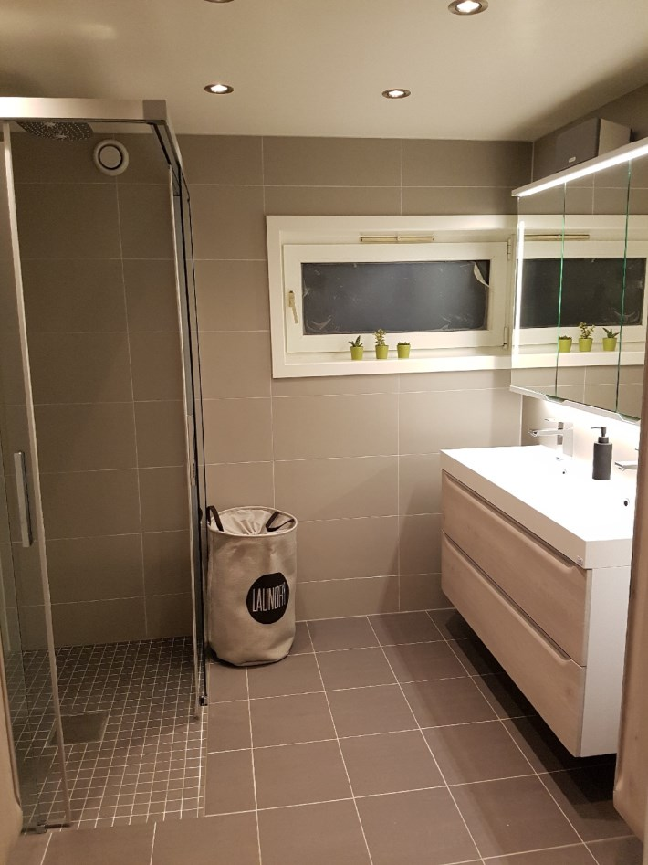

Nye bad og rørsystem
Det var stor forskjell på tilstanden på badene. Noen hadde bad fra 1975, mens andre hadde nyere bad.

### Eksempel på bad før renovasjon

### Arbeid utført

Badene ble revet totalt og alt utstyr ble demontert. Beboere kunne velge om utstyr skulle remonteres senere. (ikke alt kunne remonteres)  

{}
