## Nye bad og rørsystemer
Det var stor forskjell på tilstanden på badene. Noen hadde bad fra 1975, mens andre hadde nyere bad.

### Eksempel på bad før renovasjon

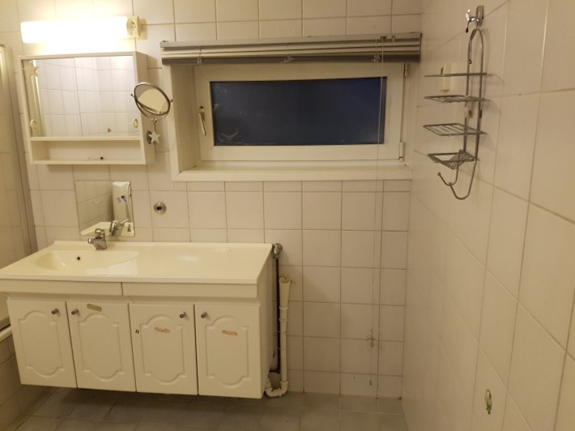

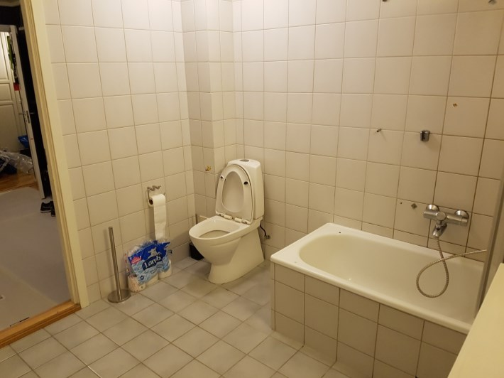

### Arbeid utført

Badene ble revet fullstendig, og alt utstyr ble demontert. Beboerne kunne velge om utstyret skulle monteres igjen senere, men ikke alt kunne gjenbrukes.

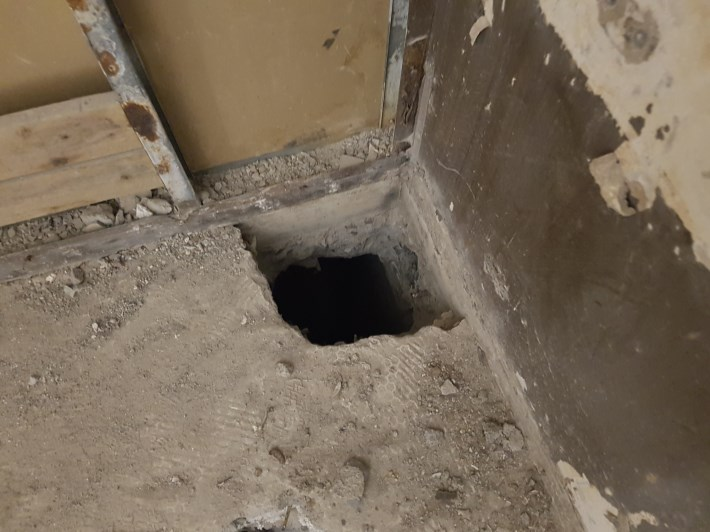

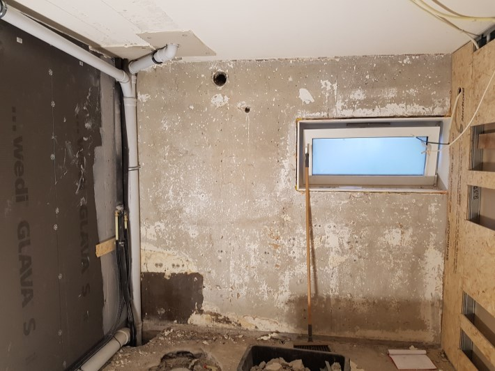

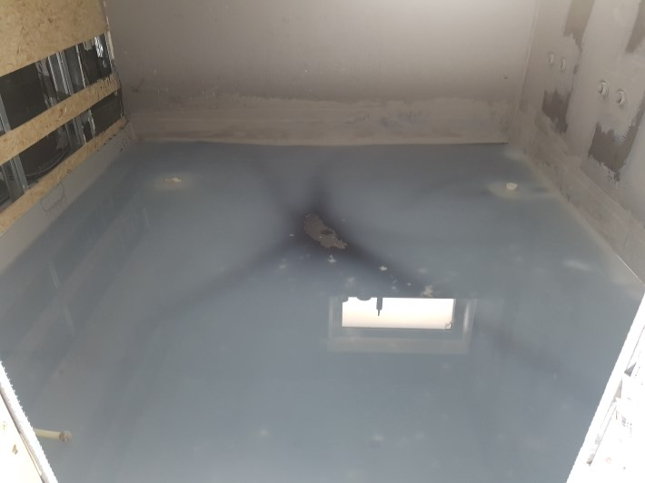

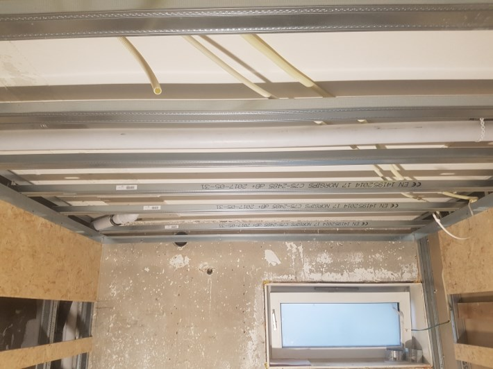

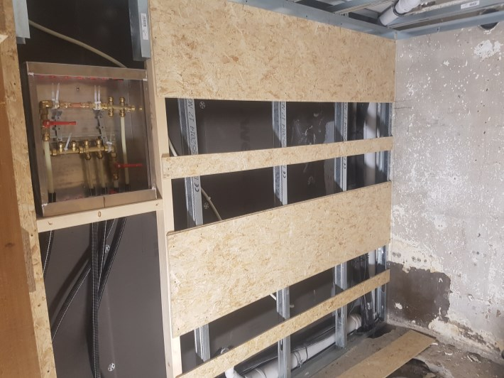

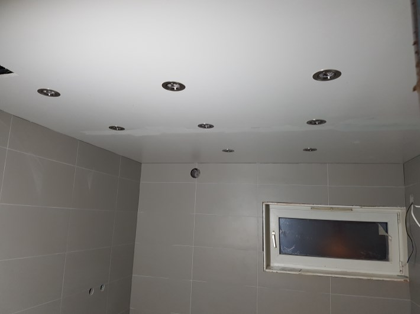

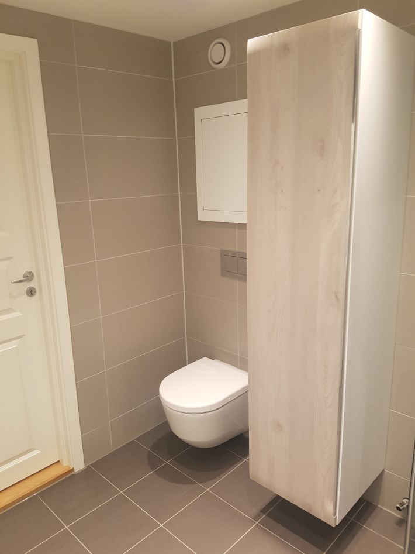

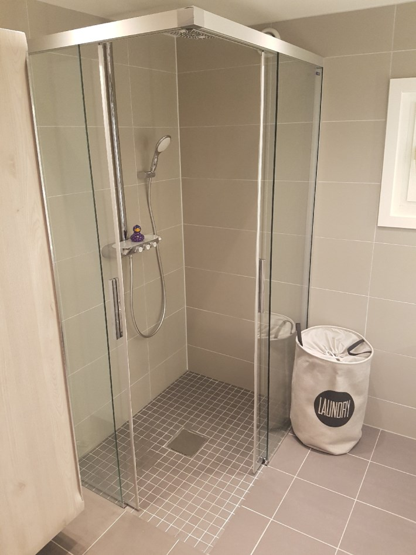

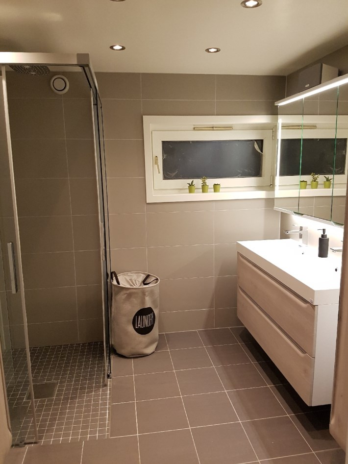

{}
