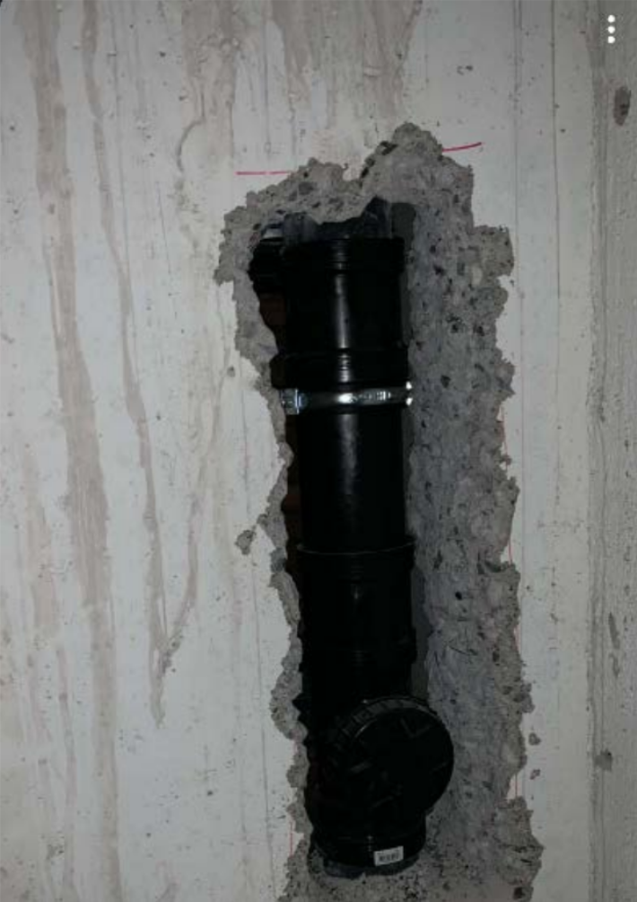
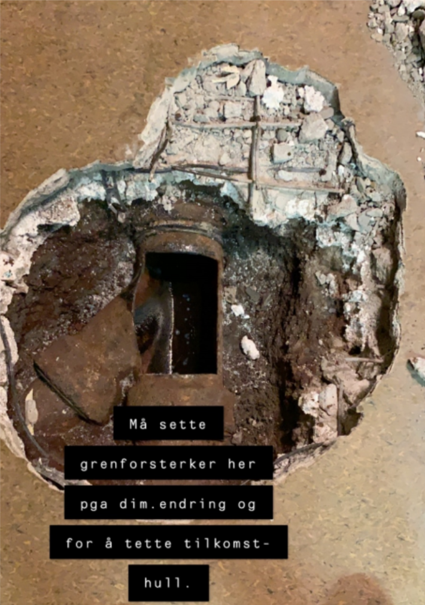
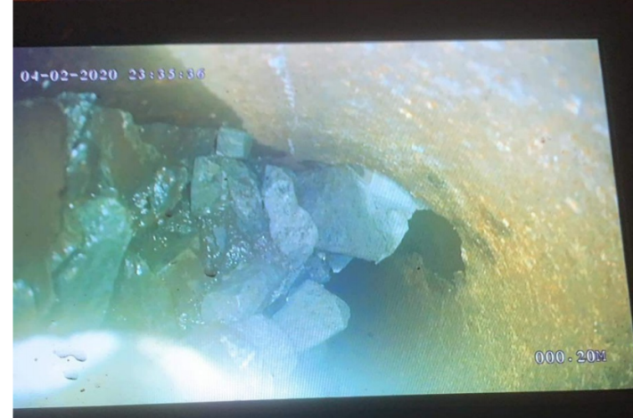

Det er firmaet Olimb som ble valgt som leverandør av rørfornying. Jobben ble delt opp i flere omganger. Detaljer om hvordan slik rehabilitering med rørfornying foregår kan man lese om på Olimbs hjemmeside.

## Rørfornying innvendig taknedløp fra tak

Dette ble utført i sammenheng med fasadeprosjektet og takarbeidet som er del av fasadeprosjektet.

I tillegg til å rørfornye taknedløpet måtte det etableres stakeluker. Dette gjorde at noen boder møtte tømmes for å få tilgang.

Dette arbeidet ble utført sommeren 2019 for alle blokkene.

## Rørfornying bunnledning og stikknedløp

Som del av bad- og våtromprosjektet ble alle nedfallstammer erstattet av nye rør, men bunnledningen og stikkledning ut mot kommunalt nettverk av rør ble ikke erstattet. Her ble det bestemt at man kjører rørfornying hvor man lager en strømpe innvendig i røret for å tette og reparere hull.

Rørene er fra 1975 og er i dårlig stand. Under arbeidet med dette er det funnet områder med hull og store skader. Bildene nedenfor viser eksempler på store skader funnet i 84, 82 og 68.

Arbeidet for 68, 82 og 84 ble gjennomført vinteren 2019-2020. Her benyttet man en teknikk som heter overpumping hvor et separat midlertidlig avløpsystem ble etablert slik at man kunne benytte seg av vann i blokkene under arbeidet. (med en del begrensninger).

For 64 og 66 er denne teknikken ikke mulig å bruke. For disse blokkene måtte vannet stenges av i arbeidsperioden og det ble etablerert provisoriske toalett og dusjløsning. Dette arbeidet ble utført i juli/august 2020.

{}
