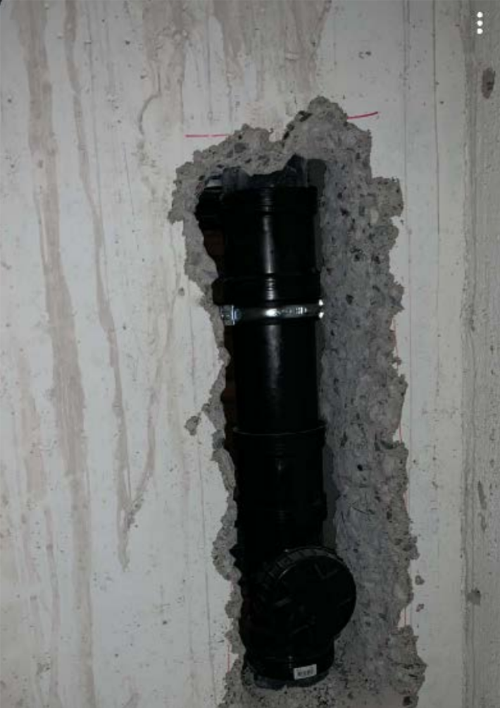
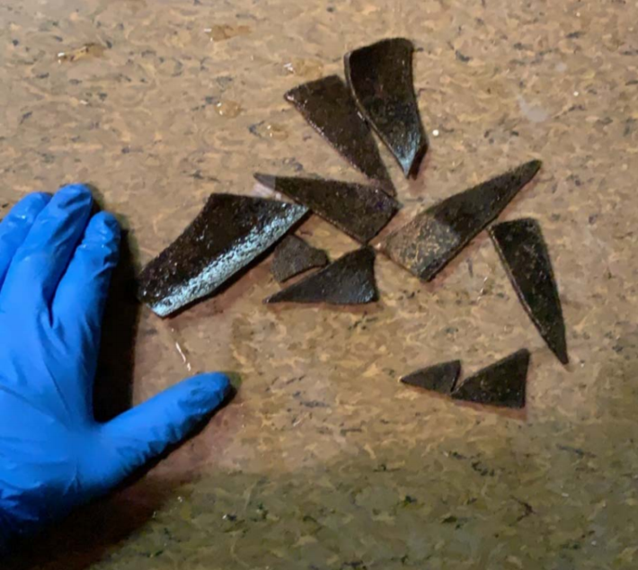
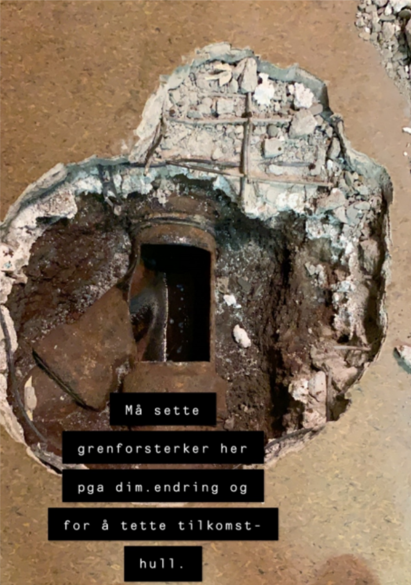
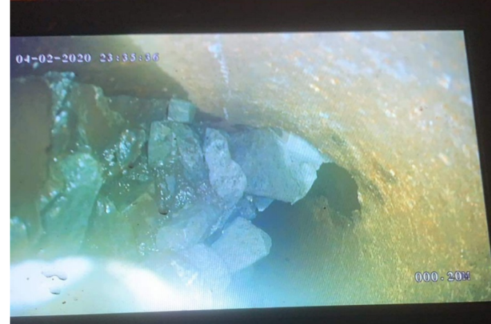

Olimb ble valgt som leverandør av rørfornyingen. Arbeidet ble delt opp i flere etapper. Du kan lese mer om hvordan slik rehabilitering foregår, på Olimbs nettsted.

## Rørfornying innvendig taknedløp fra tak

Dette ble utført i forbindelse med takarbeidet i fasadeprosjektet.

I tillegg til å rørfornye taknedløpene måtte det etableres stakeluker. Noen boder måtte derfor tømmes for å gi tilgang.

Dette arbeidet ble utført sommeren 2019 for alle blokkene.

## Rørfornying bunnledning og stikkledning

Som del av bad- og våtromsprosjektet ble alle nedfallsstammer erstattet med nye rør. Bunnledningene og stikkledningene ut mot det kommunale avløpsnettet ble ikke erstattet. I stedet ble det valgt rørfornying, der en strømpe etableres innvendig i røret for å tette og reparere skader.

Rørene er fra 1975 og er i dårlig stand. Under arbeidet med dette er det funnet områder med hull og store skader. Bildene nedenfor viser eksempler på store skader funnet i 84, 82 og 68.

Arbeidet i nr. 68, 82 og 84 ble gjennomført vinteren 2019–2020. Det ble benyttet en teknikk kalt overpumping, der et separat, midlertidig avløpssystem gjorde det mulig å bruke vann i blokkene under arbeidet, med enkelte begrensninger.

I nr. 64 og 66 var det ikke mulig å bruke denne teknikken. Vannet måtte derfor stenges av i arbeidsperioden, og det ble etablert provisoriske toaletter og dusjer. Arbeidet ble utført i juli og august 2020.

{}
