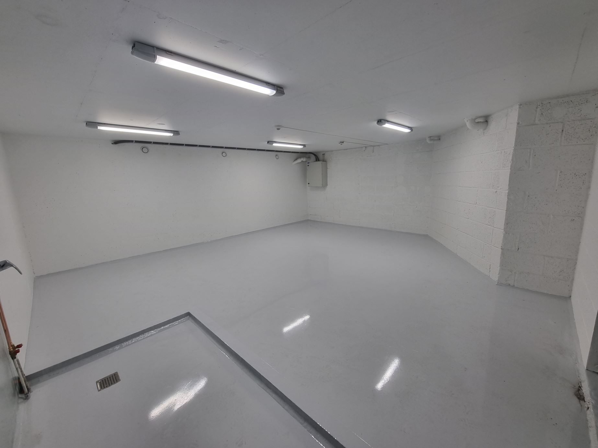
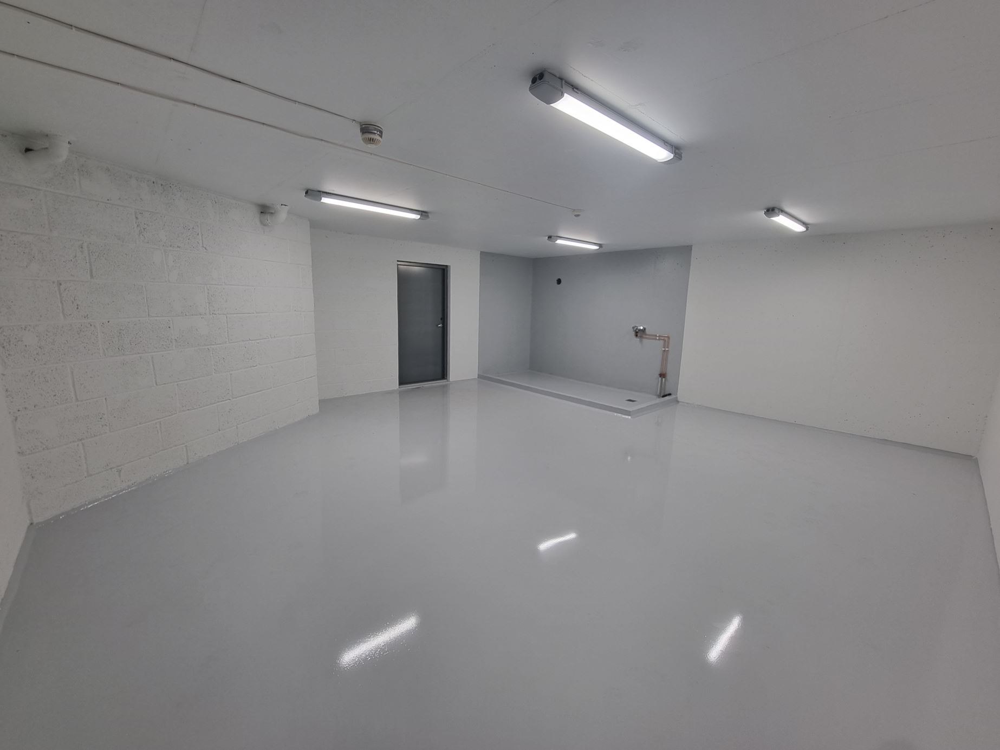
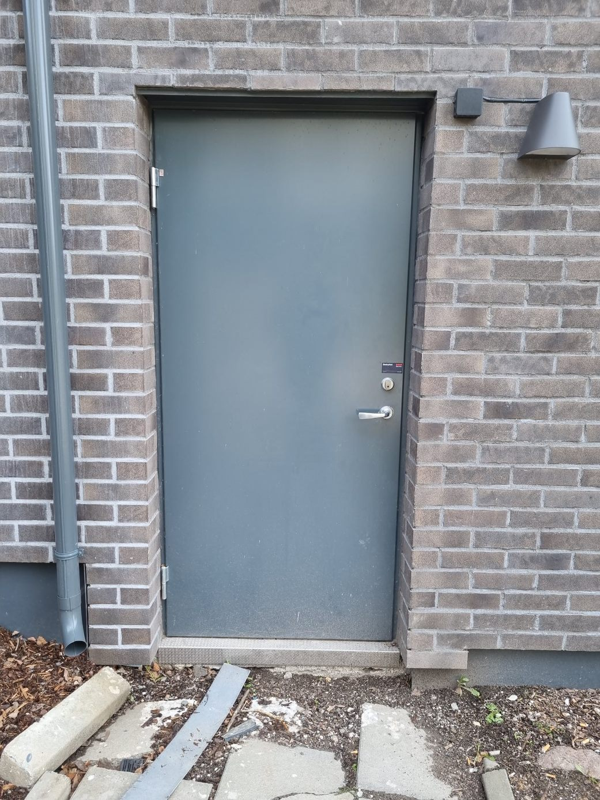

I motsetning til de andre blokkene var det ikke et dedikert område i 68 blokken hvor beboere kunne oppevare sykler. 

Våren 2023 ble vaskeriet i 68 blokken gjort om til sykkelrom.  

Sykkelrommet har begrenset plass til sykler med tanke på hvor mange beboere det er i blokken.

For å unngå et stort antall ubrukte sykler tar opp plass, som man f.eks ser i 84 blokken har man følgende regler.

1. Tilgang til sykkelrommet bestilles via Vibbo eller på mail til setra@styrerommet.no
2. Sykler må merkes med leilighetsnr.
3. Sykler må brukes. Det er sunt. Sykler som har stått ubrukt i 2 sykkelsesonger vil bli fjernet og gitt vekk. Bruker du ikke sykkelen så selg den på Finn. Ikke bruk verdifull plass til sykler som ikke brukes.
4. Ta syklene inn gjennom sideutgangen i 68J på bakkeplan. Ikke frakt dem i heisen.
5. Pass på at dørene er lukket og låst når du forlater rommet/gangen.

