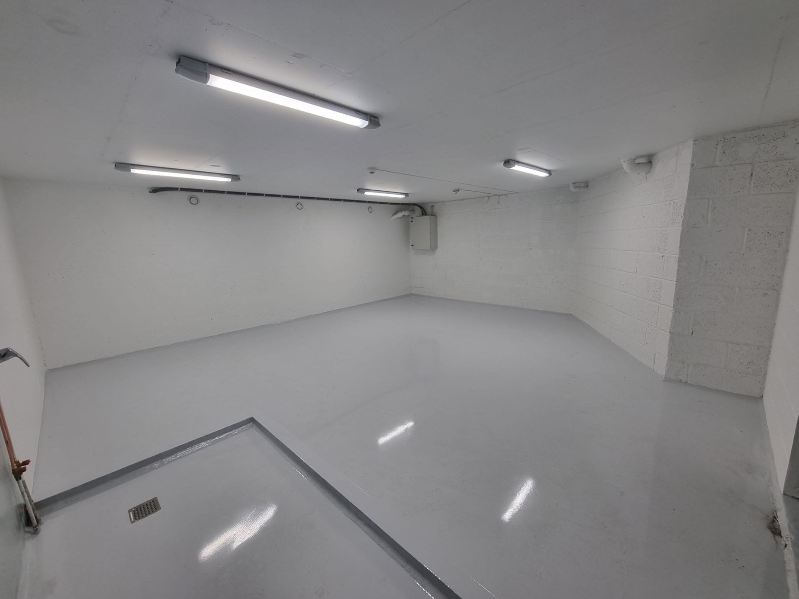
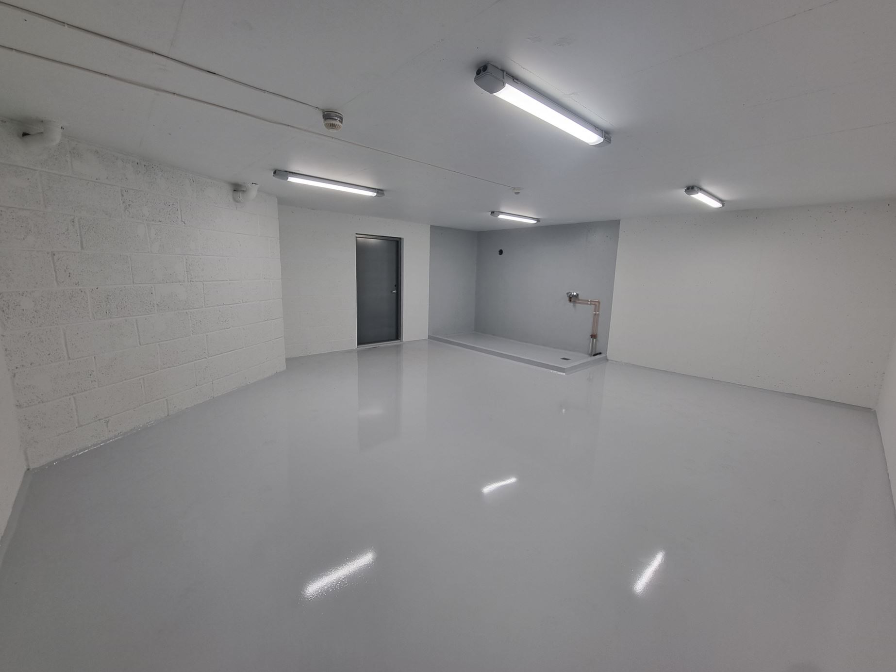
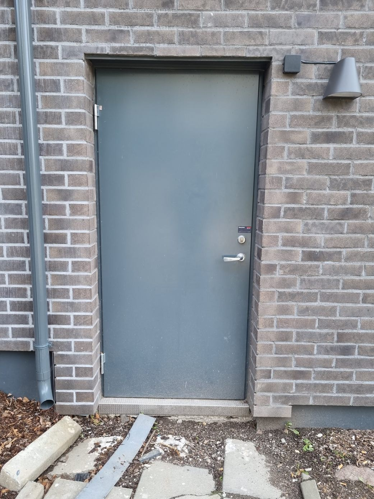

I motsetning til de andre blokkene hadde nr. 68 ikke et eget område der beboerne kunne oppbevare sykler.

Våren 2023 ble vaskeriet i nr. 68 gjort om til sykkelrom.

Sykkelrommet har begrenset plass sammenlignet med antallet beboere i blokken.

For å unngå at mange ubrukte sykler tar opp plass, gjelder følgende regler:

1. Tilgang til sykkelrommet bestilles via Vibbo eller på e-post til setra@styrerommet.no.
2. Sykler må merkes med leilighetsnummer.
3. Sykler må brukes. Det er sunt. Sykler som har stått ubrukt i to sykkelsesonger, blir fjernet og gitt bort. Hvis du ikke bruker sykkelen, kan du selge den på FINN. Ikke bruk verdifull plass på sykler som ikke er i bruk.
4. Ta syklene inn gjennom sideutgangen i 68J på bakkeplan. Ikke frakt dem i heisen.
5. Pass på at dørene er lukket og låst når du forlater rommet/gangen.

