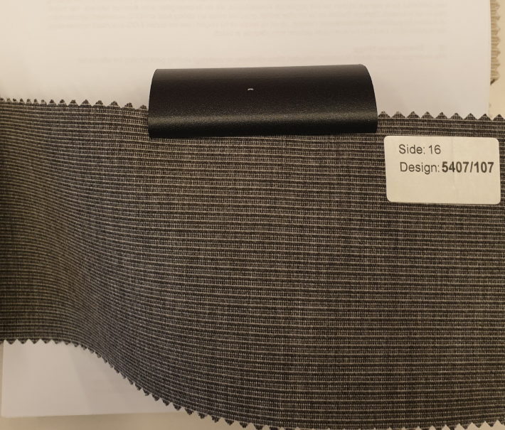
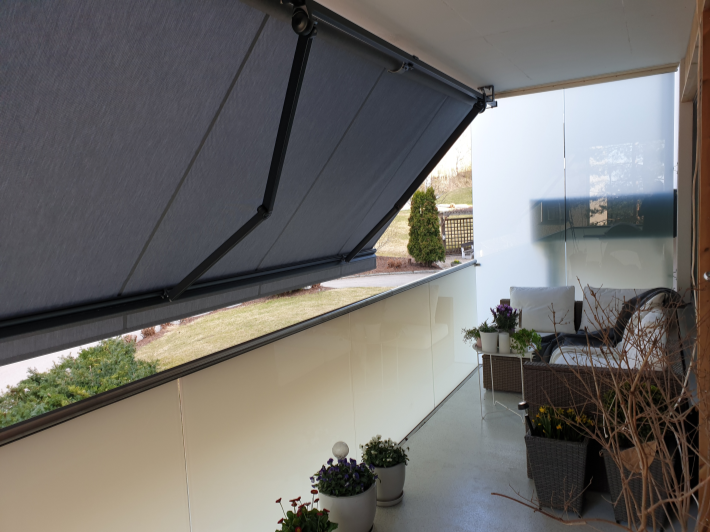
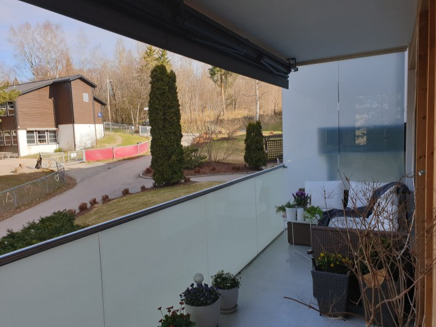
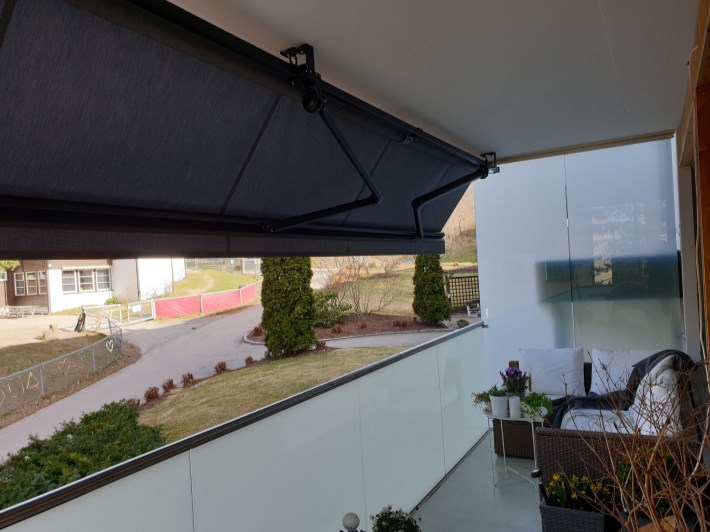
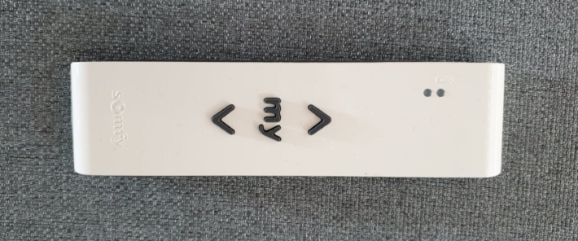

Det er kun markiser fra Norsol som kan monteres i borettslaget, i samsvar med spesifikasjonene nedenfor.

## Norsol

Norsol er en ledende aktør innen solskjerming og har levert skreddersydde løsninger siden 1983.

Produksjonen foregår i en moderne fabrikk på Nordmøre og produktene testes for det norske klimaet ved Nordvestlandets kystlinje.

Norsk produksjon gir kortreiste produkter og forutsigbar leveringstid. Norsol ble sertifisert som Miljøfyrtårn allerede i 2002, som et av de første selskapene i Norge, og sertifikatet fornyes årlig.

## Norlet terrassemarkise

Norlet fra Norsol er terrassemarkisen for alle anledninger. Solide armer og frontskinne i bruddsikker aluminium sikrer optimalt dukspenn og lang levetid. Velg blant et stort utvalg skreddersydde kvalitetsduker, samt motor og fjernkontroll.

Norlet-serien er bygget for å tåle et værhardt norsk klima og er godt egnet til skjerming av uterom. Du kan velge mellom manuell sveiv, motor med bryter eller motor med fjernkontroll. Markisen kan også utstyres med sol- eller vindautomatikk. Det finnes mer enn 140 kvalitetsduker i akryl, med ensfarget, tofarget eller stripet design. Norlet er klassifisert i vindklasse 2 etter standarden EN 13561.

Fargen som er valgt på stoffet og fargen på metallet vises på bildet under.

[Les mer om Norlet på Norsols nettsted](https://www.norsol.no/blogg/produkter/markiser/).
 
## Autorisert montør

Flinke Hender AS er autorisert solskjermingsmontør.

Tilbud for balkonger på fire meter i nr. 84 (priser fra 2020):

Norsol Norlet, 420 cm × 2 m, manuell, med sortlakkerte armer og frontskinne: 11 817 kroner.

Norsol Norlet, 420 cm × 2 m, med motor, fjernkontroll, sortlakkerte armer og frontskinne: 14 413 kroner.

Tilbud for balkonger på seks meter i nr. 64, 66, 68 og 82 (priser fra 2020):

Norsol Norlet, 630 cm × 2 m, manuell, med sortlakkerte armer og frontskinne: 17 248 kroner.

Norsol Norlet, 630 cm × 2 m, med motor, fjernkontroll, sortlakkerte armer og frontskinne: 19 769 kroner.

Montering kostet ca. 2 550 kroner, i tillegg til kostnaden for kranbil. Kostnaden for kranbil avhenger av hvor mange markiser som bestilles og leveres samtidig, og fordeles på beboerne som er med på hvert løft. Dette ble anslått til ca. 500 kroner per markise.

For markiser med motor kommer kostnaden til elektriker i tillegg. Kostnaden varierer etter det eksisterende elektriske anlegget i leiligheten. Tilbudet ga også mulighet til å bestille elektriker, men beboerne kunne velge en annen elektriker.

## Montering

Markisene monteres ytterst i balkongtaket med en vinkel på 45 grader, som vist på bildet nedenfor. Dette gir god solskjerming selv når kveldssolen står lavt. Andre vinkler er ikke tillatt.

## Fjernkontroll

Fjernkontrollen til de elektriske markisene kommuniserer via radiosignaler, slik at markisen enkelt kan styres på avstand.

{}
