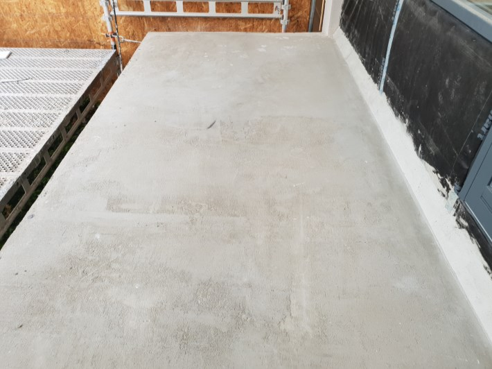
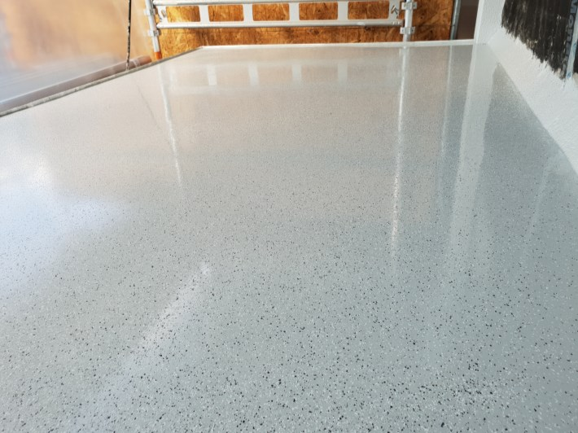
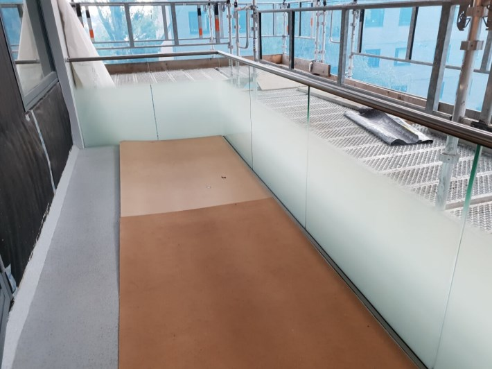
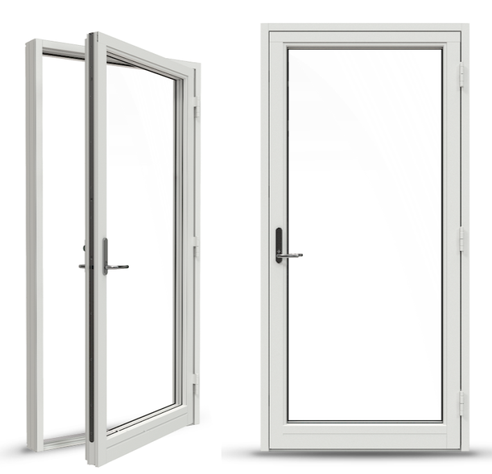

Som del av forberedelsene til prosjektet ble tilstanden til balkongene nøye vurder. Man konkluderte at det ikke var behov for å rive balkongene, men at de trengtes å renoveres.

## Balkonggulv

Betongen ble pusset og rettet ut før man la StoPur EB200 polyuretanbelegg for balkonger

Balkongtaket ble også malt hvitt.

Vask og vedlikehold av belegg

Rengjøring utføres regelmessig avhengig av hvor fort gulvet blir nedsmusset.

Løs smuss fjernes med støvsuger eller kost/feiebrett. 

Vaskevannet tilsettes nøytralt rengjørings-middel, StoDivers IF. Gjenstående smuss må skures vekk med myk børste/svamp. 

Rengjøring med andre typer rengjøringsmidler (for eksempel aceton, rødsprit, tynner etc.) skal ikke utføres uten godkjenning fra Sto Norge AS. Heller ikke må skarpe gjenstander (for eksempel kniv, sparkel eller tilsvarende) brukes ved rengjøring. Dette kan medføre skader på belegget. 
  
Utbedring av skader Kontakt Sto Norge AS for utbedringsalternativer. Eventuell overmaling av belegget gjøres kun i samråd med Sto Norge AS. 
 
Belegget kan IKKE belegges med fliser og det anbefales å bruke møbelknotter under balkongmøblene.

Les mer i vedlagte brosjyre.

## Balkongrekkverk

Rekkverket som vil bli brukt er Færder II. Høyden for balkonger vil variere. For 1-3 i lavblokkene så vil høyden være 100cm. For 4. etasjen vil det være 120 cm.  Tilsvarende forskjelel vil man ha i 68 og 84. Hvilket etasje skiller kommer på er fortsatt ikke avklart. 

For 1. etasjen i lavblokkene vil glasset frostes helt opp. For de andre vil det frostes 80 cm som bildet viser. 

Det er ikke lov å henge noe på selve rekkverket som f.eks blomsterkasser. Leverandøren informer om at "Ved å belaste glassrekkverkene med at noe henger på håndløper og gir glasset punktlaster med vridning vil medføre at garanti bortfaller ved eventuell skade på håndløper eller at glasset krakelerer(knuser)

## Balkongtak toppetasjer

På balkongene som ligger i toppetasjen bygges det nytt tak i treverk. Dette gir en stor forbedring sammenlignet med bølgeblikktakene man hadde før. Bildet nedenfor viser taket.

## Balkongdører

Alle balkongdørene vil byttes ut. Disse erstattes med Nordan ND NTech Villa Sikkerhetsdør. 

Totalt er det 250 slike dører som erstattes. Dørene vil slå utover og vil være hengslet som i tidligere. (Venstre eller høyrehengslet avhengig av plassering av dør i forhold til stuevinduer). 

Størrelsen på dørene blir også som i dag. Dvs at 68 blokken får dører som er bredere enn de andre blokkene.

{}
